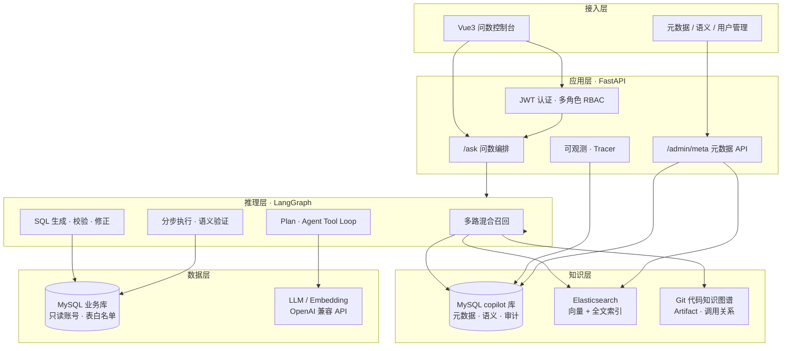
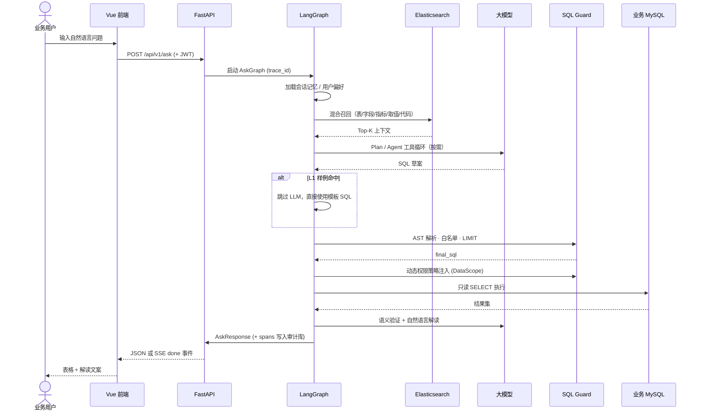
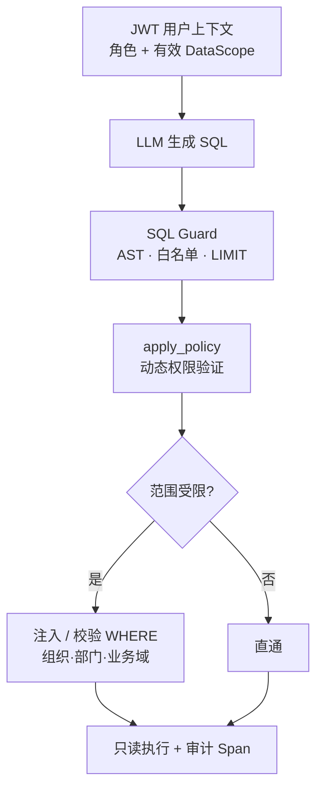
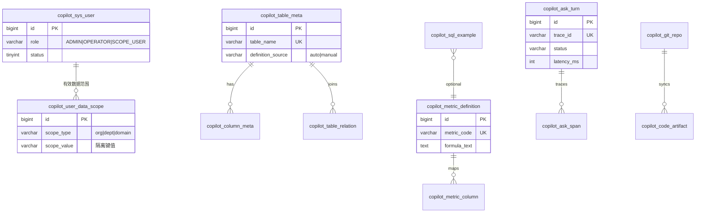

# Data Copilot · 企业级智能问数平台

> **让业务人员用自然语言查数据，把固定报表开发周期从「周」缩短到「分钟」。**

Data Copilot 是一套面向中大型业务系统的 **NL2SQL（自然语言转 SQL）** 子产品：产品、运营、业务域管理员无需写 SQL，即可在**动态数据权限**边界内自助查询核心业务指标。平台以 **元数据治理 + 混合召回 + LangGraph 多阶段推理 + SQL 安全网关** 为核心，兼顾准确率、可审计性与企业落地成本。

---

## 核心价值

| 维度 | 传统方案 | Data Copilot |
|------|----------|--------------|
| 需求响应 | 每个新问题走 PRD → 开发 → 发版 | 运营配置元数据 / L1 样例，或 LLM 即时生成 |
| 数据安全 | 报表接口分散，权限难统一 | 表白名单 + AST 校验 + **动态权限验证** + 只读连接 |
| 口径一致 | 口径散落在代码与文档 | 语义库（指标定义、别名、公式）驱动召回与 Prompt |
| 可观测 | 黑盒接口，问题难追溯 | 全链路 Trace / Span / Audit，支持 badcase 闭环 |
| 知识沉淀 | 业务逻辑锁死在 Java/SQL | Git 代码知识图谱 + 表字段 meta 融合召回 |

**典型场景**：「本部门本月核心指标是多少？」「最近 7 天每日趋势？」「全平台昨日汇总？」—— 系统自动理解意图、经动态权限校验后生成只读 SQL，返回表格与自然语言解读。

---

## 系统架构



### 部署拓扑

```text
┌──────────────────────────────────────────────────────────────────────┐
│  应用宿主机                                                           │
│  · Python Uvicorn :8000    ← 问数 API（开发 / Docker 生产）           │
│  · Vue Vite :5173          ← 前端（开发）；生产为静态资源 + Nginx      │
│  · Ollama / 内网 LLM       ← 大模型 + Embedding（OpenAI 兼容协议）     │
│  · MySQL 5.7+              ← 业务只读库 + copilot 治理库（同实例可共存）  │
└───────────────────────────────┬──────────────────────────────────────┘
                                │ host.docker.internal
┌───────────────────────────────▼──────────────────────────────────────┐
│  检索基础设施（Docker Compose）                                        │
│  · Elasticsearch :9200     ← 字段向量 · 取值全文 · 代码 Artifact 索引   │
│  · Redis / MinIO（可选）   ← 文档 RAG 栈，与问数元数据解耦              │
└──────────────────────────────────────────────────────────────────────┘
```

**设计原则**：业务 MySQL 不容器化，与现网一致；问数仅在独立库 `copilot` 中建表，对业务库 **零侵入、只读访问**。

---

## 问数链路（LangGraph）

单次 `/ask` 请求经 **30+ 节点** 的有向图编排，支持 SSE 流式进度推送。

```mermaid
flowchart LR
    subgraph Phase1["① 上下文"]
        N1[normalize_question]
        N2[session / preference / 指代消解]
    end

    subgraph Phase2["② 混合召回"]
        K[extract_keywords]
        T[recall_tables]
        C[recall_columns]
        M[recall_metrics]
        F[recall_field_values]
        Merge[merge · filter · build_llm_context]
    end

    subgraph Phase3["③ 推理"]
        P[plan_question]
        AL[agent_loop<br/>MySQL meta + 代码工具]
        GS[generate_sql / generate_sql_step]
    end

    subgraph Phase4["④ 安全与执行"]
        V[validate_sql]
        CS[correct_sql]
        AP[apply_policy · 动态 DataScope]
        EX[execute_sql · 分步 SQL]
        VF[verify_answer]
        FA[format_answer]
    end

    N1 --> N2 --> K --> T --> C --> M --> F --> Merge
    Merge --> P
    P -->|简单问句| GS
    P -->|复杂问句| AL --> GS
    GS --> V
    V -->|失败| CS --> V
    V -->|通过| AP --> EX --> VF --> FA
```



### 时序图：一次完整问数



---

## 技术亮点

### 1. 三层知识融合

```text
┌─────────────────┐   ┌─────────────────┐   ┌─────────────────┐
│  结构化元数据    │   │  语义指标库      │   │  代码知识图谱    │
│  表/字段/关系    │ + │  口径/别名/公式  │ + │  Git 同步解析    │
│  information_   │   │  L1 SQL 样例     │   │  Java/MyBatis   │
│  schema 半自动   │   │  badcase 闭环    │   │  ES 向量召回     │
└────────┬────────┘   └────────┬────────┘   └────────┬────────┘
         └─────────────────────┼─────────────────────┘
                               ▼
                    HybridRetriever → LLM Context
```

- **向量召回**：字段 / 指标语义相似度（Elasticsearch `dense_vector`）
- **全文召回**：枚举取值、业务术语（BM25）
- **结构化补全**：MySQL 元数据 + keyword 降级（ES 不可用时仍可服务）

### 2. SQL 安全网关（Defense in Depth）

| 层级 | 机制 |
|------|------|
| 连接层 | 业务库独立只读账号，`assert_business_readonly_sql` |
| 语法层 | sqlglot AST：仅允许单条 `SELECT` |
| 范围层 | 动态表白名单（`copilot_table_meta.status=1` 优先） |
| 权限层 | **动态 DataScope**：按角色 / 组织 / 数据域自动注入 WHERE 条件，越权 SQL 拦截 |
| 资源层 | 自动追加 `LIMIT`，防大结果集拖垮库 |
| 修正层 | `correct_sql` 校验失败时 LLM 自我修正（有限重试） |

### 3. 多角色 RBAC 与动态权限验证

平台采用 **RBAC + DataScope** 双层模型：角色决定「能做什么」，数据范围决定「能看哪些行」。

```text
超级管理员 ──► 全量数据域 · 用户管理 · 元数据治理
运营管理员 ──► 全量数据域 · 元数据治理 · badcase 处理
业务域用户 ──► 绑定组织 / 部门 / 数据域 · 问数自动带范围过滤
```

**动态权限验证流程**（`apply_policy` 节点）：

1. 从 JWT 解析当前用户角色与 **有效数据范围**（组织、部门、业务域等维度）
2. 对照元数据中配置的 **范围字段映射**（哪张表、哪一列承载隔离键）
3. 对 LLM 生成的 SQL 做 AST 级 **WHERE 注入 / 缺失校验** — 范围受限用户若 SQL 未含必要过滤条件则拒绝执行
4. 全链路审计：每次策略应用写入 Span，便于合规追溯

JWT 无状态认证；业务域用户支持 **多范围绑定 + 运行时切换**（切换后 JWT 刷新，后续问数自动套用新 DataScope）。



### 4. Agent 增强推理（复杂报表）

简单问句走 **Plan → 单条 SQL**；复杂多表 / 多步聚合走 **Agent Tool Loop**：

- 按需调用 MySQL meta 工具（表结构、关系、有效字段定义）
- 按需读取代码 Artifact（Service / Mapper 口径对齐）
- 支持 **分步 SQL** 执行与中间结果组装（`assemble_result`）
- 答案 **语义验证**（`verify_answer`）降低「SQL 对但答非所问」

### 5. 可观测与持续优化

- 每次问数写入 `copilot_ask_turn` / `copilot_ask_span` / 审计表
- 记录：延迟、Token、召回模式、降级级别、错误码
- 用户 👍/👎 反馈 → badcase 队列 → 运营修正 SQL → 沉淀为 L1 样例
- 评测脚本 `replay_eval.py` + 固定评测集，支持 Agent 复杂问句子集回归

### 6. 会话记忆与用户偏好

- 多轮对话 **指代消解**（「那上周呢？」）
- 用户级偏好持久化（默认时间范围、常用维度等）
- 会话列表 / 历史回放 API

---

## 技术栈

| 层级 | 选型 | 说明 |
|------|------|------|
| 后端 | Python 3.10+ · FastAPI · SQLAlchemy 2 async | 高性能异步 API |
| 编排 | LangGraph · LangChain | 有向图问数流水线 |
| 前端 | Vue 3 · Vite · Pinia | 问数对话 + 元数据管理后台 |
| 数据库 | MySQL 5.7+ | 双库：业务只读 + copilot 治理 |
| 检索 | Elasticsearch 8.x | 向量 + 全文混合召回 |
| LLM | Ollama / 通义 / DeepSeek 等 | OpenAI 兼容 `chat/completions` |
| 安全 | JWT · bcrypt · sqlglot | 认证 + SQL AST 校验 |
| 部署 | Docker Compose · Uvicorn | 后端容器化；DB/LLM 宿主机 |

---

## 仓库结构

```text
data-copilot-bot/
├── backend/
│   ├── app/
│   │   ├── agent/          # LangGraph 图、召回、Plan、Agent Loop
│   │   ├── ask/            # 问数服务、L1 匹配
│   │   ├── auth/           # JWT、用户仓储
│   │   ├── meta/           # 元数据 CRUD、ES 索引
│   │   ├── retrieval/      # HybridRetriever、ES Client
│   │   ├── sql/            # SQL Guard、白名单、列级策略
│   │   ├── code/           # Git 同步、代码解析、知识图谱
│   │   ├── memory/         # 会话记忆、用户偏好
│   │   ├── observability/  # Tracer、Span 写入
│   │   └── api/            # REST 路由
│   ├── scripts/            # DDL 迁移、种子、索引重建、评测
│   ├── tests/              # pytest 单测（Guard / Graph / Meta / Agent）
│   └── deploy/             # Docker Compose
├── frontend/
│   └── src/
│       ├── views/          # Ask、Login、AdminMeta*、AdminUsers
│       └── api/            # 后端 API 封装
└── docs/                   # 详细设计、评测集、进度
```

---

## 核心 API 一览

| 方法 | 路径 | 能力 |
|------|------|------|
| POST | `/api/v1/auth/login` | 登录，签发 JWT |
| POST | `/api/v1/auth/switch-scope` | 切换当前有效数据范围（DataScope） |
| GET | `/api/v1/auth/me` | 当前用户上下文 |
| POST | `/api/v1/ask` | 自然语言问数（支持 SSE 流式） |
| POST | `/api/v1/ask/cancel` | 中断进行中的问数 |
| GET/POST | `/api/v1/sessions` | 会话管理 |
| POST | `/api/v1/feedback` | 问数反馈 / badcase |
| GET/POST | `/api/v1/admin/meta/*` | 元数据、语义库、L1 样例 CRUD |
| POST | `/api/v1/admin/meta/rebuild-index` | 重建 ES 问数索引 |
| GET/POST | `/api/v1/admin/code/*` | Git 仓库同步、代码索引 |
| GET/POST | `/api/v1/admin/users` | 超管用户管理 |
| GET | `/health` · `/ready` | 存活探针（含 MySQL / ES） |

完整 OpenAPI 文档：启动后端后访问 `/docs`。

---

## 快速开始

### 环境要求

| 组件 | 说明 |
|------|------|
| MySQL 5.7+ | 业务库（只读）+ `copilot` 治理库 |
| Python 3.10+ | 后端运行时 |
| Node.js 18+ | 前端构建 |
| Elasticsearch 8.x | 混合召回（可选 keyword 降级） |
| Ollama 或兼容 API | LLM + Embedding |

### 后端

```powershell
cd backend
copy .env.example .env.development
# 编辑 MySQL、JWT、LLM、ES 等配置

$env:APP_ENV = "development"
python -m venv .venv
.\.venv\Scripts\activate
pip install -e ".[dev]"

# 初始化 copilot 库表（copilot_* 前缀）
mysql -u root -p < scripts/ddl_copilot.sql
python scripts/seed_admin.py

uvicorn app.main:app --host 0.0.0.0 --port 8000
```

### 前端

```powershell
cd frontend
copy .env.example .env.development
npm install
npm run dev
```

浏览器访问 `http://127.0.0.1:5173`。

### 测试

```powershell
cd backend
$env:APP_ENV = "development"
pytest tests/ -q
```

### Docker 部署（后端 API）

```powershell
cd backend
copy .env.example .env.production
docker compose -f deploy/docker-compose.yml up -d --build
```

---

## 数据模型（治理库概要）



---

## 质量保障

- **单元测试**：SQL Guard、角色策略、元数据 effective 合并、LangGraph 节点、Agent 工具等 **40+ 测试文件**
- **评测回归**：`scripts/replay_eval.py` 对固定问句集批量回放，输出准确率 / 延迟报告
- **badcase 闭环**：运营在前端修正 SQL → 一键沉淀 L1 → 下次同类问句直出

---

## 扩展阅读

| 文档 | 内容 |
|------|------|
| [docs/DEVELOPMENT_PLAN.md](docs/DEVELOPMENT_PLAN.md) | 完整架构设计、14 周里程碑、API 契约 |
| [docs/PROGRESS.md](docs/PROGRESS.md) | 模块完成度与联调清单 |
| [docs/EVAL_QUESTIONS.md](docs/EVAL_QUESTIONS.md) | 评测问句说明 |

---

## License

内部项目 / 面试展示用途。部署前请替换 `JWT_SECRET`、`SEED_ADMIN_PASSWORD` 等敏感配置，并遵循所在组织的数据安全规范。
