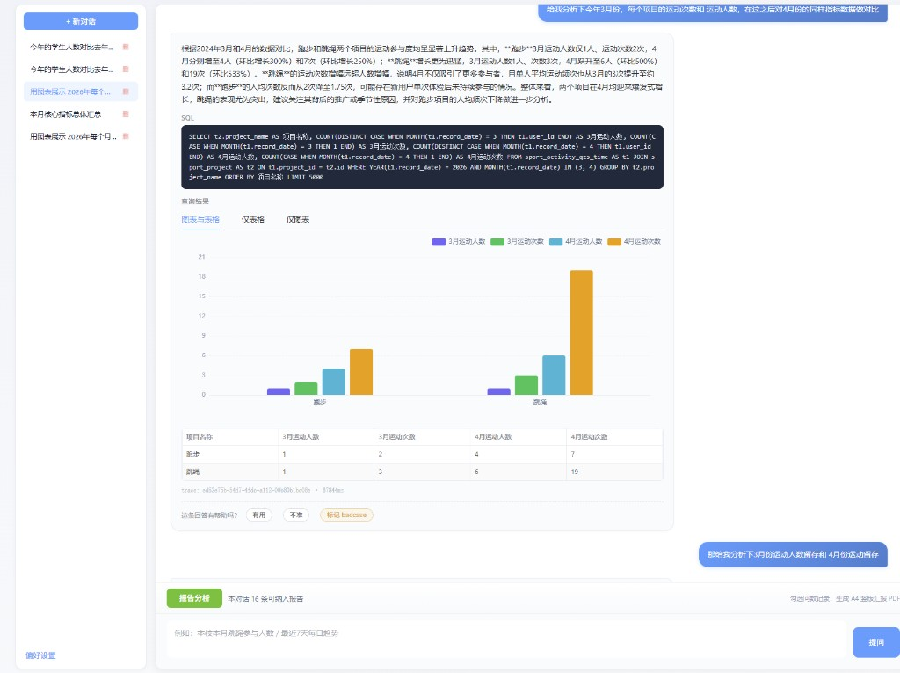
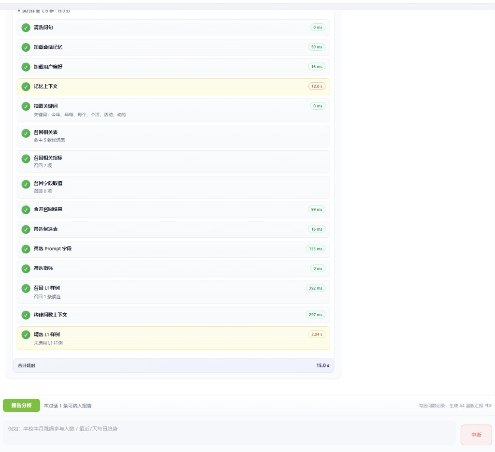
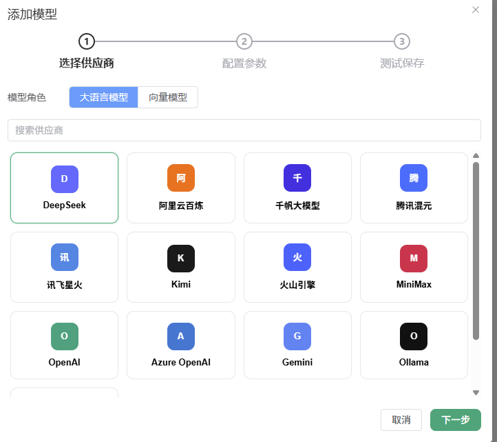
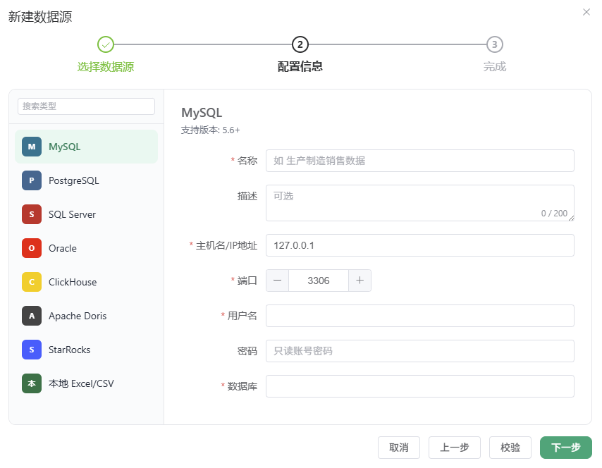
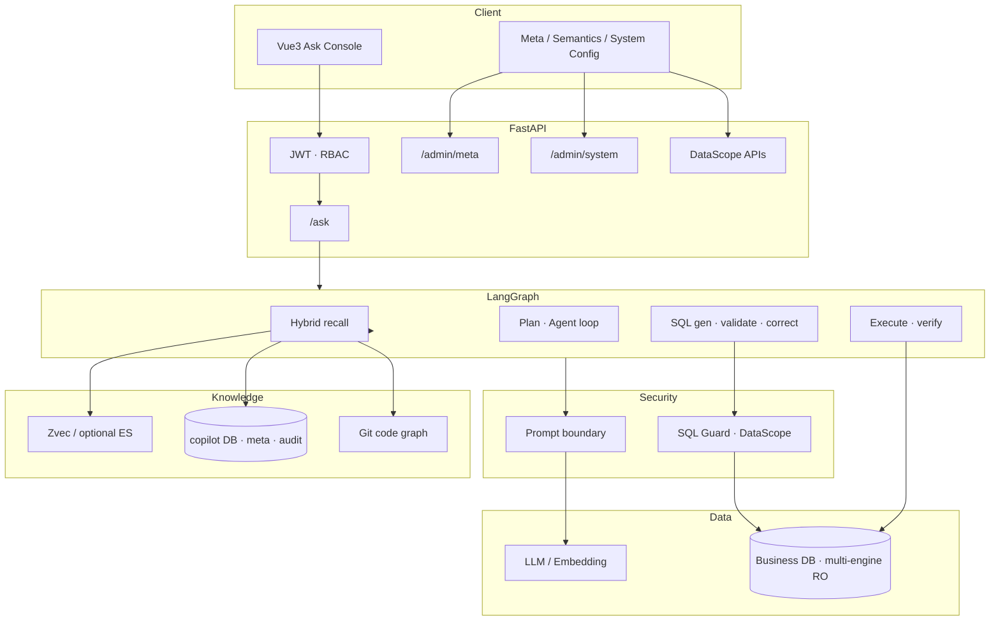

# Data Copilot

### Enterprise Natural-Language Analytics

<p align="center">
  
  
  
  
  
  
</p>

<p align="center">
  <strong>Ask your enterprise data in natural language</strong> — turn week-long report cycles into minutes.<br/>
  NL2SQL for mid/large business systems: metadata governance, hybrid retrieval, multi-stage reasoning,<br/>
  a fail-closed SQL gateway, and config-driven row-level DataScope — in one product.
</p>

<p align="center">
  <a href="README.zh-CN.md">中文</a> ·
  <a href="AGENTS.md">For AI Agents</a> ·
  <a href="docs/DEMO.md">Demo</a> ·
  <a href="#why-data-copilot">Why</a> ·
  <a href="#architecture">Architecture</a> ·
  <a href="#quick-start">Quick Start</a> ·
  <a href="#docs">Docs</a>
</p>

> **Open Source Demo (Scheme A)** — `make demo-up && make demo-smoke` · UI http://localhost:8080 · `admin` / `demo123456` · **no API key** (Fixture mode). Details: [AGENTS.md](AGENTS.md) · [docs/DEMO.md](docs/DEMO.md)

---

## Why Data Copilot

| | Typical Chat-to-SQL | Data Copilot |
|--|---------------------|--------------|
| Security | Trust the model | **Fail-closed** SQL Guard + DataScope (never rely on the model “behaving”) |
| Permissions | App-layer filters (easy to miss) | Config-driven **row-level grants** injected / checked at execution |
| Knowledge | Schema dump only | **Meta + metrics + optional code graph** hybrid recall |
| Ops | Black box | SSE timeline, spans, audit, badcase → L1 loop |
| Databases | One engine | Catalog-driven **multi-engine** (MySQL / PG / CH / Excel / …) |

**Ask once → secure SQL → table + chart + plain-language answer.**

<p align="center">
  
</p>
<p align="center"><em>Ask workspace · natural-language answer + SQL (ADMIN) + chart / table</em></p>

<p align="center">
  
</p>
<p align="center"><em>Live pipeline · per-node progress & latency</em></p>

---

## Features

- **LangGraph ask pipeline** — memory → hybrid recall → L1 examples → plan / agent tool loop → validate → execute → verify
- **SQL Guard** — SELECT-only AST checks, table allow-list, column deny, LIMIT, DataScope injection
- **DataScope** — RBAC + dimension grants; missing grants fail closed (`NO_DATA_SCOPE`)
- **Prompt hardening** — untrusted boundaries + recall sanitization; execution layer still enforces policy
- **Multi-engine catalogs** — LLM providers & datasources configured in admin UI (YAML catalogs, encrypted secrets)
- **Retrieval** — Zvec by default (vector + FTS + RRF); optional Elasticsearch
- **Observability** — turn / span / audit tables; thumbs feedback → badcase → L1

Admin UI for LLM providers and datasources:

<p align="center">
  
</p>
<p align="center">
  
</p>

---

## Architecture



**Design:** governance DB (`copilot`) is separate from business DBs. Ask paths are **read-only** against business data. LLM & datasource credentials are encrypted at rest.

---

## Quick Start

### Demo (recommended — no host MySQL / no API key)

```bash
make demo-up && make demo-smoke
# Windows PowerShell:
#   .\scripts\demo_up.ps1
#   .\scripts\demo_smoke.ps1
```

| | |
|--|--|
| UI | http://localhost:8080 |
| API | http://localhost:8000 |
| Login | `admin` / `demo123456` |

Preset Fixture questions are listed in [`demo/profiles/_shared/questions.json`](demo/profiles/_shared/questions.json). Coding agents should start from [`AGENTS.md`](AGENTS.md).

### Local development

| Component | Notes |
|-----------|--------|
| MySQL 5.7+ | Business (RO) + `copilot` governance DB |
| Python 3.10+ | Backend |
| Node.js 18+ | Frontend |
| Zvec (default) | Hybrid recall |
| OpenAI-compatible LLM | Ollama / cloud |

```bash
# Backend
cd backend
cp .env.example .env.development   # or copy on Windows
export APP_ENV=development         # PowerShell: $env:APP_ENV="development"
python -m venv .venv && source .venv/bin/activate
pip install -e ".[dev]"
# Apply scripts/sql/copilot/V*.sql, then:
python scripts/seed_admin.py
uvicorn app.main:app --host 0.0.0.0 --port 8000

# Frontend
cd frontend
cp .env.example .env.development
npm install && npm run dev
# http://127.0.0.1:5173
```

```bash
cd backend && pytest tests/ -q
```

More detail (Chinese): [README.zh-CN.md](README.zh-CN.md) · [docs/DEMO.md](docs/DEMO.md)

---

## Tech stack

| Layer | Choice |
|-------|--------|
| API | Python · FastAPI · SQLAlchemy 2 async |
| Orchestration | LangGraph · LangChain |
| UI | Vue 3 · Vite · Pinia |
| Governance DB | MySQL (demo Compose uses MySQL 8) |
| Retrieval | Zvec (default) · Elasticsearch (optional) |
| Security | JWT · sqlglot · DataScope · prompt boundary |

---

## Docs

| Doc | Topic |
|-----|--------|
| [docs/README.md](docs/README.md) | Doc index (numbered plans) |
| [docs/20-OPENSOURCE_GROWTH_PLAN.md](docs/20-OPENSOURCE_GROWTH_PLAN.md) | Opensource / star-growth plan |
| [docs/02-PROGRESS.md](docs/02-PROGRESS.md) | Implementation progress |
| [docs/01-MVP_DEVELOPMENT_PLAN.md](docs/01-MVP_DEVELOPMENT_PLAN.md) | Full MVP design (CN) |
| [docs/91-PROMPT_SECURITY.md](docs/91-PROMPT_SECURITY.md) | Prompt injection threat model |
| [docs/92-EVAL_QUESTIONS.md](docs/92-EVAL_QUESTIONS.md) | Eval suites (incl. `inj-*`) |
| [AGENTS.md](AGENTS.md) | One-command demo for coding agents |

---

## License

[Apache License 2.0](LICENSE). Replace `JWT_SECRET`, demo passwords, and other secrets before any real deployment. Enable DataScope in production only after migrations and user grants are configured.
