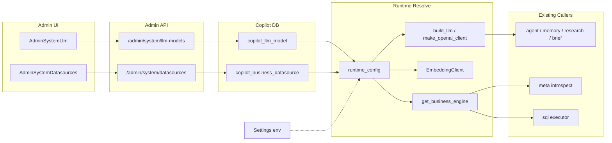

# 大模型与业务数据源配置化 · 开发计划

> **状态**：已落地（一期代码）  
> **版本**：v1.0 · 2026-08  
> **范围**：系统管理侧 **AI 模型配置** + **业务数据源配置**（对标 [SQLBot](https://github.com/dataease/SQLBot) 信息架构，贴合本仓库现有 Meta / Ask 链路）  
> **原则**：配置落入 **copilot 库**；运行时 **库优先、env 回退**；问数库 `MYSQL_COPILOT_*` / JWT 等部署项 **仍仅 env**  
> **非目标（一期）**：多数据源并行问数、Ask 选源、`table_meta.datasource_id`、非 MySQL 引擎、SQLBot 仪表板 / 嵌入 / 商业版提示词  
> **迁移**：上线前在 copilot 库执行 `backend/scripts/sql/copilot/V016__system_llm_and_datasource.sql`，并安装依赖 `cryptography`

---

## 目录

1. [背景与现状](#1-背景与现状)
2. [产品目标与边界](#2-产品目标与边界)
3. [配置优先级与种子](#3-配置优先级与种子)
4. [总体架构](#4-总体架构)
5. [数据模型](#5-数据模型)
6. [密钥与安全](#6-密钥与安全)
7. [后端设计](#7-后端设计)
8. [Admin API](#8-admin-api)
9. [前端设计](#9-前端设计)
10. [关联改动清单（必读）](#10-关联改动清单必读)
11. [配置项](#11-配置项)
12. [分步实施指南](#12-分步实施指南)
13. [测试与验收](#13-测试与验收)
14. [风险与降级](#14-风险与降级)
15. [二期预留](#15-二期预留)

---

## 1. 背景与现状

### 1.1 痛点

| 能力 | 现状 | 问题 |
|------|------|------|
| 大模型 | `.env` → `Settings.llm_*` | 换模型需改环境变量并重启；无管理页；无法多模型并存选默认 |
| Embedding | `.env` → `Settings.embedding_*` | 与聊天模型同样只能部署配置 |
| 业务库 | `.env` → `MYSQL_BUSINESS_*` + `get_business_engine()` 单例 | 换库需改 env 重启；无法在 UI 校验连接 |
| 管理台 | 已有表/关系/L1/术语等 Meta | **缺连接层**，与 SQLBot「先配模型 + 数据源再问数」不一致 |

### 1.2 本仓库已有出口（改造锚点）

| 出口 | 路径 | 说明 |
|------|------|------|
| Chat LLM | `backend/app/agent/llm_sql.py` · `build_llm` | LangChain `ChatOpenAI` |
| OpenAI 客户端 | `backend/app/agent/llm_client.py` · `make_openai_client` | 思考流 / 原始 SDK |
| Embedding | `backend/app/retrieval/embedding.py` · `EmbeddingClient` | 向量索引与召回 |
| 业务引擎 | `backend/app/db/business.py` · `get_business_engine` | 只读问数执行 + introspect |
| SQL 执行 | `backend/app/sql/executor.py` | 依赖业务引擎 |
| Meta | `backend/app/meta/service.py` + `introspector.py` | `mysql_business_database` 作 schema 名 |
| 健康检查 | `backend/app/api/health.py` | 直接读 Settings |
| 管理导航 | `frontend/src/components/MetaAdminNav.vue` | 扩展入口 |

### 1.3 与总纲关系

- 总纲 [`01-MVP_DEVELOPMENT_PLAN.md`](./01-MVP_DEVELOPMENT_PLAN.md) 仍以 env 描述双库与 LLM；**本专项完成后**运行时以 UI/库配置为准，env 降为冷启动与回退。
- 业务库只读策略不变：见 [`90-DATABASE_CHANGE_POLICY.md`](./90-DATABASE_CHANGE_POLICY.md)。
- 语义层（表定义、术语、L1）已有页面，**本期不重做**，只补「连哪里 / 用哪个模型」。

### 1.4 对标 SQLBot（样式与业务）

| SQLBot | 本项目一期 |
|--------|------------|
| 系统管理 → AI 模型配置 | `/admin/system/llm`：增删改、测试、设默认（chat / embedding） |
| 导航 → 数据源 | `/admin/system/datasources`：MySQL 连接、校验、设为当前问数库 |
| 数据源内选表开启问数 | **沿用现有** Meta「注册表 / 刷新结构」（默认业务库） |
| 术语 / SQL 示例 | **已有** 运营中心 / L1，导航旁挂即可 |

视觉：控件体系继续 **Element Plus + 现有 admin layout**（`#f5f7fa`、顶栏、`MetaAdminNav`）；字段语义与交互对标 SQLBot（供应商、API Base、Key、校验连接、设默认），不另起主题。

---

## 2. 产品目标与边界

### 2.1 In Scope（一期）

1. **AI 模型配置页**（仅 ADMIN）
   - 管理多条 OpenAI 兼容模型；`role` 区分 `chat` / `embedding`
   - 每个 role 一条默认；连通性测试；密钥脱敏
2. **业务数据源配置页**（仅 ADMIN）
   - 管理多条 MySQL 业务连接；一条 `is_default` 作为当前问数/introspect 库
   - 连接校验（含未保存草稿）；切换默认二次确认 + 引擎热切换
3. **运行时解析**
   - 问数、Memory、Research、Brief Report、Verify、Sheet 命名等 LLM 调用统一走 resolve
   - Embedding / 业务引擎统一走 resolve
4. **空库种子**：启动时若无记录，从 env 写入默认 chat + embedding + datasource
5. **审计**：变更默认模型 / 默认数据源写入 `copilot_audit_log`

### 2.2 Out of Scope（一期不做）

- 多数据源并行：Ask / Embed 选 `datasourceId`
- `copilot_table_meta.datasource_id` 及按源隔离关系 / L1 / scope
- PostgreSQL / ClickHouse 等（表字段可预留 `db_type`，实现仅 `mysql`）
- 问数库（copilot）连接 UI 配置
- 照搬 SQLBot 全套（仪表板、小助手嵌入、商业自定义提示词）
- 删除 env 配置项（必须保留作回退）

---

## 3. 配置优先级与种子

### 3.1 优先级（钉死）

```text
运行时生效值
  = copilot 库中「启用 + 默认」的 chat / embedding / business_datasource
  → 若无可用记录 → Settings（.env）回退

启动空表
  → seed_from_env：各插入 1 条 is_default=1（chat、embedding、datasource）
```

### 3.2 永不进 UI

| 配置 | 原因 |
|------|------|
| `MYSQL_COPILOT_*` | 系统元数据库，部署级 |
| `JWT_SECRET` / `JWT_EXPIRE_*` | 安全基础设施 |
| `CONFIG_CRYPTO_KEY` | 加密密钥本身 |
| CORS / 限流 / SQL 超时等策略开关 | 部署与安全策略，非「模型/库连接」 |

---

## 4. 总体架构



### 4.1 设计原则

| 原则 | 说明 |
|------|------|
| **单出口** | 业务代码禁止再散读 `settings.llm_*` / `business_database_url` 做问数；只经 `build_llm` / `make_openai_client` / `EmbeddingClient` / `get_business_engine` |
| **热切换** | 设默认或更新默认数据源后 `invalidate_business_engine()`（dispose + 清单例） |
| **Fail-closed 安全** | 业务库仍只 SELECT；密钥不回传明文 |
| **行为兼容** | 仅 env、未点 UI 时，种子后行为与改造前一致 |

---

## 5. 数据模型

新增迁移（手工执行，见 [`90-DATABASE_CHANGE_POLICY.md`](./90-DATABASE_CHANGE_POLICY.md)）：

`backend/scripts/sql/copilot/V016__system_llm_and_datasource.sql`

### 5.1 `copilot_llm_model`

| 列 | 类型 | 说明 |
|----|------|------|
| `id` | BIGINT PK | |
| `name` | VARCHAR(128) | 展示名 |
| `provider` | VARCHAR(64) | 如 `openai_compatible` |
| `api_base` | VARCHAR(512) | |
| `api_key_enc` | TEXT | Fernet 密文 |
| `model_name` | VARCHAR(128) | |
| `role` | VARCHAR(32) | `chat` \| `embedding` |
| `timeout_sec` | INT | |
| `temperature` | DECIMAL / FLOAT | chat 用；embedding 可忽略 |
| `extra_json` | TEXT | thinking、reasoning_effort、embedding_dims 等 |
| `is_default` | TINYINT | 同 role 仅一条为 1 |
| `status` | TINYINT | 1 启用 0 停用 |
| `created_at` / `updated_at` | DATETIME | |
| `deleted` | TINYINT | 逻辑删除 |

索引建议：`KEY idx_role_default (role, is_default, deleted, status)`。  
默认唯一性由 **应用层事务**（先清同 role 默认再设）保证。

### 5.2 `copilot_business_datasource`

| 列 | 类型 | 说明 |
|----|------|------|
| `id` | BIGINT PK | |
| `name` | VARCHAR(128) | |
| `db_type` | VARCHAR(32) | 一期固定 `mysql` |
| `host` | VARCHAR(256) | |
| `port` | INT | |
| `database_name` | VARCHAR(128) | 对应原 `MYSQL_BUSINESS_DATABASE` |
| `username` | VARCHAR(128) | |
| `password_enc` | TEXT | Fernet 密文 |
| `is_default` | TINYINT | 全局仅一条默认 |
| `status` | TINYINT | |
| `last_test_at` | DATETIME NULL | |
| `last_test_ok` | TINYINT NULL | |
| `created_at` / `updated_at` / `deleted` | | |

### 5.3 一期不改

- `copilot_table_meta` **不加** `datasource_id`（避免半吊子多源）。
- 现有 Meta / L1 / glossary / scope 表结构不变。

---

## 6. 密钥与安全

### 6.1 加解密

- 新模块：`backend/app/security/config_crypto.py`
- 算法：Fernet
- 密钥：`CONFIG_CRYPTO_KEY`；为空则用 `SHA256(JWT_SECRET)` 派生 32 字节再 urlsafe_b64（保证现网不配也能跑）

### 6.2 API 脱敏

- 列表/详情：返回 `hasApiKey: true/false` 或 `apiKeyMasked: "********"`，**永不**返回明文
- 更新：请求体 `apiKey` / `password` 为空或省略 → **不覆盖**已存密文
- 权限：全部 system 配置接口 `require_admin`（比 Meta 的 OPERATOR 更严）

### 6.3 审计

写 `copilot_audit_log`，至少覆盖：

- 设默认 chat / embedding 模型
- 设默认业务数据源
- 删除默认候选（失败路径可不记或记 warn）

---

## 7. 后端设计

### 7.1 新增模块

| 路径 | 职责 |
|------|------|
| `app/security/config_crypto.py` | encrypt / decrypt |
| `app/system/llm_repository.py` | LLM CRUD、set_default |
| `app/system/datasource_repository.py` | 数据源 CRUD、set_default、更新 last_test_* |
| `app/system/runtime_config.py` | `resolve_chat_llm()`、`resolve_embedding()`、`resolve_business_dsn()`；进程内短缓存；写操作后 invalidate |
| `app/system/seed_from_env.py` | 空表从 Settings 种子 |
| `app/system/models.py`（或 dataclasses） | `ResolvedLlmConfig`、`ResolvedBusinessDsn` |
| `app/api/admin_system.py` | REST |
| `app/api/schemas_system.py` | Pydantic 请求/响应（camelCase 与现网一致） |

### 7.2 Resolved 结构（示意）

```python
@dataclass(frozen=True)
class ResolvedLlmConfig:
    api_base: str
    api_key: str
    model: str
    timeout_sec: int
    temperature: float
    extra: dict  # thinking 等
    source: str  # "db" | "env"

@dataclass(frozen=True)
class ResolvedBusinessDsn:
    host: str
    port: int
    user: str
    password: str
    database: str
    source: str

    @property
    def sqlalchemy_url(self) -> str: ...
```

### 7.3 业务引擎热切换

改造 `backend/app/db/business.py`：

1. 建引擎时使用 `resolve_business_dsn().sqlalchemy_url`，不再直接 `settings.business_database_url`
2. 提供 `invalidate_business_engine()`：`await engine.dispose()`（或同步 dispose）并清空模块级 `_engine` / `_session_factory`
3. `set-default`、更新当前默认行的连接信息后必须调用
4. Meta introspector 的 `TABLE_SCHEMA` 使用 `resolve_business_dsn().database`

### 7.4 启动

在 FastAPI lifespan（`backend/app/main.py` 或等价入口）中：

```text
await seed_system_config_from_env()
```

仅当对应表无未删除记录时插入，避免覆盖用户已改配置。

---

## 8. Admin API

前缀：`/api/v1/admin/system`  
鉴权：`require_admin`  
注册：与 `admin_meta` 并列挂到 app。

### 8.1 LLM

| 方法 | 路径 | 说明 |
|------|------|------|
| GET | `/llm-models` | 列表；支持 `?role=chat\|embedding` |
| POST | `/llm-models` | 创建 |
| PUT | `/llm-models/{id}` | 更新（空 Key 不改） |
| DELETE | `/llm-models/{id}` | 逻辑删除；若为唯一默认且无其它启用模型 → 400 |
| POST | `/llm-models/{id}/set-default` | 同 role 唯一默认；invalidate LLM 缓存 |
| POST | `/llm-models/{id}/test` | chat：极短 completion；embedding：调 `/embeddings` |

### 8.2 Datasource

| 方法 | 路径 | 说明 |
|------|------|------|
| GET | `/datasources` | 列表 |
| POST | `/datasources` | 创建 |
| PUT | `/datasources/{id}` | 更新（空密码不改） |
| DELETE | `/datasources/{id}` | 逻辑删除；删唯一默认 → 400 |
| POST | `/datasources/test` | body 可为未保存连接 |
| POST | `/datasources/{id}/test` | 测已存连接；写 `last_test_*` |
| POST | `/datasources/{id}/set-default` | 设默认 + `invalidate_business_engine()` |

测试连接：`SELECT 1`，超时短（如 5s）；账号仍应为只读（文档提示）。

### 8.3 Health（可选增强）

`/ready` 或 health 载荷增加脱敏字段：生效 `llmApiBase`、`businessDatabase`、`configSource: db|env`，便于运维确认 UI 是否已接管。

---

## 9. 前端设计

### 9.1 路由

在 `frontend/src/router/index.js` 增加：

- `/admin/system/llm` → `AdminSystemLlm.vue`
- `/admin/system/datasources` → `AdminSystemDatasources.vue`

### 9.2 API 封装

新建 `frontend/src/api/systemConfig.js`，风格对齐 `meta.js` / `admin.js`。

### 9.3 导航

`MetaAdminNav.vue` 增加：

- 「AI 模型」→ `/admin/system/llm`
- 「数据源」→ `/admin/system/datasources`

仅 `userRole === 'ADMIN'` 显示（与「数据范围」「Git 仓库」同级门控）。

### 9.4 页面交互（对标 SQLBot + 本仓库列表页）

**AI 模型**

- 表格列：名称、角色、Provider、Model、API Base、默认、状态、操作
- Dialog：名称、角色、Provider、API Base、API Key（编辑占位「留空不修改」）、Model、超时、温度、extra（thinking 等可简化为开关）
- 操作：设为默认、测试、编辑、删除

**数据源**

- 表格列：名称、主机、端口、库名、用户、默认、最近测试、操作
- Dialog：名称、Host、Port、Database、User、Password
- 操作：校验连接、设为当前问数库（`ElMessageBox` 二次确认文案：已注册 Meta 表可能对新库无效，需重新 introspect）、编辑、删除

布局复用现有 admin：`layout` + header + `MetaAdminNav` + `el-card` / `el-table`。

---

## 10. 关联改动清单（必读）

### 10.1 必须改为走 resolve / 单出口

| 模块 | 文件（示意） | 改法 |
|------|--------------|------|
| SQL 生成 | `agent/llm_sql.py` | `build_llm` 内部 resolve chat |
| 思考流客户端 | `agent/llm_client.py` | `make_openai_client` resolve |
| Memory | `memory/memory_llm.py` 等 | 禁止直读 `settings.llm_*`；走公共 client |
| Research / Brief / Verify / sheet_names | 各 LLM 触点 | 同上；合入前 `rg "settings\.llm_"` 清扫 |
| Embedding | `retrieval/embedding.py` | resolve embedding |
| 索引重建 | `meta/index_service.py` | 间接经 EmbeddingClient 即可 |
| 业务引擎 | `db/business.py` | resolve DSN + invalidate |
| SQL 执行 | `sql/executor.py` | 跟引擎 |
| Meta | `meta/service.py` | schema 名用 resolved.database |
| Health | `api/health.py` | 探测生效配置 |

### 10.2 脚本

| 脚本 | 说明 |
|------|------|
| `scripts/seed_semantic_meta.py` | 可继续用 Settings；或改为 resolve（优先 resolve，保证与运行时一致） |
| `scripts/diag_join_fanout.py` / `check_business_tables.py` | 建议改用 resolve，避免 UI 改库后脚本仍打 env |

### 10.3 明确不改

- `db/copilot.py` 与 `MYSQL_COPILOT_*`
- SQL Guard / DataScope / Prompt Boundary 策略逻辑
- Meta CRUD 业务语义（仅消费引擎 / schema 名）

---

## 11. 配置项

| 环境变量 | 默认 | 说明 |
|----------|------|------|
| 既有 `LLM_*` / `EMBEDDING_*` / `MYSQL_BUSINESS_*` | 同现网 | 回退 + 空库种子来源 |
| `CONFIG_CRYPTO_KEY` | 空 | 可选；空则派生自 `JWT_SECRET` |

`.env.example` 增加注释：

```text
# 运行时优先读管理台写入的 copilot_llm_model / copilot_business_datasource；
# 以下 LLM_* / EMBEDDING_* / MYSQL_BUSINESS_* 用于冷启动种子与库不可用时回退。
# CONFIG_CRYPTO_KEY=  # 可选；不配则用 JWT_SECRET 派生
```

---

## 12. 分步实施指南

### Phase 0 · 准备（0.5d）

| # | 任务 | 产出 |
|---|------|------|
| 0.1 | 评审本计划；确认仅 ADMIN | — |
| 0.2 | 在目标环境执行 V016（开发库） | 表存在 |

### Phase 1 · 存储与解析（1～1.5d）

| # | 任务 | 文件 |
|---|------|------|
| 1.1 | 编写 `V016__system_llm_and_datasource.sql` | `backend/scripts/sql/copilot/` |
| 1.2 | `config_crypto` + 单测 | `app/security/config_crypto.py` |
| 1.3 | LLM / datasource repository | `app/system/*_repository.py` |
| 1.4 | `runtime_config` + 缓存失效 | `app/system/runtime_config.py` |
| 1.5 | `seed_from_env` + lifespan 调用 | `app/system/seed_from_env.py`、`main.py` |

**验收**：空库启动自动 3 条默认；resolve 与 env 一致。

### Phase 2 · 贯通运行时（1～1.5d）

| # | 任务 | 文件 |
|---|------|------|
| 2.1 | 改造 `build_llm` / `make_openai_client` | `llm_sql.py`、`llm_client.py` |
| 2.2 | 清扫其它 LLM 触点 | `rg` 列表全改 |
| 2.3 | `EmbeddingClient` | `embedding.py` |
| 2.4 | `business` 引擎 + invalidate + meta schema | `business.py`、`meta/service.py` |
| 2.5 | health 脱敏展示生效源 | `health.py` |

**验收**：不改 UI，问数 / introspect / rebuild-index 与改前一致。

### Phase 3 · Admin API（1d）

| # | 任务 | 文件 |
|---|------|------|
| 3.1 | schemas + `admin_system` 路由 | `app/api/admin_system.py` |
| 3.2 | test / set-default / audit | 同上 |
| 3.3 | API 测试（权限 + CRUD） | `backend/tests/` |

**验收**：ADMIN 可测通；OPERATOR / SCHOOL 403。

### Phase 4 · 前端（1～1.5d）

| # | 任务 | 文件 |
|---|------|------|
| 4.1 | `systemConfig.js` + 路由 | `frontend/src/api/`、`router/` |
| 4.2 | `AdminSystemLlm.vue` | `frontend/src/views/` |
| 4.3 | `AdminSystemDatasources.vue` | 同上 |
| 4.4 | `MetaAdminNav` ADMIN 入口 | `MetaAdminNav.vue` |

**验收**：两页可完成「测试 → 设默认 → 问数生效」。

### Phase 5 · 收尾（0.5d）

| # | 任务 |
|---|------|
| 5.1 | 更新 `.env.example`、本计划状态改为「开发中/已落地」 |
| 5.2 | 手工验收清单（§13.2）打勾 |
| 5.3 | （可选）`02-PROGRESS.md` 增加一行进度 |

---

## 13. 测试与验收

### 13.1 自动化

- crypto round-trip
- repository：CRUD、同 role 默认唯一、删除唯一默认失败
- `runtime_config`：db 命中 / env 回退
- API：ADMIN vs 非 ADMIN；test 接口 mock HTTP
- 引擎 invalidate 后新 DSN 被使用（mock / 注入）

### 13.2 手工验收

| # | 步骤 | 期望 |
|---|------|------|
| 1 | 空配置库启动 | 自动种子；Ask / Meta 正常 |
| 2 | UI 改默认 chat 并 test | 新问数走新模型 |
| 3 | UI 改默认 embedding；rebuild index | 索引用新模型；dims 变更有提示 |
| 4 | 新增第二业务源 → test → 设默认 | health / introspect 指向新库 |
| 5 | 列表接口抓包 | 无明文 Key/密码 |
| 6 | OPERATOR 打开 system API | 403 |
| 7 | 切回原默认数据源 | Meta 表若在新库不存在则注册失败有明确错误 |

---

## 14. 风险与降级

| 风险 | 影响 | 缓解 |
|------|------|------|
| 漏改散落的 `settings.llm_*` | 部分链路仍打旧模型 | 单出口 + 合入前 `rg` 清扫 |
| 切换业务库时进行中 SQL | 连接失败 / 脏结果 | set-default dispose；低峰操作；二次确认 |
| Embedding dims 变更 | Zvec 索引不兼容 | 保存/test 时提示必须 rebuild；文档说明 |
| Fernet 密钥更换 | 旧密文无法解密 | 文档禁止随意改 `CONFIG_CRYPTO_KEY`；换钥需重录 Key |
| 用户误删唯一默认 | 服务回退 env 或拒绝删除 | 删除默认返回 400，引导先设其它为默认 |
| 库挂掉 | resolve 失败 | **Fail-open 到 env**，保证可运维救急 |

---

## 15. 二期预留

> 一期表结构不引入半吊子多源字段。  
> **多供应商 / 多库类型 / 专业配置 UI** 已单独立项，见：  
> **[11-SYSTEM_CONFIG_PROVIDERS_UI_PLAN.md](./11-SYSTEM_CONFIG_PROVIDERS_UI_PLAN.md)**

其余预留：

- `copilot_table_meta.datasource_id` + Ask 选源  
- 按数据源隔离 relation / L1 / scope  
- `get_business_engine(ds_id)` 多池  

---

## 附录 A · 建议目录树（落地后）

```text
backend/
  scripts/sql/copilot/V016__system_llm_and_datasource.sql
  app/
    security/config_crypto.py
    system/
      __init__.py
      models.py
      llm_repository.py
      datasource_repository.py
      runtime_config.py
      seed_from_env.py
    api/admin_system.py
    api/schemas_system.py
frontend/src/
  api/systemConfig.js
  views/AdminSystemLlm.vue
  views/AdminSystemDatasources.vue
docs/
  10-LLM_DATASOURCE_CONFIG_PLAN.md    # 本文件
```

## 附录 B · 相关文档

| 文档 | 关系 |
|------|------|
| [`01-MVP_DEVELOPMENT_PLAN.md`](./01-MVP_DEVELOPMENT_PLAN.md) | 总纲（env 双库与 LLM 基线） |
| [`90-DATABASE_CHANGE_POLICY.md`](./90-DATABASE_CHANGE_POLICY.md) | 业务库只读 / 问数库 DDL 策略 |
| [`02-PROGRESS.md`](./02-PROGRESS.md) | 进度表（落地后更新） |
| SQLBot 文档 | [AI 模型配置](https://dataease.cn/sqlbot/v1/system/model/)、[数据源概览](https://dataease.cn/sqlbot/v1/user_manual/datasource_description/) |
