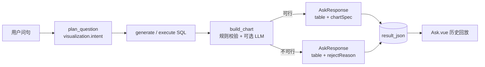

# 图表展示功能 · 开发计划

> 与 [01-MVP_DEVELOPMENT_PLAN.md](./01-MVP_DEVELOPMENT_PLAN.md) Phase 2「图表（AntV）」对齐的详细实现方案。  
> **状态**：已实现（2026-06-27）

---

## 1. 背景与现状

| 项 | 现状 |
|----|------|
| 产品宣传 | README / showcase 已提及「自动图表」 |
| 总体规划 | `01-MVP_DEVELOPMENT_PLAN.md` §14 列为 Phase 2 backlog（AntV） |
| 前端 | `Ask.vue` 仅 `el-table` 展示；`package.json` 无图表库 |
| Plan LLM | `plan_llm.py` 输出 complexity / multi_sql / steps，**无图表字段** |
| API | `AskResponse` 仅有 `columns` / `rows`，**无 chartSpec** |
| 历史回放 | `copilot_ask_turn.result_json` 存 columns/rows/answer；切换会话可恢复表格，**无图表** |

**目标**：Plan 阶段识别图表意图与类型倾向；SQL 执行后用规则引擎生成可渲染的 `chartSpec`；前端**表格与图表同时展示**；历史会话回放图表一并恢复。

---

## 2. 设计原则

1. **两阶段决策**：Plan 负责「意图」；执行后 `chart_builder` 负责「可行性 + 规格」——Plan 发生在 SQL 之前，无法预知列结构与行数。
2. **Fail-open 问数、Fail-closed 图表**：不可图表时**拒绝图表而非拒绝问数**，表格与自然语言回答照常返回。
3. **表格 + 图表并存**：图表是表格的可视化摘要，默认与表格同屏或 Tab 切换，不互相替代。
4. **最小侵入**：复用现有 `columns` / `rows`；`chartSpec` 为附加层，不改动 SQL Guard / DataScope 链路。
5. **历史可回放**：`chartSpec` 写入 `result_json`，与表格同源持久化，无需新表。

---

## 3. 总体架构



**LangGraph 接入点**（在 `verify_answer` 通过之后、`format_answer` 之前）：

```text
execute_sql / assemble → verify_answer → build_chart → format_answer
```

---

## 4. 数据模型

### 4.1 Plan JSON 扩展（`plan_llm.py` / `_normalize_plan`）

在现有 plan 上增加 `visualization` 块：

```json
{
  "visualization": {
    "enabled": true,
    "user_explicit": false,
    "preferred_types": ["line"],
    "reason": "问句含「最近7天每日趋势」，适合时间序列折线图",
    "fallback_to_table": true
  }
}
```

| 字段 | 类型 | 含义 |
|------|------|------|
| `enabled` | bool | 是否尝试出图（false = 仅表格，如明细列表） |
| `user_explicit` | bool | 用户是否明确要求图表/趋势/占比 |
| `preferred_types` | string[] | 优先级：`line` `bar` `column` `pie` `area` `scatter` `combo` `none` |
| `reason` | string | 供 trace / 调试 |
| `fallback_to_table` | bool | 不可图表时是否仍返回表格（默认 true） |

**Plan Prompt 补充规则**（写入 `plan_llm.py` system prompt）：

- 问句含「趋势 / 走势 / 每日 / 按月 / 曲线」→ `enabled=true`, `preferred_types=["line","area"]`
- 问句含「对比 / 排名 / TopN / 各项目 / 各部门」→ `bar` 或 `column`
- 问句含「占比 / 构成 / 份额 / 比例」→ `pie`（类别 ≤8 时）
- 问句要「明细 / 列表 / 导出 / 每条记录」→ `enabled=false`
- 单值聚合（如「本月总数是多少」）→ `enabled=false`
- 用户说「用图表展示」但语义是明细 → `enabled=false`，`reason` 说明仅表格更合适

**快路径（`plan_skipped=true`）覆盖**：

- `complexity=low` 仍跳过 agent loop，但 `_normalize_plan` / fallback plan 用**规则**从问句推断 `visualization`（零 LLM 成本兜底），或通过轻量 prompt 仅输出 visualization 子字段。

### 4.2 ChartSpec（API 响应 + 持久化）

新建 `backend/app/schemas/chart.py`（或扩展 `ask.py`）：

```python
class ChartSeriesSpec(CamelModel):
    name: str
    column: str          # 对应 columns 中的列名
    type: str | None     # line / bar，用于 combo

class ChartSpec(CamelModel):
    chart_type: str      # line | bar | column | pie | area | scatter | combo | none
    title: str | None
    x_column: str | None # 维度轴
    y_columns: list[str] # 度量列（pie 时通常 1 个）
    series: list[ChartSeriesSpec] | None
    options: dict | None # 堆叠、排序、limit 等
    status: str          # ready | rejected | skipped
    reject_reason: str | None
```

`AskResponse` 扩展：

```python
class AskResponse(CamelModel):
    ...
    chart_spec: ChartSpec | None = None
    visualization_intent: dict | None = None  # 来自 plan，便于前端展示「原计划 vs 实际」
```

`AskGraphState` 增加：`visualization_intent`、`chart_spec`。

### 4.3 历史持久化（`trace_log.build_result_json`）

```python
payload["chart_spec"] = chart_spec
payload["visualization_intent"] = visualization_intent
```

- `session_service.load_messages` 与 `Ask.vue` 的 `buildAssistantHistoryMessage` 透传上述字段。
- **无需 DB migration**：`result_json` 已是 JSON 列（V008）。

---

## 5. 后端开发任务

### 5.1 Phase 1：规则引擎 + 数据结构（1～2 天）

**新建 `backend/app/agent/chart_builder.py`**

```python
def build_chart_spec(
    *,
    columns: list[str],
    rows: list[list],
    visualization_intent: dict | None,
    question: str,
) -> ChartSpec:
    ...
```

**可图表性规则（程序判定，Fail-closed）**：

| 条件 | 结果 |
|------|------|
| `visualization.enabled == false` | `status=skipped` |
| 无 rows 或 row_count == 0 | `rejected`：「无数据」 |
| 1 行且仅 1 个数值列 | `rejected`：「单值结果不适合图表」 |
| 无数值列 | `rejected` |
| 无合适维度列（pie / bar / line 需要） | `rejected` |
| row_count > 500 | `rejected` 或截断 Top50 + 提示 |
| pie 且类别 > 12 | 改 bar 或 rejected |
| 宽表 pivot（`assembly_mode=join_by_date`） | 优先 line / combo，x=日期列 |

**维度 / 度量识别**：

- 复用 `result_assembler._is_numeric`
- 时间维：列名匹配 `日期|date|day|month|time` 或值形如 ISO 日期
- 度量：数值列；排除 id 类列（`id`, `sch_id`, `activity_id`）
- 在 `localize_result_columns` **之后** build chart（与 `runner.py` 一致）

**类型选择优先级**：

1. 若 plan `preferred_types` 与数据兼容 → 采用
2. 否则启发式：有时间维 + 多行 → `line`；单分类维 + 单度量 + ≤8 类 → `pie`；否则 `bar`
3. 多度量同 x → `combo` 或 grouped `bar`

**改动文件**：

| 文件 | 改动 |
|------|------|
| `backend/app/schemas/chart.py` | 新建 ChartSpec 模型 |
| `backend/app/schemas/ask.py` | AskResponse 扩展 |
| `backend/app/agent/chart_builder.py` | 新建规则引擎 |
| `backend/app/agent/state.py` | 新字段 |
| `backend/app/agent/graph.py` | 增加 `build_chart` 节点 |
| `backend/app/agent/runner.py` | 响应与 snapshot |
| `backend/app/observability/trace_log.py` | `build_result_json` 扩展 |
| `backend/app/memory/session_service.py` | messages 返回 chartSpec |
| `backend/tests/test_chart_builder.py` | 新建单测 |

### 5.2 Phase 2：Plan LLM 意图识别（1 天）

| 文件 | 改动 |
|------|------|
| `plan_llm.py` | 扩展 system prompt + JSON 示例 + `_normalize_plan` |
| `plan_nodes.py` | span 记录 visualization 决策 |
| `tests/test_plan_llm.py` | normalization 覆盖 |

**拒答策略**：

- Plan 阶段**不**因「不能图表」拒绝整次问数
- 若 `user_explicit=true` 且 `chart_spec.status=rejected`：`format_answer` 追加「当前结果无法生成合适图表：{reason}，以下为表格数据。」

### 5.3 Phase 3：可选 LLM 精修（1 天，可后置）

- 规则引擎 confidence 低时，小 prompt 输出 `{ chart_type, x_column, y_columns }`
- **必须**再跑程序校验；LLM 输出不合法则回退规则引擎
- 配置：`CHART_LLM_REFINE_ENABLED=false`（MVP 默认关）

### 5.4 Phase 4：SSE 与 Trace（0.5 天）

- `log_utils.py` 增加节点 label：「生成图表」
- SSE `done` 事件已带完整 `AskResponse`，协议不变
- `trace_log` final summary 增加 `chart_type` / `chart_status`

### 5.5 SQL 生成可选增强（Phase 2+）

若 `visualization.enabled=true` 且 preferred=line，在 SQL prompt 中加 hint：「SELECT 需包含时间粒度列，按时间 ORDER BY，行数建议 ≤ 366」。

---

## 6. 图表类型决策表

| 场景 | 推荐类型 | 必要条件 |
|------|----------|----------|
| 时间序列趋势 | `line` / `area` | 1 时间维 + ≥1 数值度量，≥2 行 |
| 分类对比 | `bar` / `column` | 1 分类维 + 1+ 度量，2～30 类 |
| 占比构成 | `pie` | 1 分类维 + 1 度量，2～8 类，总和有意义 |
| 双指标不同量纲 | `combo` | 1 维 + 2 度量（如人数 + 率） |
| 两数值关系 | `scatter` | 2 数值列，≥5 点 |
| 宽表多活动对比 | `line` multi-series | x=日期，y=各活动指标列 |
| 明细列表 | `none` | 多文本列、行数多、无聚合 |

**reject_reason 示例**：

- 「共 1 行 1 列，为单一汇总值，建议使用表格查看」
- 「结果含 120 个类别，饼图无法清晰展示，已改为柱状图 Top20」
- 「无数值列，无法生成图表」

---

## 7. 前端开发任务

### 7.1 依赖选型

| 方案 | 优点 | 缺点 |
|------|------|------|
| **ECharts + vue-echarts**（MVP 推荐） | Vue 生态成熟、饼/柱/线齐全 | 与 AntV 总体规划不一致 |
| **@antv/g2plot** | 与 DEVELOPMENT_PLAN 一致 | 需自行封装 Vue 组件 |

`ChartSpec` 稳定后，渲染层可替换；业务逻辑与 AntV / ECharts 解耦。

### 7.2 组件结构

```text
frontend/src/components/
  ResultChart.vue      # 根据 chartSpec + columns/rows 渲染
  ResultPanel.vue      # 表格 + 图表布局（Tab 或上下分栏）

frontend/src/utils/
  chartAdapter.js      # columns/rows → ECharts option
```

**布局示意**：

```text
┌─────────────────────────────────────┐
│ 自然语言 answer                      │
├─────────────────────────────────────┤
│ [图表] [表格]  ← el-tabs 或双栏同显    │
│  ┌──────────┐  ┌──────────────────┐ │
│  │ Chart    │  │ el-table         │ │
│  └──────────┘  └──────────────────┘ │
└─────────────────────────────────────┘
```

- `chart_spec.status === 'ready'` → 渲染图表
- `rejected` → 灰色提示 + 仅表格
- `skipped` → 仅表格

### 7.3 `Ask.vue` 改动

| 位置 | 改动 |
|------|------|
| SSE `onDone` | `msg.chartSpec = res.chartSpec` |
| `buildAssistantHistoryMessage` | 从 snapshot 恢复 chartSpec |
| template 查询结果区 | 用 `ResultPanel` 替换纯 `el-table` |
| 分步 intermediateSteps | MVP 不对中间步出图，仅最终 assembled 结果 |

### 7.4 依赖

`frontend/package.json` 增加 `echarts`、`vue-echarts`（或 AntV 方案）。

---

## 8. 分阶段交付（Sprint）

### Sprint 1 — MVP（约 3～4 天）

- [ ] `ChartSpec` schema + `AskResponse` 扩展
- [ ] `chart_builder.py` 规则引擎（line / bar / pie / none）
- [ ] Graph 节点 `build_chart`
- [ ] `build_result_json` / session 历史透传
- [ ] 前端 `ResultChart` + 表格并排
- [ ] 单测 `test_chart_builder.py`

### Sprint 2 — Plan 意图（约 2 天）

- [ ] `plan_llm` visualization 字段 + normalize
- [ ] fallback plan 规则推断
- [ ] Plan 单测 + 集成测试（mock LLM）

### Sprint 3 — 体验（约 2 天）

- [ ] 用户明确要求图表时的 reject 文案
- [ ] 宽表 / `join_by_date` 的 combo 图
- [ ] 移动端响应式
- [ ] 偏好设置可选「默认展示：图表优先 / 表格优先」

### Sprint 4 — 可选

- [ ] LLM refine 低置信度映射
- [ ] AntV 替换 ECharts
- [ ] 导出 PNG

---

## 9. 测试用例

### 9.1 后端单元测试

| 输入 | 期望 chart_type | 期望 status |
|------|-----------------|-------------|
| `[日期, 人数]` × 7 行 | line | ready |
| `[项目, 个数]` × 5 行 | bar | ready |
| `[项目, 占比]` × 4 行，intent=pie | pie | ready |
| `[cnt]` × 1 行 | none | rejected |
| 空 rows | none | rejected |
| 50 列宽表 + 日期 | line multi-series | ready |

### 9.2 前端

- 实时问数：表格 + 图表同时出现
- 切换会话：历史消息图表仍渲染
- `chart_spec=null`：仅表格，不报错
- `rejected`：显示原因，表格正常

### 9.3 E2E 问句样例

1. 「最近 7 天每日参与人数」→ line + table
2. 「各运动项目参与人数对比」→ bar + table
3. 「本月总参与人数」→ table only（rejected / skipped）
4. 「给我明细列表」→ table only（plan enabled=false）

---

## 10. 风险与对策

| 风险 | 对策 |
|------|------|
| LLM Plan 乱设 enabled=true | 执行后规则引擎兜底 reject |
| result_json 体积增大 | chartSpec 只存配置；rows 仍受 `_MAX_RESULT_ROWS` 限制 |
| 列名中文 / 动态 pivot 难映射 | 统一在 `localize_result_columns` 之后 build |
| 分步 SQL 中间结果 | MVP 仅对 assembled 最终结果出图 |
| 7B 模型 Plan JSON 不稳定 | `_normalize_plan` 严格默认值；缺失 visualization 视为 enabled=false |

---

## 11. 关键文件清单

| 层级 | 文件 | 改动摘要 |
|------|------|----------|
| 文档 | `docs/12-CHART_VISUALIZATION_PLAN.md` | 本文 |
| Schema | `backend/app/schemas/ask.py` | chart_spec 字段 |
| Schema | `backend/app/schemas/chart.py` | 新建 |
| Plan | `backend/app/agent/plan_llm.py` | visualization 意图 |
| 核心 | `backend/app/agent/chart_builder.py` | 新建 |
| Graph | `backend/app/agent/graph.py` | build_chart 节点 |
| State | `backend/app/agent/state.py` | 新字段 |
| 持久化 | `backend/app/observability/trace_log.py` | result_json |
| Runner | `backend/app/agent/runner.py` | 响应与 snapshot |
| Session | `backend/app/memory/session_service.py` | 历史 messages |
| 前端 | `frontend/src/components/ResultChart.vue` | 新建 |
| 前端 | `frontend/src/components/ResultPanel.vue` | 新建 |
| 前端 | `frontend/src/views/Ask.vue` | 集成 + 回放 |
| 依赖 | `frontend/package.json` | echarts |

---

## 12. 与现有链路对照

```text
plan_question
  └─ visualization.intent          ← 新增（LLM + 规则兜底）

generate_sql / agent_loop
  └─ 可选：enabled=true 时 SQL prompt hint 保留时间维

assemble_intermediate_results
  └─ 输出最终 columns/rows        ← 已有

build_chart                        ← 新增节点
  └─ chart_spec

format_answer
  └─ chart rejected + user_explicit → 追加说明

runner._finish_turn
  └─ result_json 持久化 chart_spec  ← 历史回放关键
```

---

## 7. Phase 2 · Chart SSR（P2-A）

在线 `ChartSpec` + 前端 AntV/ECharts 已实现（本文 §1～6）。**Phase 2** 将新增 **Chart SSR 统一渲染**（借鉴 [SQLBot g2-ssr](https://github.com/dataease/SQLBot) 思路）：

- `ChartSpec` → Node SSR 服务 → PNG/SVG  
- **Ask**、**Insight PDF**、长报告 HTML **共用同一出图链路**  
- 替代/降级现有 `matplotlib`（`chart_png.py`），解决中文与样式不一致  

详见 **[03-PHASE2_ROADMAP.md §2](./03-PHASE2_ROADMAP.md#2-p2-a--chart-ssr-统一渲染)**。

---

*最后更新：2026-07-11*
