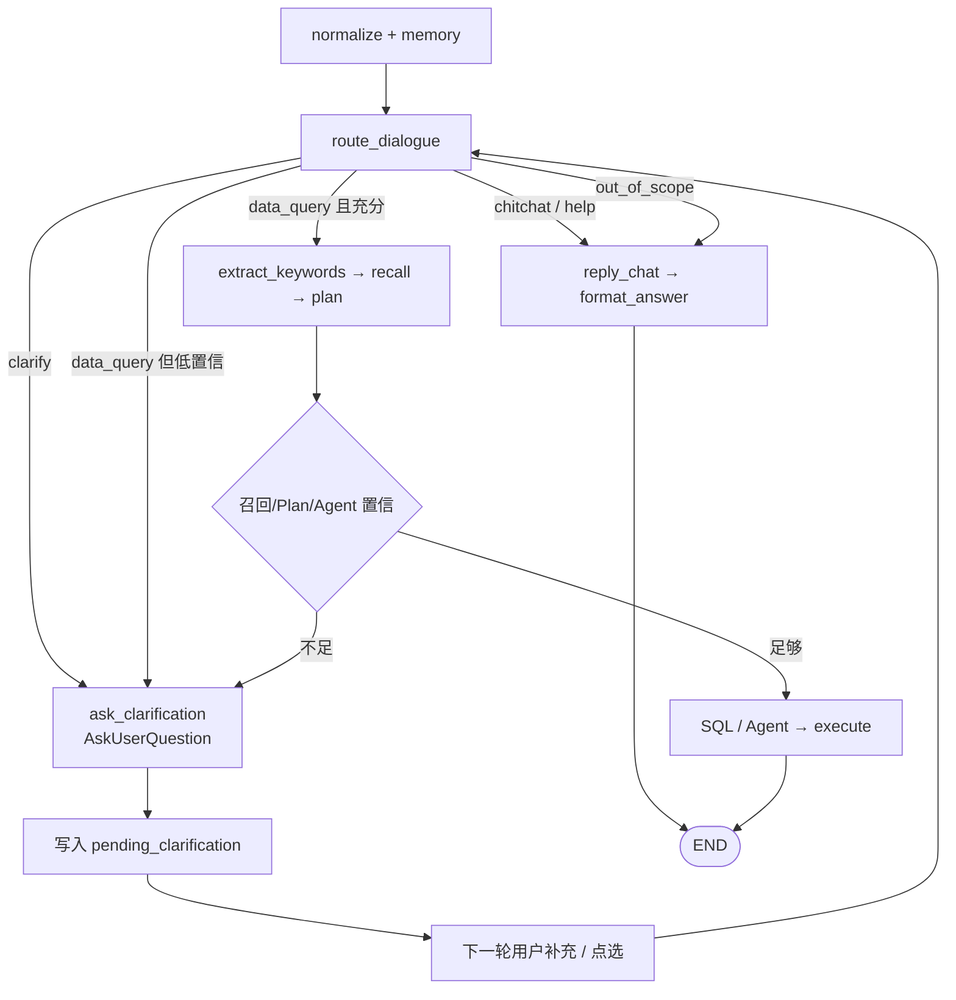

# 对话门禁与多轮澄清 · 开发计划

> **状态**：待开发（方案已定）  
> **版本**：v1.4 · 2026-08-11  
> **范围**：闲聊短路、域外拒答、缺槽澄清、低置信召回闸门；多轮半截问句合并后再执行；**AskUserQuestion 主动提问工具**；**澄清线程与成功问数隔离**；**与 L1 短期记忆协同**；开源参考（门禁 + AskUser）  
> **原则**：在现有 LangGraph 问数图上**加门禁**，不推倒 Plan / Agent Loop / 分步 SQL  
> **关联文档**：[01-MVP_DEVELOPMENT_PLAN.md](./01-MVP_DEVELOPMENT_PLAN.md) §11.5（会话记忆）、[13-ASK_STREAM_UI_PLAN.md](./13-ASK_STREAM_UI_PLAN.md)、[92-EVAL_QUESTIONS.md](./92-EVAL_QUESTIONS.md)  
> **参考**：[WorkBuddy · AskUserQuestion 设计哲学](https://cloud.tencent.com/developer/article/2703129)（结构化提问、选项克制、人机协作）

---

## 目录

1. [背景与现状](#1-背景与现状)
2. [目标与非目标](#2-目标与非目标)
3. [设计原则](#3-设计原则)
4. [总体架构](#4-总体架构)
5. [对话动作与槽位模型](#5-对话动作与槽位模型)
6. [AskUserQuestion：主动提问工具](#6-askuserquestion主动提问工具)
7. [LangGraph 改造](#7-langgraph-改造)
8. [API 与 SSE 契约](#8-api-与-sse-契约)
9. [会话记忆：pending 澄清态](#9-会话记忆pending-澄清态)
10. [召回 / Plan 二次闸门](#10-召回--plan-二次闸门)
11. [前端体验](#11-前端体验)
12. [分阶段实施](#12-分阶段实施)
13. [配置项](#13-配置项)
14. [评测与验收](#14-评测与验收)
15. [风险与降级](#15-风险与降级)

---

## 1. 背景与现状

### 1.1 产品问题

| 场景 | 用户表现 | 当前行为 | 不良后果 |
|------|----------|----------|----------|
| 闲聊 | 「你好」「你能做什么」 | 全量召回 → Plan → 尝试 SQL | 错表、空结果、浪费 LLM/库 |
| 半截问 | 「帮我看看跳绳」 | 强行补全并执行 | 答非所问 |
| 模糊问 | 「最近怎么样」 | 低相关召回仍生成 SQL | 错误执行、信任损伤 |
| 多轮补全 | 先问一半，再补时间/指标 | 仅有指代改写（「那上周呢」） | 无法「先问再查」 |

### 1.2 现有链路（缺口）

```text
normalize → load_session_memory → load_user_preference → process_memory_context
  → extract_keywords → 全量召回 → L1 → plan_question
  → generate_sql | agent_loop → validate → execute → verify → format_answer
```

| 能力 | 现状 |
|------|------|
| 对话意图分流 | **无**；每句话默认进召回+SQL |
| `plan.intent` | 查询形态（`simple_aggregate` 等），**不是**对话动作 |
| 缺槽澄清 | **无**；只有规则指代改写（`reference_resolver`） |
| 召回置信闸门 | **弱**；低分仍继续生成 |
| 多轮半截问题 | 图**无** checkpoint / interrupt；一轮必须跑完 |
| `AskResponse.status` | 主要为 `success` / `fail`，**无** `need_clarification` / `chitchat` |

### 1.3 可复用资产

| 资产 | 路径 | 用途 |
|------|------|------|
| 会话记忆 L1 | `memory_nodes` / `SessionMemory` / `slot_json` | 存 `pending_clarification` |
| 指代改写 | `memory/reference_resolver.py` | 与澄清合并顺序：先 pending，再指代 |
| Plan 路由 | `plan_nodes.route_after_plan` | 扩展 `clarify` 出口 |
| SSE `done` | `AskResponse` | 扩展 status + clarification |
| 前端消息态 | `Ask.vue` / EmbedAsk | 渲染追问气泡与选项 |

---

## 2. 目标与非目标

### 2.1 目标

1. **闲聊 / 能力说明 / 域外问题**：零召回、零 SQL，直接自然语言回复。  
2. **缺关键槽位**：通过 **AskUserQuestion** 主动追问（最多 1～2 轮），不执行查询。  
3. **意图清晰的问数**：保持现有 Plan / Agent / SQL 路径不变。  
4. **低置信召回 / Plan / Agent 判定条件不足**：同一套 AskUserQuestion 停下执行，禁止瞎查。  
5. **API / 前端可区分**：`need_clarification`、`chitchat` 与 `success`/`fail` 分流展示。

### 2.2 非目标（本计划不做）

- 不上 LangGraph 持久化 checkpoint + human-in-the-loop（与现有 session memory 重复，成本高）。  
- 不为闲聊单独建 ReAct Agent。  
- 不做全量多轮向量 episodic memory。  
- 默认不做「猜一个最像的 SQL 先跑」；模糊时优先澄清。  
- 不改 Java 业务工程；不新增 SQLite。

---

## 3. 设计原则

1. **先分流，再问数**：执行门禁尽量靠前；闲聊不得进入召回。  
2. **保守执行**：错答成本高于多问一轮；缺槽 / 低置信默认 **AskUserQuestion**，不执行。  
3. **最小侵入**：新增节点 + 条件边；复用 `SessionMemory`、`AskResponse`、SSE。  
4. **澄清有上限**：单主题最多追问 2 轮；单次提问 ≤4 题、每题 ≤4 选项（默认更少）。  
5. **Fail-open 可配置**：门禁 LLM 失败时，可降级为「按原问句继续问数」或「安全拒答」（默认偏保守：标记 degraded 并继续，但打 span 可观测）。  
6. **与指代共存**：`pending_clarification` 优先于 `resolve_references`。  
7. **结构化优于自由文本**：选项 + recommended 引导；仍保留自由补充入口。

---

## 4. 总体架构



**对话动作（dialogue_act）**：

| 动作 | 含义 | 后续 |
|------|------|------|
| `chitchat` | 寒暄、能力说明、与数据无关闲聊 | `reply_chat`，零召回 |
| `out_of_scope` | 明显非本系统数据域 | 礼貌拒答 + 可问范围引导 |
| `clarify` | 意图像问数但缺槽 / 过糊 | `ask_clarification` |
| `data_query` | 可执行或可尝试的问数 | 现有召回链路 |

---

## 5. 对话动作与槽位模型

### 5.1 `route_dialogue` 输出（结构化）

```json
{
  "dialogue_act": "chitchat|clarify|data_query|out_of_scope",
  "confidence": 0.86,
  "resolved_question": "本校近30天跳绳参与人数趋势",
  "missing_slots": ["time_range", "metric"],
  "filled_slots": {
    "entity": "跳绳",
    "scope": "本校"
  },
  "clarify_question": "你想看哪个时间范围？例如近7天、本月、本学期。",
  "clarify_options": ["近7天", "本月", "本学期"],
  "assumptions": [],
  "reason": "有实体无时间与指标"
}
```

| 字段 | 说明 |
|------|------|
| `dialogue_act` | 路由主键 |
| `confidence` | 0～1；低于阈值按 `clarify` 或降级策略处理 |
| `resolved_question` | 结合 pending / 指代后的独立问句；供召回与 Plan 使用 |
| `missing_slots` | 标准槽：`time_range` / `metric` / `entity` / `scope` / `dimension` |
| `clarify_question` | 展示给用户的追问（单轮只问 1～2 个点） |
| `clarify_options` | 可选快捷选项（前端 chip）；可空 |
| `assumptions` | P2 可选：用户授权「按假设查询」时使用 |

### 5.2 规则短路（零 LLM）

高确定性模式先走规则，降低延迟与误分类：

| 模式（示例） | 动作 |
|--------------|------|
| `^(你好|您好|在吗|嗨|hello)$` | `chitchat` |
| 含「你是谁 / 能做什么 / 怎么用」 | `chitchat`（能力说明模板） |
| 极短无业务词（≤2 字且非指标别名） | `clarify` 或 `chitchat` |
| 明显注入攻击句式 | 仍走现有 Prompt 安全 / Guard，**不**当闲聊放行执行 |

其余交给轻量 LLM（可与 chat 同模型，temperature 低、短 JSON）。

### 5.3 标准槽位（问数最小充分集）

| 槽位 | 是否常缺 | 缺省策略（P0） |
|------|----------|----------------|
| `metric` / 可度量意图 | 高 | **必须澄清**或能从 L1/指标库唯一命中 |
| `time_range` | 高 | **必须澄清**（不做隐式「全历史」） |
| `entity`（项目/活动等） | 中 | 问句已点名则可；否则澄清或候选列表 |
| `scope`（本校/全平台） | 中 | 可默认角色范围内「本校」，并在 answer 中声明假设 |

P0 硬规则建议：**无时间且无明确「累计/总共」口径 → clarify**；**无任何指标/度量词且召回指标 top1 过低 → clarify**。

---

## 6. AskUserQuestion：主动提问工具

> 结论：**能主动提问**——半截问、意图不清、条件不足时，系统应停下执行并开口问用户，而不是猜 SQL。  
> 借鉴 [WorkBuddy AskUserQuestion](https://cloud.tencent.com/developer/article/2703129)：把「向用户提问」做成**一等公民工具/载荷**，结构化选项优于纯自由文本，并保持克制。

### 6.1 与 WorkBuddy 的对照

| WorkBuddy 理念 | 本系统落地 |
|----------------|------------|
| Agent 沉默是缺陷；该问就问 | 门禁 / Plan / Agent Loop 任一阶段可触发提问，**禁止继续 execute_sql** |
| `AskUserQuestion` 是工具 | 统一载荷 `AskUserQuestionPayload`；早闸由节点发出，Agent 路径可调用同名工具 |
| 结构化优于自由文本 | 每题带 `options` + 可选 `recommended`；仍允许「其他」自由输入 |
| 一次最多约 4 个问题 | `questions.length ≤ 4`（问数场景 P0 建议默认 ≤2，降低负担） |
| 每题最多约 4 个选项 | `options.length ≤ 4` |
| 推荐标记引导默认 | `option.recommended=true` 前端高亮「建议」 |
| 人机协作非替代 | 澄清不算 fail；用户可点选或改写后再跑 |

### 6.2 谁可以发起提问（三处触发）

```text
① route_dialogue（最早）
   半截问 / 闲聊分流后的 clarify / 置信不足
        ↓
② plan_question（召回之后）
   ready_to_execute=false / missing_slots / ambiguities
        ↓
③ agent_loop（最晚）
   工具探查后仍歧义（如两个指标同分）→ 调用 ask_user_question 工具并结束本轮
```

三者**输出同一契约**，前端只认一种 UI，避免三套追问组件。

| 触发点 | 典型场景 | 是否已召回 |
|--------|----------|------------|
| ① 门禁 | 「帮我看看跳绳」缺时间/指标 | 否（省成本） |
| ② Plan | 问句完整但口径歧义、多锚点表 | 是（选项可来自候选） |
| ③ Agent | `search_metrics` 返回多个近义指标 | 是（选项来自 observation） |

### 6.3 统一载荷（AskUserQuestion）

替代/演进原扁平 `clarify_question` + `clarify_options`：P0 可先扁平兼容，P1 升为多题结构。

```json
{
  "ask_user_question": {
    "title": "还需要确认一下",
    "reason": "已识别「跳绳」，但缺少时间范围与指标",
    "questions": [
      {
        "id": "time_range",
        "prompt": "想看哪个时间范围？",
        "allow_free_text": true,
        "options": [
          { "id": "7d", "label": "近7天", "recommended": true },
          { "id": "month", "label": "本月" },
          { "id": "term", "label": "本学期" },
          { "id": "custom", "label": "我自己说" }
        ]
      },
      {
        "id": "metric",
        "prompt": "关注哪个指标？",
        "allow_free_text": true,
        "options": [
          { "id": "participants", "label": "参与人数", "recommended": true },
          { "id": "person_times", "label": "参与人次" }
        ]
      }
    ]
  }
}
```

| 约束 | 值 | 说明 |
|------|-----|------|
| 单次问题数 | ≤ 4（默认 ≤ 2） | 一次问太多会劝退；多槽分轮问 |
| 每题选项数 | ≤ 4 | 认知负担；多余进「其他」 |
| 推荐项 | 每题 ≤ 1 个 `recommended` | 引导默认，不自动替用户选定执行 |
| 自由输入 | `allow_free_text` | chip + 输入框并存 |

### 6.4 Agent 工具形态（P1）

在现有 `TOOL_REGISTRY`（`describe_table` / `search_metrics` …）旁增加**非执行库工具**：

```text
ask_user_question
  args: { questions: [...], reason?: string }
  效果: 不查库；写 state.clarification；agent_loop_done=true；
        status=need_clarification；本轮图走到 format_answer
```

`decide_agent_action` 增加动作：

```json
{ "action": "ask_user", "tool": "ask_user_question", "args": { ... } }
```

与 `finish`（信息足够 → 生成 SQL）相对：**信息不足 → ask_user，绝不 finish 后瞎生成**。

> **不做** WorkBuddy 式进程内阻塞等待：本系统仍是「本轮 `/ask` 结束 → 用户下轮再 POST」。  
> 语义等价于 AskUserQuestion，实现上用 `pending_clarification` 承接答案，而不是 LangGraph interrupt 挂起线程。

### 6.5 用户作答回流

```text
用户点选 / 输入
  → 下一轮 question（或结构化 answers 可选字段）
  → route_dialogue 读 pending + 合并 answers
  → 槽位齐 → data_query；否则继续 AskUserQuestion（ask_count+1）
```

P1 可选请求扩展（非必须）：

```json
{
  "question": "近7天参与人数",
  "clarificationAnswers": [
    { "questionId": "time_range", "optionId": "7d" },
    { "questionId": "metric", "optionId": "participants" }
  ]
}
```

无该字段时，纯自然语言补充仍可用（与现网输入框兼容）。

### 6.6 主动提问的边界（克制）

| 允许开口问 | 不要问 |
|------------|--------|
| 缺时间 / 指标 / 实体导致无法安全出 SQL | 已能唯一推断的槽（如角色强制本校） |
| 多个指标/表分数接近 | 把 SQL 细节、表名抛给业务用户选 |
| 宽范围高风险查询确认（P2） | 一次甩出 >4 题或每题 >4 选项 |
| Agent 探查后仍歧义 | 用提问掩盖召回失败（应明示「未找到相关数据」） |

---

## 7. LangGraph 改造

### 7.1 新增 / 调整节点

| 节点 | 职责 |
|------|------|
| `route_dialogue` | 读 memory + pending；规则/LLM 输出 dialogue 结构；写 `dialogue_act`、`resolved_question`、`missing_slots` 等 |
| `reply_chat` | 闲聊/域外模板或轻量 LLM 答复；设 `status=chitchat` 或 `out_of_scope` |
| `ask_clarification` | 生成/落盘 clarification；写 `pending_clarification`；`status=need_clarification`；**不进召回** |
| `route_after_plan`（扩展） | `ready_to_execute=false` → `ask_clarification` |
| `merge_retrieved_info`（扩展） | 召回分数过低 → 设 error/clarify 标志，供后续路由 |

### 7.2 边变更（示意）

```text
process_memory_context → route_dialogue
route_dialogue ──chitchat/out_of_scope──► reply_chat → format_answer → END
route_dialogue ──clarify────────────────► ask_clarification → format_answer → END
route_dialogue ──data_query─────────────► extract_keywords → … → plan_question
plan_question  ──ready──────────────────► generate_sql | agent_loop
plan_question  ──not_ready──────────────► ask_clarification → format_answer → END
agent_loop     ──ask_user_question──────► ask_clarification → format_answer → END
```

### 7.3 `AskGraphState` 扩展字段

```python
dialogue_act: str | None
dialogue_confidence: float | None
resolved_question: str | None
missing_slots: list[str]
clarify_question: str | None          # P0 扁平兼容
clarify_options: list[str]            # P0 扁平兼容
ask_user_question: dict | None        # AskUserQuestionPayload
pending_clarification: dict | None  # 从 memory 读入 / 写出
ready_to_execute: bool
```

`recall_question` / Plan / SQL 一律优先使用 `resolved_question`（若有）。

### 7.4 与现有 memory 顺序

```text
load_session_memory
  → load_user_preference
  → process_memory_context   # STAR 等
  → route_dialogue           # ① 合并 pending ② 再考虑指代 ③ 分流
```

指代解析可内聚进 `route_dialogue`，或保留独立函数由该节点调用；避免两处各改一遍问句。

---

## 8. API 与 SSE 契约

### 8.1 `AskResponse` 扩展

```python
status: str  # success | fail | need_clarification | chitchat | out_of_scope
dialogue_act: str | None = None
clarification: ClarificationPayload | None = None  # 含 ask_user_question 或扁平字段

class ClarificationOption(CamelModel):
    id: str
    label: str
    recommended: bool = False

class ClarificationQuestion(CamelModel):
    id: str
    prompt: str
    allow_free_text: bool = True
    options: list[ClarificationOption] = []

class ClarificationPayload(CamelModel):
    """兼容 P0 扁平字段 + P1 AskUserQuestion 多题结构。"""
    question: str | None = None          # 总述 / 单题文案（扁平）
    missing_slots: list[str] = []
    options: list[str] | None = None     # 扁平 chip（P0）
    partial_question: str | None = None
    title: str | None = None
    reason: str | None = None
    questions: list[ClarificationQuestion] | None = None  # AskUserQuestion
```

兼容约定：

- 旧前端不认识新 status 时，至少 `answer` 有可读追问文案；`columns`/`rows` 为空。  
- `need_clarification` **不算 fail**（不计入错误率主指标；可单独统计）。  
- `chitchat` / `out_of_scope`：无 SQL、无图表。  
- 有 `questions` 时前端优先渲染多题表单；否则回退 `question` + `options`。

### 8.2 SSE

| 事件 | 变化 |
|------|------|
| `progress` | 增加节点 `route_dialogue` / `ask_clarification` / `reply_chat` / `ask_user_question` 的中文 label |
| `done` | 载荷含新 `status` + `clarification` |
| 可选 `activity` | `正在判断问题类型…` / `需要补充信息…` |

### 8.3 会话历史回放

`SessionMessageItem` / `result_json` 同步持久化：

- `status`
- `clarification`（若有，含 AskUserQuestion）
- `dialogue_act`

历史气泡需能区分「助手在追问」与「查询失败」。

---

## 9. 会话记忆：pending 澄清态

### 9.1 存储位置

复用会话级 `slot_json`（或 turn 旁路字段），**不新建表**（P0）：

```json
{
  "last_sql": "...",
  "pending_clarification": {
    "original_question": "帮我看看跳绳",
    "resolved_partial": "跳绳相关查询",
    "missing_slots": ["time_range", "metric"],
    "ask_user_question": { "title": "...", "questions": [] },
    "clarify_question": "你想看参与人数还是参与人次？时间范围呢？",
    "candidates": {
      "metrics": ["参与人数", "参与人次"]
    },
    "ask_count": 1,
    "trace_id": "...",
    "created_at": "ISO-8601"
  }
}
```

### 9.2 状态机

```text
无 pending
  └─ 用户提问 → route_dialogue
       ├─ clarify → 写 pending(ask_count=1)，返回 AskUserQuestion
       └─ data_query → 清 pending（若有），执行

有 pending
  └─ 用户补充 / clarificationAnswers → 合并槽位 / 改写 resolved_question
       ├─ 仍缺且 ask_count < MAX(2) → 再 AskUserQuestion，ask_count++
       ├─ 槽位齐 → 清 pending，data_query
       └─ ask_count 达上限 → 清或保留 pending；返回引导换完整问法（不执行）
```

### 9.3 取消澄清

- 「新对话」：新 `sessionId`，pending 自然隔离。  
- 用户明确「取消 / 算了」：规则识别后清除 pending，返回简短确认。  
- 切换学校：pending 可保留语义，但执行时仍以当前 Scope 为准（与 §11.5 一致）。

### 9.4 与「上一轮完整问数」隔离（防串话）

核心原则：**澄清只跟 `pending_clarification` 绑在一起；上一轮成功问数只进 `last_turn` 槽位，二者默认不互相吞并。**

#### 两套记忆通道

| 通道 | 存什么 | 谁消费 | 何时清空 |
|------|--------|--------|----------|
| `pending_clarification` | 当前未完成的半截问线程 | 仅澄清合并 | 成功出数 / 取消 / 换题 / 超轮次 / 新 session |
| `last_turn`（既有槽位） | 最近一次 **成功** 问数的 question/SQL/tables | 仅指代（「那上周呢」） | 被下一轮成功问数覆盖；**澄清轮不写入 last_turn** |

```text
成功问数 A 完成后：
  pending = null
  last_turn = A

用户又开半截问 B：
  pending = B 的线程（thread_id 新生成）
  last_turn 仍是 A，但澄清合并时禁止读 A 的 question 来拼接

用户答完 B 并成功：
  pending = null
  last_turn = B（覆盖 A）
```

#### 硬规则（实现必须遵守）

1. **无 pending → 绝不做「半截合并」**  
   本轮问句按独立问句处理；最多走指代（且仅当命中指代句式时才用 `last_turn`）。

2. **有 pending → 默认只与 pending 合并，不拼接 last_turn.question**  
   `resolved = f(pending.original + pending.filled + 本轮作答)`  
   禁止：`resolved = last_turn.question + 本轮作答`（那会把上一题完整问句串进来）。

3. **澄清轮不更新 last_turn**  
   `need_clarification` / `chitchat` 的 turn 可落库做 UI 历史，但 **不写入** 供指代用的成功槽位。

4. **pending 带 `thread_id`**  
   前端点选提交时带回 `clarificationThreadId`；与当前 pending 不一致则忽略作答（防点了旧卡片）。

5. **换题检测（topic switch）→ 丢弃 pending，另起炉灶**  
   有 pending 时，若本轮被判定为「新问题」而非「对上一追问的回答」，则：
   - 清除旧 pending  
   - 本轮按无 pending 重新 `route_dialogue`  
   - 不把旧半截问与新问句拼接  

   判定信号（规则 + 轻量 LLM，命中任一即可换题）：

   | 信号 | 示例 |
   |------|------|
   | 显式取消 | 「取消」「算了」「不问这个了」 |
   | 完整新问句 | 本轮已自带时间+指标+实体，且与 pending.entity 明显不同 |
   | 实体切换 | pending 在谈「跳绳」，用户突然问「足球报名人数」 |
   | 前端「换个问题」 | UI 按钮直接清 pending 再发 |
   | 结构化作答缺失且不像补槽 | 长句、无 clarificationAnswers、语义独立 |

6. **指代与澄清互斥优先级**  

```text
if pending:
    只走澄清合并或换题；不做「那上周呢」式指代到 last_turn
elif 命中指代句式:
    用 last_turn 改写
else:
    独立问句
```

7. **成功出数立即清 pending**  
   任何 `status=success` 且实际执行了 SQL 的路径，结束时 `pending=null`，避免下一轮还把补丁贴到已完成话题上。

#### 反例（必须挡住）

| 错误串话 | 防护 |
|----------|------|
| 上题「本校近7天跳绳人数」成功后，用户说「足球」，被拼成「本校近7天跳绳人数足球」 | 无 pending 时「足球」是新半截问，只开新 pending，不读 last_turn 来拼接 |
| 澄清中用户改口问完整新题，仍拼进旧 pending | 换题检测清 pending |
| 用户点了两轮前的旧选项卡片 | `thread_id` 校验失败则忽略 |
| 澄清失败/取消后，下一句仍带旧 missing_slots | 取消与超轮次清 pending |

#### pending 结构补强

```json
{
  "pending_clarification": {
    "thread_id": "clr_01J...",
    "original_question": "帮我看看跳绳",
    "filled_slots": { "entity": "跳绳" },
    "missing_slots": ["time_range", "metric"],
    "ask_count": 1,
    "source": "dialogue_gate|plan|agent",
    "created_at": "ISO-8601"
  }
}
```

### 9.5 与 L1 短期记忆的协同（防冲突）

短期记忆（现网）和澄清 pending **不是两套对立系统**，而是同一会话里的**不同通道**；冲突只出现在「谁有权改写本轮问句」边界不清时。

#### 现网 L1 在做什么

| 能力 | 实现 | 数据来源 |
|------|------|----------|
| 加载槽位 | `load_session_memory` | 仅 `status=success` 且有 `final_sql` 的 turn |
| STAR / 指代改写 | `process_memory_context` | 上一轮成功问句 / SQL |
| Prompt 注入 | `memory_prompt_text` | last_turn + summary，供 SQL 生成参考 |
| `slot_json` | `last_sql` / `last_question` 等 | 成功问数摘要 |

澄清轮本身**不会**进入上述成功槽位（与现网「只读 success」一致），因此 pending 不会污染 `last_turn`。

#### 真正会打架的点

| 冲突 | 原因 | 处理 |
|------|------|------|
| STAR 先改写，再澄清合并 | 图序若先 `process_memory_context` 再 `route_dialogue`，补槽句「近7天」可能被 STAR 拼到**上一完整题**上 | **有 pending 时：禁止 STAR/指代改写问句**；只做澄清合并 |
| 补槽句被当成指代 | 「同上」「刚才」命中 `reference_resolver` | pending 激活时跳过指代 |
| 澄清合并后 STAR 再改一次 | 双重改写 | `route_dialogue` 产出的 `resolved_question` 为最终问句；下游不得再覆盖 |
| Prompt 仍注入旧题 SQL | 澄清结束后进 SQL 时，旧上下文干扰 | 允许注入 last_turn 作参考，但 **system 标明「本轮已解析问句以 resolved 为准」**；有 pending 的澄清轮根本不进 SQL |

#### 推荐图序与门控

```text
load_session_memory
  → load_user_preference
  → route_dialogue          # 先看 pending / 分流
       │
       ├─ 有 pending 且本轮是补答
       │     → 合并 → resolved_question
       │     → process_memory_context(skip_rewrite=true)  # 可只拼 preference，不改问句
       │     → 槽齐则召回…
       │
       ├─ 有 pending 且换题/取消
       │     → 清 pending → 按无 pending 重走
       │
       └─ 无 pending
             → process_memory_context  # 现网 STAR/指代照常
             → chitchat / clarify / data_query …
```

> 若改造成本要求少动边：也可保持 `process_memory_context` 在前，但必须传入 `pending`，并在 LLM/规则里设 **`if pending: inherit=false, resolved_question=原问句`**，效果等价。

#### 职责划分（不冲突的一句话）

| 模块 | 负责 | 不负责 |
|------|------|--------|
| **pending 澄清** | 半截问补槽、AskUserQuestion 线程 | 成功题之间的「那上周呢」 |
| **L1 短期记忆** | 成功题指代、SQL few-shot 上下文 | 未完成澄清的槽位合并 |
| **L2 偏好** | 跨对话显式偏好 | 与 pending 无关，始终可注入 |

```text
问句改写优先级（高 → 低）：
  1. pending 澄清合并 / 换题
  2. L1 指代 / STAR（仅无 pending）
  3. 本轮原始 question
```

#### 兼容性结论

- **不会**因为加了门禁就废掉短期记忆：完整问数之后的「那上周呢」仍走 L1。  
- **不会**让短期记忆把半截澄清拼到上一完整题：pending 门控 + 成功槽位过滤。  
- 需要改的是 **编排顺序/门控**，不是推倒 Memory 模块。

---

## 10. 召回 / Plan 二次闸门

前置门禁无法 100% 挡住「像问数但库里没有」的情况，故在召回与 Plan 后再挡一层。

### 10.1 召回分数门槛

在 `merge_retrieved_info`（或紧随其后）：

| 条件 | 动作 |
|------|------|
| 表 top1 score < `DIALOGUE_RECALL_TABLE_MIN` | 倾向 clarify / 「未找到相关表」 |
| 指标问句且 metric top1 < `DIALOGUE_RECALL_METRIC_MIN` | AskUserQuestion（候选指标作 options） |
| 召回结果为空 | 不进入 generate_sql |

具体分数口径与现有 hybrid 召回字段对齐（实现时读 `RecalledTable.score` 等）。

### 10.2 Plan 扩展

`plan_llm` / `_normalize_plan` 增加：

```json
{
  "ready_to_execute": true,
  "missing_slots": [],
  "ambiguities": ["指标可能是参与人数或人次"],
  "ask_user_question": null
}
```

`route_after_plan`：

```text
if error_code → format_answer
if not ready_to_execute → ask_clarification  # 组装 AskUserQuestion
if plan_skipped → generate_sql
else → agent_loop
```

### 10.3 P2：确认后执行（可选）

对「全平台 + 无时间 + 大表」等宽范围查询：先返回计划摘要 + AskUserQuestion（确认题）或 `status=need_confirmation`，用户确认后再跑。P0/P1 可不做，仅预留字段。

---

## 11. 前端体验

### 11.1 Ask / Embed

| status | UI |
|--------|-----|
| `chitchat` / `out_of_scope` | 普通助手气泡，无表/图/SQL |
| `need_clarification` | **AskUserQuestion 卡片**：逐题展示 prompt + 选项 chip（`recommended` 高亮）；支持自由补充；提交后发下一轮 `/ask` |
| `success` | 现有表/图/解读 |
| `fail` | 现有错误样式 |

交互约束（对齐 WorkBuddy 克制原则）：

- 一屏问题 ≤ 4（默认展示 ≤ 2）  
- 每题选项 ≤ 4  
- 推荐项可一键「按建议继续」  
- 不自动静默替用户选完并执行

### 11.2 进度条

宏观 6 步中，「理解」阶段覆盖 `route_dialogue`；若直接澄清，流水线在「理解」结束，不展示虚假的召回/SQL 完成态。Agent 中途提问时，停在「规划/探查」并标注「等待你的确认」。

### 11.3 历史回放

加载 messages 时按 `status` 渲染；澄清轮次不显示空表格，可回放当时选项（只读）。

---

## 12. 分阶段实施

### P0 · 门禁与澄清契约（约 1～2 周）

| # | 任务 | 产出 |
|---|------|------|
| 1 | `AskGraphState` + `AskResponse` + `ClarificationPayload`（含扁平 + 预留 `questions`） | API 契约 |
| 2 | `route_dialogue`：规则短路 + LLM JSON | 节点 + 单测 |
| 3 | `reply_chat` / `ask_clarification` + 图边；输出 AskUserQuestion 或扁平兼容 | 闲聊/澄清短路 |
| 4 | `NODE_LABELS` + SSE progress | 可观测 |
| 5 | 前端：`need_clarification` 卡片（单题/多题均可渲染） | Ask.vue / Embed |
| 6 | 评测集：闲聊 / 半截 / 域外各 ≥5 条 | `docs/92-EVAL_QUESTIONS.md` 或独立 json |
| 7 | Feature flag：`DIALOGUE_GATE_ENABLED` | 可回滚 |

**P0 验收**：闲聊不进召回 span；半截问返回 `need_clarification`（含可点选选项）且无 SQL 执行 span。

### P1 · 多轮 pending + 二次闸门 + Agent 工具（约 1～2 周）

| # | 任务 | 产出 |
|---|------|------|
| 1 | `pending_clarification` 读写与合并；可选 `clarificationAnswers` | SessionMemory |
| 2 | 召回分数门槛 → AskUserQuestion | merge / route |
| 3 | Plan `ready_to_execute` + 组装提问载荷 | plan_llm + route_after_plan |
| 4 | Agent 工具 `ask_user_question` + `action=ask_user` | agent_llm / tools |
| 5 | 澄清轮次上限与取消语义 | 规则 + 文案 |
| 6 | 历史回放持久化 clarification | result_json / sessions API |
| 7 | 回归：多轮「跳绳」→「近7天人数」应成功出数 | e2e / 评测 |

### P2 · 体验增强（约 1 周，可排期）

| # | 任务 |
|---|------|
| 1 | 澄清选项与指标/实体候选联动（来自召回 topK / observation） |
| 2 | 宽范围查询确认执行（AskUserQuestion 确认题） |
| 3 | 运营看板：澄清率、闲聊率、澄清后转化成功率、AskUser 触发来源分布 |
| 4 | 假设查询（用户明确「按推荐默认查」） |

```text
W1     P0：契约 + route_dialogue + AskUserQuestion UI
W2     P0 收尾 + 评测；开做 P1 pending
W3     P1：召回/Plan 闸门 + agent ask_user_question
W4     P2 可选项 + 运营指标（按需）
```

---

## 13. 配置项

| 环境变量 | 默认 | 说明 |
|----------|------|------|
| `DIALOGUE_GATE_ENABLED` | `true` | 总开关；false 时行为与现网一致 |
| `DIALOGUE_GATE_LLM_ENABLED` | `true` | false 时仅规则短路 |
| `DIALOGUE_CLARIFY_MAX_ASKS` | `2` | 单主题最大追问轮数 |
| `DIALOGUE_MIN_CONFIDENCE` | `0.55` | 低于此置信 → clarify |
| `DIALOGUE_ASK_MAX_QUESTIONS` | `2` | 单次 AskUserQuestion 问题上限（硬顶 4） |
| `DIALOGUE_ASK_MAX_OPTIONS` | `4` | 每题选项上限 |
| `DIALOGUE_AGENT_ASK_ENABLED` | `true` | Agent Loop 是否允许调用 ask_user_question |
| `DIALOGUE_RECALL_TABLE_MIN` | 待标定 | 表召回最低分 |
| `DIALOGUE_RECALL_METRIC_MIN` | 待标定 | 指标召回最低分 |
| `DIALOGUE_FAIL_OPEN` | `true` | 门禁 LLM 异常时是否降级继续问数 |
| `DIALOGUE_REQUIRE_TIME_SLOT` | `true` | 无时间是否强制澄清 |

实现落在 `config/settings.py`，与现有 Settings 风格一致。

---

## 14. 评测与验收

### 14.1 用例集（建议 ID 前缀 `dlg-`）

| ID | 问句 | 期望 |
|----|------|------|
| `dlg-chat-01` | 你好 | `chitchat`；无 recall/SQL span |
| `dlg-chat-02` | 你能做什么 | `chitchat`；能力说明 |
| `dlg-oos-01` | 帮我写首诗 | `out_of_scope` |
| `dlg-clr-01` | 帮我看看跳绳 | `need_clarification`；含 AskUserQuestion / missing_slots |
| `dlg-clr-02` | （接上）近7天参与人数 | `success`；有结果或合理空集 |
| `dlg-clr-03` | 最近怎么样 | `need_clarification` 或 `out_of_scope` |
| `dlg-ask-01` | 指标歧义问句 | Agent/Plan 触发 ask_user；选项 ≤4；有 recommended |
| `dlg-ok-01` | 本校近7天跳绳参与人数 | `data_query` → 现有成功路径 |
| `dlg-iso-01` | 成功问「跳绳近7天人数」后再说「足球」 | 新 pending，不得拼成跳绳+足球 |
| `dlg-iso-02` | 澄清中改口问完整新题 | 清旧 pending，按新题路由 |
| `dlg-iso-03` | 提交过期 clarificationThreadId | 忽略作答，不合并 |

### 14.2 量化门槛（上线前）

| 指标 | 目标 |
|------|------|
| 闲聊误进 SQL 执行 | ≤ 5% |
| 完整问数被误澄清 | ≤ 10% |
| 澄清后 2 轮内转化成功（人工标） | ≥ 70% |
| AskUser 单次问题数违规（>4） | 0 |
| P0 门禁额外 p95 延迟 | ≤ 800ms（规则命中应 ≪） |

### 14.3 单测重点

- 规则短路表  
- pending 合并与 ask_count 上限  
- AskUserQuestion 裁剪（超 4 题/超 4 选项被截断）  
- `route_after_plan` 在 `ready_to_execute=false` 时不进 `generate_sql`  
- Agent `ask_user` 不进入 SQL 生成  
- `AskResponse` 序列化 camelCase（`clarification.questions`）

---

## 15. 风险与降级

| 风险 | 缓解 |
|------|------|
| 门禁误杀正常问数 | 置信阈值可配；`DIALOGUE_FAIL_OPEN`；badcase 回流调 prompt/规则 |
| 澄清死循环 | `DIALOGUE_CLARIFY_MAX_ASKS`；超限固定文案 |
| 多轮合并改写错误 | 保留 `original_question`；trace 记录 resolved；评测 dlg-clr-02 |
| Agent 过度提问 | 默认每轮 ≤2 题；探查不足时优先再搜 meta，而非立刻问用户 |
| 与 STAR memory / 指代冲突 | 文档化优先级：pending > 指代 > 原问句 |
| 前端旧版 | `answer` 始终可读；新字段可选 |
| 延迟上升 | 规则优先；门禁 prompt 短；可与 normalize 合并调用（后期优化） |

**总开关回滚**：`DIALOGUE_GATE_ENABLED=false` → 恢复「每句都问数」旧路径。

---

## 附录 A · 关键文件清单（预计）

| 区域 | 文件 |
|------|------|
| 图 | `backend/app/agent/graph.py`、`state.py` |
| 新节点 | `backend/app/agent/dialogue_nodes.py`（建议新建） |
| 门禁 LLM | `backend/app/agent/dialogue_llm.py`（建议新建） |
| AskUser 载荷 | `backend/app/schemas/ask.py`（Clarification*）+ 可选 `ask_user_question` 工具模块 |
| Plan | `backend/app/agent/plan_llm.py`、`plan_nodes.py` |
| Agent | `backend/app/agent/agent_llm.py`、`agent_nodes.py`、`tools/executor.py` |
| 召回闸 | `backend/app/agent/recall_nodes.py` |
| 记忆 | `backend/app/memory/models.py`、session repository / `memory_nodes.py` |
| API | `backend/app/schemas/ask.py`、sessions schema |
| 配置 | `backend/config/settings.py` |
| 前端 | `frontend/src/views/Ask.vue`、`EmbedAsk.vue`、AskUserQuestion 组件、ask API 类型 |
| 测试 | `backend/tests/test_dialogue_gate.py`、`test_ask_user_question.py` 等 |
| 评测 | `docs/92-EVAL_QUESTIONS.md` 或 `docs/eval/dialogue_gate.json` |

## 附录 B · 决策摘要

| 议题 | 决策 |
|------|------|
| 是否重写 Agent | **否**，加对话门禁 |
| 多轮用 checkpoint 吗 | **否**，用 session `pending_clarification` |
| 模糊时是否猜 SQL | **否**（默认），先 AskUserQuestion |
| 闲聊是否走召回 | **否** |
| Plan.intent 是否复用 | **否**；新增 `dialogue_act`，与查询形态 intent 分离 |
| 是否做 AskUserQuestion | **是**；统一载荷，三处触发（门禁 / Plan / Agent 工具） |
| 是否进程内挂起等用户 | **否**；本轮结束返回提问，下轮 `/ask` 合并作答 |

## 附录 C · 门禁相关开源参考（GitHub）

> **用法**：借模式与接口设计，**不整仓引入**。本仓库已有 LangGraph / 召回 / Plan，优先抄「分类 → 分流 → 澄清」骨架。

### C.1 最贴近「门禁」的项目

| 项目 | 链接 | 可借鉴点 | 与本计划差异 |
|------|------|----------|--------------|
| **nl-to-sql** | [ratnadeep007/nl-to-sql](https://github.com/ratnadeep007/nl-to-sql) | 问句先过 `OpenAIIntentClassifier` → `analysis` / `clarification` / `refusal`，非分析类拒答、模糊则澄清再生成 SQL | SQLite demo；无你们这套 meta/DataScope |
| **nlq-agent** | [gh-madhu1/nlq-agent](https://github.com/gh-madhu1/nlq-agent) | **规则/关键词 Intent & Safety 先短路**（零 LLM），再条件 refine → 召回 → 生成；目录有 `intent_safety.py` | 本地小模型向；槽位模型较弱 |
| **confidence-router** | [reaatech/confidence-router](https://github.com/reaatech/confidence-router) | 通用 **route / clarify / fallback** 置信带；可插 keyword / embedding / LLM；`maxClarificationOptions` 等 | 非 NL2SQL 专用，可嵌进 `route_dialogue` |
| **ReasonSQL** | [The-Harsh-Vardhan/ReasonSQL](https://github.com/The-Harsh-Vardhan/ReasonSQL) | LangGraph + **ClarificationAgent**；模糊词（recent/best）主动追问；条件边路由 | Agent 偏重，可参考澄清节点而非整图 |
| **CortexKG** | [priyanthan07/CortexKG](https://github.com/priyanthan07/CortexKG) | **两阶段澄清**：schema 前（过糊才问）+ schema 后（多候选才问），避免过度打断 | KG/Postgres 重；理念可映射门禁① + Plan② |

### C.2 相关但别当门禁主参考

| 项目 | 链接 | 说明 |
|------|------|------|
| [vanna-ai/vanna](https://github.com/vanna-ai/vanna) | RAG Text-to-SQL 主流；强在检索/权限，**弱在显式闲聊/缺槽门禁** |
| [dataease/SQLBot](https://github.com/dataease/SQLBot) | 产品化问数；可参考交互，门禁实现需自己翻源码 |
| [azain47/Multi-Agent-Text2SQL-System](https://github.com/azain47/Multi-Agent-Text2SQL-System) | LangGraph + **Relevance Checker**（是否与库相关）≈ `out_of_scope` |
| Rasa / Dialogflow 类 | 经典槽位填充 | 过重；只借「必填槽未满则 ask」策略 |

### C.3 建议阅读顺序（实现 P0 时）

1. **nl-to-sql** 的 intent → clarification/refusal 分支（契约形状）  
2. **nlq-agent** 的 `intent_safety` 规则短路（降延迟、控成本）  
3. **confidence-router** 的阈值带（`DIALOGUE_MIN_CONFIDENCE` 标定思路）  
4. **CortexKG / ReasonSQL** 的「何时问、何时不问」（防过度澄清）

### C.4 对本仓库的落地映射

```text
nl-to-sql: analysis|clarification|refusal
    ≈ 本计划 dialogue_act: data_query|clarify|out_of_scope/chitchat

nlq-agent: keyword classify before RAG
    ≈ route_dialogue 规则短路 → 再 LLM

CortexKG: pre-schema + post-schema clarify
    ≈ 门禁① + Plan/召回闸②（+ Agent③）

confidence-router: route|clarify|fallback
    ≈ confidence 阈值与 AskUserQuestion options 上限
```

## 附录 D · AskUserQuestion 开源实现参考（GitHub）

> WorkBuddy / Claude Code 的 AskUserQuestion **产品哲学**可参考腾讯云文：[AskUserQuestion 设计哲学](https://cloud.tencent.com/developer/article/2703129)。  
> **可直接读源码的开源实现**如下（契约几乎同源：1–4 题、每题 2–4 选项、自动 Other、Recommended 约定）。

### D.1 最值得抄契约 / UI 的项目

| 项目 | 链接 | 为什么好 | 借什么 |
|------|------|----------|--------|
| **Qwen Code** | [QwenLM/qwen-code · `askUserQuestion.ts`](https://github.com/QwenLM/qwen-code/blob/main/packages/core/src/tools/askUserQuestion.ts) | **开源里最贴近 Claude/WorkBuddy 同款工具**；JSON Schema 完整 | `questions[]`：`question` / `header` / `options{label,description}` / `multiSelect`；硬顶 1–4 题、2–4 选项；禁止自造 Other；Recommended 放首位 |
| **Gemini CLI** | [google-gemini/gemini-cli · ask-user.md](https://github.com/google-gemini/gemini-cli/blob/main/docs/tools/ask-user.md) | 文档清晰；扩展了 `choice` / `text` / `yesno` | 题型枚举；header chip；选项 `description`；多选时可选 “All the above” |
| **pi-agent-extensions** | [jayshah5696/pi-agent-extensions · ask-user.md](https://github.com/jayshah5696/pi-agent-extensions/blob/main/docs/extensions/ask-user.md) | 扩展层实现完整；强调克制与 Other 内置 | 无 options 时纯自由文本；Recommended 用标签约定而非 schema 字段；批量提问防疲劳 |
| **pi-ask** | [eko24ive/pi-ask](https://github.com/eko24ive/pi-ask) | **终端 UI 体验强**：单选/多选、Type your own、Review 再提交 | 前端卡片交互、Elaborate/Cancel、答案归一化回传 |
| **spec-kimi-code** | [xy200303/spec-kimi-code · ask-user.md](https://github.com/xy200303/spec-kimi-code/blob/main/packages/agent-core-v2/src/agent/questionTools/tools/ask-user.md) | 工具说明写得好：何时用/何时不用 | 空 answers + dismissed ≠ 选了推荐项；勿重复追问同一题 |

### D.2 编排层（中断 / 等人）— 与本计划取舍不同

| 项目 | 链接 | 说明 |
|------|------|------|
| [langchain-ai/langgraph](https://github.com/langchain-ai/langgraph) HITL | [`interrupt` 文档](https://docs.langchain.com/oss/python/langgraph/interrupts) | 进程内暂停 + checkpointer + `Command(resume=…)`；**产品语义**同 AskUser，但本计划明确 **不用** checkpoint，改用 `pending` + 下轮 `/ask` |
| Claude Code / Agent SDK | [anthropics/claude-code issues](https://github.com/anthropics/claude-code/issues/20275) | AskUserQuestion 行为与 schema 的权威讨论；**源码非完整开源**，借文档约束即可 |

### D.3 建议对齐的工具契约（综合 Qwen / Gemini / pi）

```json
{
  "questions": [
    {
      "header": "时间范围",
      "question": "想看哪个时间范围？",
      "type": "choice",
      "multiSelect": false,
      "options": [
        { "label": "近7天 (Recommended)", "description": "默认看最近一周" },
        { "label": "本月", "description": "自然月" },
        { "label": "本学期", "description": "按学期口径" }
      ]
    }
  ]
}
```

| 约束 | 来源共识 | 本计划取值 |
|------|----------|------------|
| 单次问题数 | 1–4 | 默认 ≤2，硬顶 4（`DIALOGUE_ASK_MAX_QUESTIONS`） |
| 每题选项 | 2–4 | ≤4；勿自造 Other，前端统一加「我自己说」 |
| Recommended | 放第一项 + 标签后缀，或 `recommended: true` | 计划已有 `recommended` 字段，可双写兼容 |
| 自定义回答 | Other / Type your own **始终可用** | `allow_free_text=true` |
| 克制 | 能推断就不问；勿重复追问 | §6.6 + ask_count 上限 |

### D.4 对本仓库的落地映射

```text
Qwen/Gemini ask_user 工具
  ≈ Agent Loop 的 ask_user_question 工具（P1）
  ≈ ClarificationPayload.questions（API/前端）

pi-ask Review + Submit
  ≈ Ask.vue 澄清卡片：点选 → 可改 → 再提交下一轮 /ask

LangGraph interrupt
  ≈ 产品语义「停下等人」；实现改用 pending_clarification（见 §6.4）
```

### D.5 建议阅读顺序（实现 AskUserQuestion 时）

1. **Qwen Code `askUserQuestion.ts`**：抄 Schema 与裁剪规则  
2. **Gemini CLI ask-user.md**：抄题型与文档表述  
3. **pi-ask / pi-agent-extensions**：抄前端交互与 Other  
4. **LangGraph interrupt**：只读概念，**不要**引入 checkpointer 除非产品改决策  

