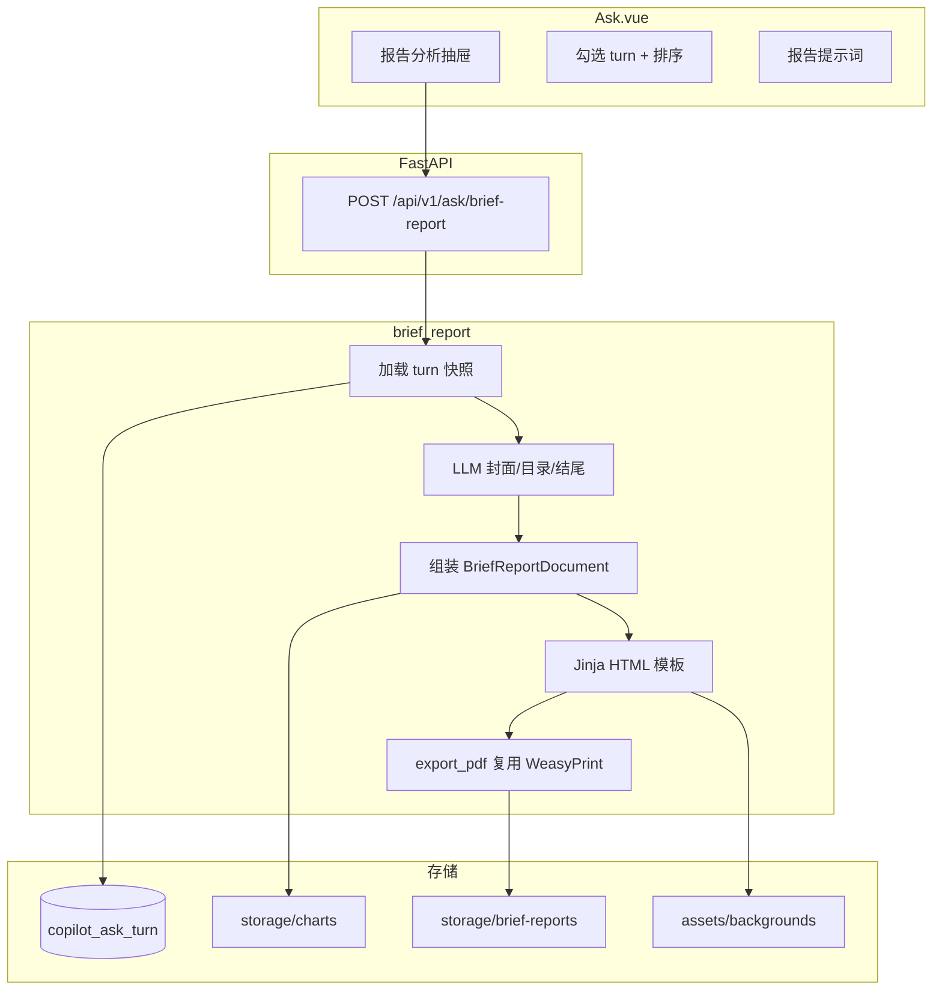

# 问数 · 报告分析（Brief Report）开发计划

> **状态**：已实现（v1）  
> **版本**：v1.1 · 2026-07（**A4 竖版**）  
> **产品名（对外）**：**报告分析**  
> **定位**：在问数对话页，用户**勾选历史回答** + **输入报告提示词**，合成面向领导汇报的 **A4 竖版 PDF 正式报告**（封面 / 目录 / 正文 / 结尾）  
> **风格参考**：高端大气、政务/教育汇报感（见样例封面、目录、结尾稿）  
> **与 Insight Engine 区别**：不自动拆解分析任务；内容来源为**用户已完成的问数轮次**，可自由编排顺序

---

## 目录

1. [背景与目标](#1-背景与目标)
2. [产品边界](#2-产品边界)
3. [背景图资源目录（必读）](#3-背景图资源目录必读)
4. [报告结构与设计规范](#4-报告结构与设计规范)
5. [总体架构](#5-总体架构)
6. [数据模型](#6-数据模型)
7. [API 设计](#7-api-设计)
8. [后端流水线](#8-后端流水线)
9. [前端交互（问数页）](#9-前端交互问数页)
10. [PDF 引擎与版式](#10-pdf-引擎与版式)
11. [安全与权限](#11-安全与权限)
12. [配置项](#12-配置项)
13. [分步实施指南](#13-分步实施指南)
14. [里程碑与验收](#14-里程碑与验收)
15. [风险与降级](#15-风险与降级)

---

## 1. 背景与目标

### 1.1 业务场景

| 现状 | 痛点 |
|------|------|
| 单次问数返回表格 + 一段解读 | 领导汇报需把**多轮问数结论**手工复制到 Word/PPT |
| Insight Engine 自动生成长报告 | 适合「一条分析意图」；不适合「从对话里挑几条凑报告」 |
| 图表已在问数结果中生成 | 导出链路未面向**演示型版式** |

### 1.2 目标

用户在 **Ask 问数页** 打开「报告分析」：

1. **勾选**当前会话中任意多条已成功问数（含问题、回答、表格、图表）；
2. **输入**报告提示词（受众、语气、侧重点，如「面向区教育局的智慧体育建设汇报」）；
3. 系统 **LLM 生成**封面/结尾文案（可与用户提示词结合），或用户部分字段覆盖；
4. 输出 **PDF**：**封面 → 目录 → 各节正文 → 结尾**；
5. 封面、结尾使用**预制背景图**（用户提供的样例图放入指定目录）；
6. 可下载、可预览，适合**打印、存档、呈报**上级（标准竖版 PDF，非 PPT 横版）。

### 1.3 设计原则

| 原则 | 说明 |
|------|------|
| **用户策展** | 章节顺序 = 勾选顺序，不二次自动问数 |
| **复用底座** | SQL/图表/回答来自已有 `copilot_ask_turn`，不重复查库 |
| **文档优先** | **A4 竖版**（210×297mm），符合正式 PDF 阅读习惯，可打印装订 |
| **Fail-open** | 某条 turn 无图表仍出表；无表无图仍出文字节 |
| **与 DAR 解耦** | 新模块 `brief_report`，不污染 Insight Engine 图 |

---

## 2. 产品边界

### 2.1 In Scope（v1）

- Ask 页入口：报告分析抽屉/向导
- 勾选本会话 `status=success` 的 turn（可多选、可排序）
- 用户报告提示词（必填，最少 10 字）
- 封面 / 结尾：背景图 + LLM/用户文案
- 目录页：章节序号 + 标题 + 一句摘要（LLM 从各节 answer 提炼）
- 正文页：每节含「原问句 + 解读 + 图表 + 表格（截断）」
- PDF 下载与浏览器预览
- 背景图从**内置资产目录**读取（见 §3）

### 2.2 Out of Scope（v1 不做）

- 用户上传自定义背景图（v2）
- 在线拖拽 WYSIWYG 排版
- 自动追加新问数章节（那是 Insight Engine）
- Word / PPTX 导出
- 跨会话勾选（v1 仅当前 `sessionId`）
- 封面/结尾动态插画（仅静态背景图）

---

## 3. 背景图资源目录（必读）

请将样例背景图放入以下目录（**已创建占位，可直接拷贝文件**）：

```text
backend/app/brief_report/assets/backgrounds/
├── README.md                 # 尺寸与命名规范
├── cover/                    # 封面背景
│   ├── cover-sport-01.jpg    # 示例：跑步剪影 + 绿光（对应样例封面）
│   ├── cover-sport-02.jpg
│   └── ...
└── ending/                   # 结尾背景
    ├── ending-light-01.jpg   # 示例：光路透视 + 感谢聆听（对应样例结尾）
    ├── ending-light-02.jpg
    └── ...
```

### 3.1 图片规格建议（A4 竖版）

| 项 | 推荐值 | 说明 |
|----|--------|------|
| 比例 | **A4 竖版**（1:√2 ≈ 1:1.414） | 与 PDF 文档惯例一致 |
| 像素（打印） | **2480 × 3508** | 300 DPI，正式呈报推荐 |
| 像素（预览/开发） | **1240 × 1754** | 150 DPI，体积更小 |
| 格式 | JPG（照片）/ PNG（需透明时） | 单张 &lt; 2～3MB |
| 命名 | `cover-{主题}-{序号}.jpg` | API 相对路径：`cover/cover-sport-01.jpg` |
| 封面安全区 | **中上区**主标题，**底部**单位/日期 | 全页底图 + 半透明标题区（CSS） |
| 结尾 | **垂直居中**「感谢聆听」+ 结语 | 底部可保留装饰图形 |

横版样例图需**裁切或重制为竖版**后再放入 `cover/`、`ending/`（勿直接拉伸变形）。

### 3.2 默认背景配置

`backend/app/brief_report/themes/presentation.yaml`：

```yaml
templateCode: presentation
page:
  layout: a4-portrait
  widthMm: 210
  heightMm: 297
  widthPx: 2480
  heightPx: 3508
backgrounds:
  defaultCover: cover/cover-sport-01.jpg
  defaultEnding: ending/ending-light-01.jpg
typography:
  titleFont: "Noto Sans SC"
  titleColor: "#1e293b"
  accentColor: "#22c55e"
```

### 3.3 Git 说明

- 小样例图可入库；大图放 `storage/` 并在 `.gitignore` 中排除（v2 运营上传）
- `cover/`、`ending/` 下保留 `.gitkeep`，无图时使用纯色渐变降级

---

## 4. 报告结构与设计规范

对照提供的样例稿，PDF 固定 **4 类页面**：

```text
┌──────────────────┐
│ P1  封面（A4竖）  │
│  [全页背景图]     │
│     主标题        │
│   ─ 绿色装饰线    │
│   汇报单位        │
│   2026年7月       │
├──────────────────┤
│ P2  目录          │
│ 目录 CONTENTS     │
│ 01 章节 + 摘要    │
│ 02 …（2×N 网格）  │
├──────────────────┤
│ P3+ 正文节        │
│ 章标题 / 问句     │
│ 解读 + 图 + 表    │
├──────────────────┤
│ Pn  结尾          │
│  [全页背景图]     │
│   感谢聆听        │
│   展望结语        │
└──────────────────┘
```

### 4.1 封面文案来源（优先级）

1. 用户显式填写 `title` / `org` / `date` → 直接用  
2. 否则 **LLM**：输入 = `userPrompt` + 各节问题/回答摘要 → 输出 JSON  
   `{ "title", "subtitle", "org", "date" }`  
3. `subtitle` 可选一行副标题

### 4.2 结尾文案来源

1. 用户 `endingMessage` 可选  
2. 否则 LLM 根据全文生成 2～4 句展望型结语（样例：「期待智慧体育为教育事业注入新活力…」）  
3. 固定大标题「感谢聆听」（可配置）

### 4.3 目录摘要

每节一条：`01` 绿色序号 + 章节标题（默认用**用户原问句缩短**）+ 摘要（LLM 从 `answer` 压缩 40～80 字）

---

## 5. 总体架构



### 5.1 与 Insight Engine 复用关系

| 能力 | Insight Engine | 报告分析（本功能） |
|------|----------------|-------------------|
| 章节来源 | 自动 plan + 子 ask | 用户勾选 turn |
| 封面背景 | SVG 渐变 | **位图 backgrounds/** |
| PDF 导出 | `research/export_pdf.py` | **复用同一引擎**，新 HTML 模板 |
| 图表 PNG | `chart_png.py` | **复用**（按 traceId 找已有或重渲染） |
| 存储目录 | `storage/reports/` | `storage/brief-reports/` |

---

## 6. 数据模型

### 6.1 请求体 `BriefReportRequest`

```json
{
  "sessionId": "sess-uuid",
  "traceIds": ["trace-1", "trace-3", "trace-5"],
  "userPrompt": "面向区教育局领导，汇报我区智慧体育建设成效与2026年活动数据",
  "options": {
    "title": null,
    "org": "XX区教育局",
    "reportDate": "2026年7月",
    "endingMessage": null,
    "coverBackground": "cover/cover-sport-01.jpg",
    "endingBackground": "ending/ending-light-01.jpg",
    "theme": "presentation",
    "pageLayout": "a4-portrait",
    "includeSqlAppendix": false
  }
}
```

### 6.2 中间结构 `BriefReportDocument`

```json
{
  "meta": {
    "reportId": "brpt-xxxx",
    "sessionId": "...",
    "generatedAt": "ISO8601",
    "userPrompt": "..."
  },
  "cover": {
    "background": "cover/cover-sport-01.jpg",
    "title": "关于全面推进我区智慧体育建设的汇报",
    "subtitle": "",
    "org": "XX区教育局",
    "date": "2026年7月"
  },
  "toc": [
    { "index": 1, "code": "01", "title": "2026年每月活动运动趋势", "summary": "..." }
  ],
  "chapters": [
    {
      "index": 1,
      "traceId": "...",
      "question": "用户原问句",
      "answer": "解读正文",
      "chartPngPath": "/abs/path/xxx.png",
      "table": { "columns": [], "rows": [], "truncated": true, "totalRows": 120 }
    }
  ],
  "ending": {
    "background": "ending/ending-light-01.jpg",
    "headline": "感谢聆听",
    "message": "期待智慧体育…"
  }
}
```

### 6.3 持久化（v1 可选表）

`copilot_brief_report`（迁移 `V014__brief_report.sql`）：

| 字段 | 说明 |
|------|------|
| report_id | PK |
| user_id | 归属 |
| session_id | 来源会话 |
| trace_ids_json | 勾选顺序 |
| user_prompt | 提示词 |
| status | pending / done / fail |
| pdf_path | 相对路径 |
| doc_json | BriefReportDocument 快照 |
| created_at | |

---

## 7. API 设计

| 方法 | 路径 | 说明 |
|------|------|------|
| `GET` | `/api/v1/ask/brief-report/backgrounds` | 列出可用封面/结尾背景（文件名 + 缩略图 URL） |
| `POST` | `/api/v1/ask/brief-report` | 生成报告（同步或 `options.stream=true` SSE） |
| `GET` | `/api/v1/ask/brief-report/{id}` | 元数据 + 章节摘要 |
| `GET` | `/api/v1/ask/brief-report/{id}/pdf` | PDF 文件（JWT） |
| `GET` | `/api/v1/ask/brief-report` | 当前用户历史列表（分页） |

### 7.1 SSE 事件（`stream=true` 时）

| 事件 | 载荷 |
|------|------|
| `status` | `{ text, phase }` |
| `progress` | `{ step, label }` 加载 turn / LLM 文案 / 渲染图表 / 导出 PDF |
| `report_done` | `{ reportId, pdfUrl, pageCount }` |
| `error` | `{ code, message }` |

---

## 8. 后端流水线

### 8.1 模块划分

```text
backend/app/brief_report/
├── __init__.py
├── assets/
│   └── backgrounds/
│       ├── README.md
│       ├── cover/
│       └── ending/
├── themes/
│   └── presentation.yaml
├── templates/
│   ├── brief_report.html      # 封面/目录/正文/结尾
│   └── brief_report.css
├── loader.py                  # 从 copilot_ask_turn 加载 turn 快照
├── planner_llm.py             # 封面/目录摘要/结尾 LLM
├── builder.py                 # BriefReportDocument 组装
├── render_html.py             # Jinja 渲染
├── export_pdf.py              # 调 research/export_pdf 或薄封装
├── repository.py
├── service.py
└── chart_resolver.py          # traceId → PNG（复用 chart 存储）
```

### 8.2 流水线步骤

| 步骤 | 说明 |
|------|------|
| 1. 校验 | `traceIds` 属于 `sessionId` 且当前用户；每条 `status=success` |
| 2. 加载 | 读 `result_json`：answer、columns、rows、chartSpec、chart_image |
| 3. 图表 | 有 `chart_image_url` 则拷贝/引用；否则 `chart_resolver` 重渲染 PNG |
| 4. LLM | 一次调用输出 cover + toc summaries + ending（JSON mode） |
| 5. 组装 | `builder.build(doc)` |
| 6. HTML | `render_html.render_brief_report_html(doc)` |
| 7. PDF | `export_report_pdf` 或 WeasyPrint；输出 `storage/brief-reports/{id}.pdf` |
| 8. 落库 | 写 `copilot_brief_report` + 审计 |

### 8.3 LLM Prompt 要点

```
你是政务/教育汇报材料撰写专家。
输入：用户报告提示词 + 各章节问句与回答摘要。
输出 JSON：cover{title,subtitle,org,date}、toc[{summary}]、ending{message}。
要求：庄重、简洁、数据表述与原文一致，禁止编造数字。
```

---

## 9. 前端交互（问数页）

### 9.1 入口

- Ask 顶栏或会话侧栏：**「报告分析」** 按钮（`BRIEF_REPORT_ENABLED=true` 时显示）
- 打开 **ElDrawer** 或三步向导

### 9.2 向导步骤

```text
Step 1  勾选内容
        □ 2026年每月活动运动次数…  ✓ 成功 · 12行 · 有图
        □ 各校参与人数对比          ✓ 成功 · 8行
        [全选] [仅选有图表]
        拖拽排序（可选 v1.1）

Step 2  报告设置
        报告提示词 * [多行文本]
        汇报单位     [可选]
        封面背景     [缩略图网格，来自 backgrounds API]
        结尾背景     [缩略图网格]

Step 3  生成与预览
        [生成 PDF]  进度条 / SSE
        内嵌 PdfViewer 预览 + 下载
```

### 9.3 组件规划

| 组件 | 路径 |
|------|------|
| `BriefReportDrawer.vue` | `frontend/src/components/brief-report/` |
| `TurnPicker.vue` | 勾选列表，数据来自 `GET /sessions/{id}/messages` |
| `BackgroundPicker.vue` | 封面/结尾背景缩略图 |
| `briefReport.js` | API 封装 |

### 9.4 会话消息数据结构复用

`Ask.vue` 已有 `fetchSessionMessages`；扩展展示：

- `traceId`、`question`、`answer`、`status`
- `hasChart`：来自 `chartSpec` / `chartImageUrl`
- 仅 `success` 可勾选

---

## 10. PDF 引擎与版式

### 10.1 引擎选型（与 Research 一致）

| 引擎 | 条件 |
|------|------|
| **WeasyPrint**（优先） | HTML+CSS 打印，适合复杂版式与背景图 |
| ReportLab（降级） | 无 WeasyPrint 时简化版（无全页背景图） |

配置复用 `RESEARCH_PDF_ENGINE=auto` 或新增 `BRIEF_REPORT_PDF_ENGINE`。

### 10.2 页面尺寸（A4 竖版）

| 项 | 值 |
|----|-----|
| 版式 | **A4 竖版** `210mm × 297mm` |
| CSS | `@page { size: A4 portrait; margin: 0; }`（封面/结尾满页） |
| 正文页边距 | 左右约 18mm，页眉页脚可选 |

### 10.3 封面 HTML 结构（示意）

```html
<section class="page cover portrait" style="background-image: url('file:///.../cover-sport-01.jpg')">
  <div class="cover-overlay"></div>
  <div class="cover-content">
    <h1>{{ cover.title }}</h1>
    <div class="accent-line"></div>
    <p class="org">{{ cover.org }}</p>
    <p class="date">{{ cover.date }}</p>
  </div>
</section>
```

- `cover-overlay`：自上而下浅色渐变，保证标题可读
- 标题区垂直偏上（约 25%～40% 处），单位/日期靠下

### 10.4 目录页

- 顶部「目录 CONTENTS」
- 竖版 **2 列 × N 行** 或单列列表（章节多时用单列更稳）
- 序号 `01` 绿色粗体 + 标题 + 灰色摘要

### 10.5 正文节

- 章标题条（左侧色条）
- 原问句引用块
- 回答正文
- 图表 `max-width: 100%`，竖版下图表高度适当限制
- 表格最多 15 行

### 10.6 结尾页

- A4 满页背景图
- 垂直居中「感谢聆听」+ 结语（2～4 句）

---

## 11. 安全与权限

| 项 | 策略 |
|----|------|
| turn 归属 | 仅可选取当前用户、当前 session 的 trace |
| SQL 附录 | 默认关闭；仅 ADMIN 可 `includeSqlAppendix=true` |
| 背景路径 | 仅允许 `backgrounds/` 下相对路径，禁止 `..` 穿越 |
| LLM 文案 | 仅基于已返回数据，不新跑 SQL |
| 文件访问 | PDF 下载需 JWT + report 归属校验 |

---

## 12. 配置项

| 变量 | 默认 | 说明 |
|------|------|------|
| `BRIEF_REPORT_ENABLED` | `false` | 功能总开关 |
| `BRIEF_REPORT_STORAGE_DIR` | `storage/brief-reports` | PDF 输出 |
| `BRIEF_REPORT_BACKGROUNDS_DIR` | `app/brief_report/assets/backgrounds` | 背景图根目录 |
| `BRIEF_REPORT_THEME` | `presentation` | 主题 YAML（A4 竖版） |
| `BRIEF_REPORT_PAGE_LAYOUT` | `a4-portrait` | 固定竖版；v2 可扩展 `landscape` |
| `BRIEF_REPORT_MAX_CHAPTERS` | `12` | 最多勾选条数 |
| `BRIEF_REPORT_LLM_ENABLED` | `true` | 封面/目录/结尾 LLM |
| `BRIEF_REPORT_PDF_ENGINE` | `auto` | 同 Research |
| `BRIEF_REPORT_TABLE_MAX_ROWS` | `15` | 正文表格行上限 |

---

## 13. 分步实施指南

### Phase 1 · 资产与模板（2d）

| # | 任务 |
|---|------|
| 1.1 | 创建 `brief_report/` 目录树 + `backgrounds/cover|ending` + README |
| 1.2 | 放入样例背景图（用户提供） |
| 1.3 | `brief_report.html` + `brief_report.css` 静态稿（写死 mock 数据出 PDF） |
| 1.4 | 打通 `export_pdf` 出 **A4 竖版**样张 |

**验收**：命令行用 mock JSON 生成与样例视觉接近的 PDF。

### Phase 2 · 数据加载与组装（2d）

| # | 任务 |
|---|------|
| 2.1 | `loader.py` 从 `copilot_ask_turn` 读 result_json |
| 2.2 | `chart_resolver.py` 对接 chart PNG |
| 2.3 | `builder.py` 组装 BriefReportDocument（无 LLM，标题用问句） |
| 2.4 | `V014__brief_report.sql` + repository |

**验收**：API 传入 traceIds，生成「无 LLM 润色」的完整 PDF。

### Phase 3 · LLM 文案（1d）

| # | 任务 |
|---|------|
| 3.1 | `planner_llm.py` 封面/目录摘要/结尾 |
| 3.2 | 合并 `userPrompt` + 用户字段覆盖逻辑 |

**验收**：同批 turn，封面/结尾文案随提示词明显变化且不含编造数据。

### Phase 4 · 问数页前端（2～3d）

| # | 任务 |
|---|------|
| 4.1 | `BriefReportDrawer` + TurnPicker |
| 4.2 | BackgroundPicker + backgrounds API |
| 4.3 | 生成进度 + PdfViewer 预览/下载 |
| 4.4 | Ask 顶栏入口 + 配置开关 |

**验收**：端到端勾选 2～3 条问数 → 输入提示词 → 下载 PDF。

### Phase 5 · 打磨（1d）

| # | 任务 |
|---|------|
| 5.1 | 字体嵌入 / 打印边距微调 |
| 5.2 | 失败降级（LLM 失败用默认文案） |
| 5.3 | 历史报告列表（可选） |
| 5.4 | 文档与 PROGRESS 更新 |

---

## 14. 里程碑与验收

### 14.1 总体验收

- [x] 问数页可打开报告分析并勾选多条成功回答
- [x] 报告提示词影响封面标题与结尾结语（LLM 启用时）
- [x] PDF 含封面（背景图/渐变）、目录、每节正文（含图/表）、结尾（背景图/渐变）
- [x] **A4 竖版**，打印/屏阅清晰
- [ ] 生成时间：3 章节约 &lt; 60s（含 LLM + PDF）— 需联调实测
- [x] 非本人 session / trace 返回 403

### 14.2 视觉对标（样例图）

| 页 | 对标元素 |
|----|----------|
| 封面 | 全页底图、主标题居中偏上 + 绿线、单位/日期靠下 |
| 目录 | 「目录 CONTENTS」+ 绿色序号 + 竖版网格/列表 |
| 结尾 | 全页底图 + 居中「感谢聆听」+ 展望结语 |

---

## 15. 风险与降级

| 风险 | 降级 |
|------|------|
| 无 WeasyPrint | ReportLab 纯色封面/结尾，无全页背景图 |
| 背景图缺失 | 主题 YAML 渐变兜底 |
| LLM 超时 | 封面用首条问句拼接标题；结尾用固定模板 |
| 图表 PNG 失败 | 仅保留表格 |
| 章节过多 | 截断并提示「最多 N 条」 |

---

## 附录 A · 文件变更清单（预估）

```text
backend/app/brief_report/          # 新模块（全文）
backend/app/api/brief_report.py    # 新路由
backend/app/schemas/brief_report.py
backend/scripts/sql/copilot/V014__brief_report.sql
backend/config/settings.py         # BRIEF_REPORT_* 配置
backend/app/main.py                # 注册路由

frontend/src/components/brief-report/
frontend/src/api/briefReport.js
frontend/src/views/Ask.vue         # 入口

docs/BRIEF_REPORT_PLAN.md          # 本文档
```

---

## 附录 B · 请你放入的背景图

**目录（请以此为准）：**

```text
backend/app/brief_report/assets/backgrounds/cover/
backend/app/brief_report/assets/backgrounds/ending/
```

建议至少各放 **2 张** **A4 竖版**样例图（推荐 **2480×3508** 或 **1240×1754**）。横版素材请裁切为竖版后放入。放好后告知文件名，在 `presentation.yaml` 配置 `defaultCover` / `defaultEnding`。
