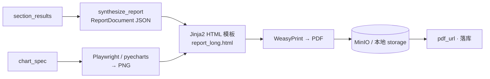
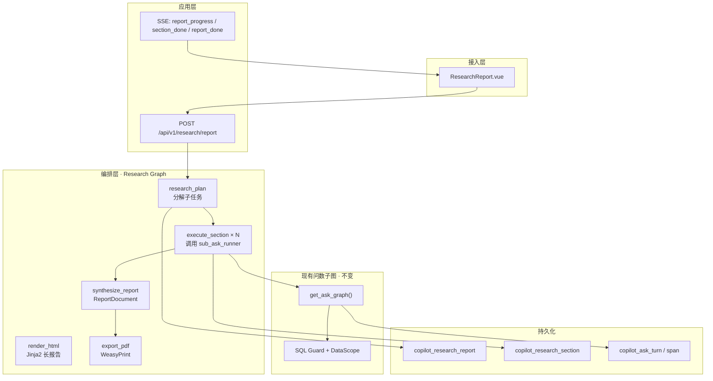

# 深度分析报告模式 · 企业级技术方案（路线 A）

> **状态**：方案设计  
> **版本**：v1.2 · 2026-07  
> **定位**：在现有 Data Copilot 问数底座上，新增 **多子任务编排 → 长报告合成 → PDF 统一交付** 能力  
> **产品名（对外）**：**Insight Engine · 深度洞察**  
> **交付物**：**PDF 长报告**（对外唯一文档格式；在线区为流式预览，终态以 PDF 为准）  
> **体验目标**：让用户感知到「AI 在持续完成复杂任务」，而非「又一个大模型对话框」  
> **原则**：复用 LangGraph / SQL Guard / DataScope / Trace；不引入开放域网页检索

---

## 目录

1. [背景与目标](#1-背景与目标)
2. [产品边界与非目标](#2-产品边界与非目标)
3. [长报告文档与 PDF 交付规范](#3-长报告文档与-pdf-交付规范)（**必读**）
   - [3.6 PDF 版式与背景主题](#36-pdf-版式与背景主题简洁大方)
4. [与现有问数链路的关系](#4-与现有问数链路的关系)
5. [总体架构](#5-总体架构)
6. [产品体验设计 · 炫酷感](#6-产品体验设计--炫酷感)（**必读**）
   - [6.9 实时反馈 · ChatGPT 式](#69-实时反馈设计chatgpt-式--演示核心)
7. [分步实施指南](#7-分步实施指南)（**核心**）
8. [数据模型](#8-数据模型)
9. [LangGraph 设计](#9-langgraph-设计)
10. [API 与 SSE 事件](#10-api-与-sse-事件)
11. [前端交互](#11-前端交互)
12. [安全与治理](#12-安全与治理)
13. [可观测与评测](#13-可观测与评测)
14. [配置项](#14-配置项)
15. [里程碑与验收标准](#15-里程碑与验收标准)
16. [风险与降级策略](#16-风险与降级策略)

---

## 1. 背景与目标

### 1.1 业务痛点

| 现状 | 问题 |
|------|------|
| 单次 `/ask` 返回一张表 + 一段摘要 | 复杂经营分析问题需用户**多次手动追问、自行拼接结论** |
| 复杂问句已有 Plan + Multi-SQL | 能力存在，但**输出形态仍是「一问一答」**，无法交付报告 |
| Trace / Span 已全链路落库 | 审计能力具备，但**缺少任务级聚合视图** |

### 1.2 目标定义

**深度分析报告模式（Deep Analytics Report，以下简称 DAR）**：用户提交一条**分析意图**（含多个子问题或分析维度），系统：

1. **分解**为 3～N 个可独立执行的子问数任务；
2. **串行/受控并行**调用现有问数子图，每步受 SQL Guard + DataScope 约束；
3. **汇总**各步子结果（表格、图表、摘要）；
4. **合成**长报告文档（结构化中间表示 → HTML 排版）；
5. **导出 PDF** 作为唯一对外交付物，在线区同步流式预览；
6. **全程 SSE 推送**子任务进度，Trace 可追溯到每个子 `trace_id`。

### 1.3 设计原则（企业级）

| 原则 | 说明 |
|------|------|
| **Fail-closed** | 任一子任务越权 / SQL 校验失败，该章节标记失败，不伪造数据 |
| **可审计** | 报告级 `report_id` + 每节关联 `sub_trace_id`，写入 `copilot_ask_span` |
| **可运营** | 子任务失败可重跑单节；报告模板可配置 |
| **破坏半径可控** | 子任务数、总超时、单行 LIMIT 均有硬上限 |
| **与问数解耦** | DAR 为**外层编排图**，内层复用 `get_ask_graph()`，不污染单轮问数 |

---

## 2. 产品边界与非目标

### 2.1 本方案覆盖（In Scope）

- 基于**企业内部结构化数据**的多章节 **长报告**（目标 **10～50+ 页 PDF**）
- 子任务类型：`metric_query`、`compare_period`、可扩展 `narrative_section`（纯解读节）
- **对外输出：PDF 唯一**（下载、归档、邮件附件均用 PDF）
- 在线 Insight 画布：执行期流式预览；**完成后以 PDF 预览器为主视图**
- 权限：继承 JWT + EffectivePolicy，**不提升用户数据范围**

### 2.2 本方案不覆盖（Out of Scope · 后续路线 B/C）

- 开放域网页 / 论文检索与引用
- 非结构化文档 RAG（PDF 规程库等，见 DEVELOPMENT_PLAN 文档 RAG 章节）
- 跨小时级异步 Job 队列（MVP 采用 **SSE 长连接 + 单进程编排**；量大时再拆 Worker）
- 自动发邮件 / 定时报告（可作为 Phase 2）
- Word / Excel / HTML 等其它格式导出（**对外仅 PDF**；转 Word 等走 Phase 3）

---

## 3. 长报告文档与 PDF 交付规范

### 3.1 交付原则

| 层级 | 格式 | 用途 |
|------|------|------|
| **对外交付** | **PDF** | 下载、分享、归档、审计附件 —— **唯一标准** |
| **内部中间表示** | `ReportDocument` JSON | Synthesizer 输出；驱动 HTML 模板与 SSE 预览 |
| **渲染中间件** | HTML + CSS | Jinja2 模板 → WeasyPrint 转 PDF；**不对外暴露** |
| **在线预览** | 流式 HTML 片段 + 完成后 **PDF.js 嵌入** | 演示实时感；终态与 PDF 一致 |

> **不提供** `.md` / `.docx` 下载按钮，避免「到底哪个是正式版」的歧义。开发调试可用 `RESEARCH_KEEP_HTML_DEBUG=true` 落盘 HTML。

### 3.2 长报告文档结构（PDF 目录）

标准长报告 **固定章节骨架**（Planner + Synthesizer 共同保证）：

```text
┌─ 封面（1 页）
├─ 目录 TOC（自动生成页码）
├─ 执行摘要 Executive Summary（1～2 页）
├─ 第 1 章 … 第 N 章（每节分析任务一章，每章 2～8 页）
│    ├─ 章节导语（LLM 解读）
│    ├─ 关键指标表（分页，宽表横向）
│    ├─ 图表页（折线/柱状/占比，每图半页～1 页）
│    └─ 本章小结（3～5 bullet）
├─ 综合洞察 Key Findings（1 页）
├─ 建议与后续行动 Recommendations（1 页）
└─ 附录 Appendix
     ├─ 数据范围与权限说明
     ├─ 子任务 trace 清单
     └─ 口径 / 指标定义引用（来自 copilot_metric_definition）
```

**篇幅目标**：

| 配置 | 默认 | 说明 |
|------|------|------|
| `RESEARCH_MAX_SECTIONS` | **12** | 分析章节上限（不含摘要/附录） |
| `RESEARCH_TARGET_PAGES` | **20～40** | 常规经营分析报告 |
| `RESEARCH_MAX_PAGES` | **80** | 硬上限，超出则表格截断 + 附录说明 |
| 每节表格最大行数（PDF） | **50** | 超出写「共 N 行，以下展示 Top 50」 |
| 每节图表数 | **1～2** | 趋势章偏 1 折线；对比章偏 1 柱状 |

### 3.3 PDF 生成流水线



**技术选型（企业级）**：

| 环节 | 推荐 | 理由 |
|------|------|------|
| 模板 | Jinja2 + 专用 `report_long.html` | 长文分页、`@page`、页眉页脚可控 |
| PDF 引擎 | **WeasyPrint** ≥60 | 中文嵌入 `Noto Sans SC`；CSS 分页成熟 |
| 图表 | Playwright 截图 ECharts **或** pyecharts.snapshot | 与前端 chartSpec 同源 |
| 存储 | MinIO `reports/{user_id}/{report_id}.pdf` | 与现有 `MINIO_ENDPOINT` 一致 |
| 预览 | 前端 `vue-pdf-embed` / pdf.js | 与下载文件字节一致 |

**页眉页脚**：

```text
页眉：Insight Engine · {report_title}          页脚：第 {page} 页 / 共 {pages} 页 · {report_id}
```

### 3.4 ReportDocument 中间 schema（非对外）

Synthesizer 输出结构化文档，**不是**面向用户的 Markdown 文件：

```json
{
  "meta": {
    "title": "本月经营洞察报告",
    "reportId": "rpt-abc123",
    "generatedAt": "2026-07-09T21:00:00+08:00",
    "scopeSummary": "运营全局 · OPERATOR",
    "pageEstimate": 28
  },
  "executiveSummary": { "paragraphs": ["…", "…"] },
  "chapters": [
    {
      "index": 1,
      "title": "总体趋势",
      "narrative": "…",
      "tables": [{ "caption": "…", "columns": [], "rows": [], "truncated": false }],
      "charts": [{ "chartId": "c1", "pngPath": "/tmp/c1.png", "caption": "…" }],
      "bullets": ["…"]
    }
  ],
  "findings": [{ "type": "up", "text": "…", "chapterIndex": 2 }],
  "recommendations": ["…"],
  "appendix": {
    "traces": [{ "chapterIndex": 1, "traceId": "…", "status": "success", "latencyMs": 2100 }],
    "metricRefs": [{ "code": "…", "name": "…" }]
  }
}
```

落库字段：`copilot_research_report.report_doc_json`（MEDIUMTEXT / JSON）。

### 3.5 长报告 Planner 扩展

Research Planner 需识别 **「长报告意图」** 并放大章节数：

| 用户意图信号 | Planner 行为 |
|-------------|-------------|
| 「深度分析」「完整报告」「详细」 | sections 目标 **6～10** |
| 「简要」「3 条结论」 | sections **3～4** |
| 模板 `monthly_ops_long` | 固定 **8 章**骨架 |

**长报告专用模板 `monthly_ops_long`**：

1. 总体 KPI 概览  
2. 时间趋势（日/周）  
3. 产品线 / 品类对比  
4. 区域 / 组织维度  
5. 结构占比变化  
6. 异常与偏离项  
7. 同比 / 环比专题  
8. 结论与行动建议  

### 3.6 PDF 版式与背景主题（简洁大方）

> **设计原则**：背景服务于可读性与品牌感，**少即是多**。禁止花哨全页摄影图、网络扒图、每页随机 AI 生图；正文页以白/浅灰为主，仅在封面与章首页使用克制装饰。

#### 3.6.1 不做的事

| 做法 | 结论 |
|------|------|
| 导入整份 PDF 样例当模板 | ❌ 难灌动态表格/图表，维护成本高 |
| 网上扒图作背景 | ❌ 版权与合规风险，风格不可控 |
| 每页不同随机背景图 | ❌ 干扰阅读，不像企业报告 |
| 实时文生图生成背景 | ❌ 风格漂移，无法品牌审核 |

#### 3.6.2 推荐方案：Theme Pack + CSS（按页型切换）

**品牌资产**（仓库内置，简洁矢量为主）：

```text
backend/app/research/assets/
  cover-bg.svg           # 封面：线性渐变 + 轻几何（无摄影）
  logo.svg               # Logo（可选，默认纯文字品牌）
  appendix-watermark.svg # 附录：5% 透明度「Insight Engine」
  fonts/NotoSansSC/      # PDF 嵌入字体
```

**不依赖外部图库**；MVP 封面可用 **纯 CSS 线性渐变**（`#312e81` → `#6366f1`），与 Insight Engine 主色一致。

**按页型切换样式**（非每页换图）：

| 页型 | 背景 / 装饰 | 风格关键词 |
|------|-------------|------------|
| **封面** | 纵向渐变 + 可选 `cover-bg.svg` 几何底纹 | 简洁、留白多、标题居中 |
| **目录** | 白底 `#ffffff` | 无背景图，细分割线即可 |
| **执行摘要** | 浅灰底 `#f8fafc` 摘要区块 | 大方、像咨询报告摘要页 |
| **章首页** | 白底 + 左侧 **4px accent 色条**（由 `intent` 决定） | 上下文感来自色条，不是配图 |
| **数据页**（表/图） | **纯白** | 零装饰，保证数字可读 |
| **洞察 / 建议** | 白底 + 浅 indigo 左边框引用块 | 突出重点句 |
| **附录** | 白底 + 低透明度 watermark | 低调、审计感 |

**章节 intent → accent 色**（与 §6.5 Design Tokens 一致）：

| intent | accent | 用途 |
|--------|--------|------|
| `trend` | `#6366f1` | 趋势章色条 / 页眉细线 |
| `compare` | `#8b5cf6` | 对比章 |
| `rank` | `#64748b` | 排名章（中性灰蓝） |
| `share` | `#6366f1` | 占比章 |
| `anomaly` | `#d97706` | 异常章（amber，仅 accent，不大面积铺色） |

#### 3.6.3 Theme Pack 配置（`templateCode` 绑定）

`app/research/themes/default.yaml`（示例）：

```yaml
templateCode: default
cover:
  gradient: ["#312e81", "#6366f1"]
  useSvg: cover-bg.svg          # false 则仅 CSS 渐变
body:
  pageBackground: "#ffffff"
  summaryBackground: "#f8fafc"
  fontFamily: "Noto Sans SC"
  accentByIntent:               # 见上表
appendix:
  watermarkOpacity: 0.05
```

`monthly_ops_long` 等模板 **继承 default**，仅可覆盖 `cover.gradient`；**禁止**每模板一套摄影图。

Phase 2（可选）：Admin「报告品牌」上传 **1 张** 经审核的封面底图 → MinIO `brand/cover.png`，仍须通过 Theme 引用，不替换 HTML 结构。

#### 3.6.4 CSS 实现要点（WeasyPrint）

```css
@page :first {
  background: linear-gradient(160deg, #312e81 0%, #6366f1 100%);
}
@page {
  background: #ffffff;
  @top-center { content: "Insight Engine · " string(report-title); font-size: 9pt; color: #94a3b8; }
  @bottom-center { content: "第 " counter(page) " 页"; font-size: 9pt; color: #94a3b8; }
}
.chapter-head { border-left: 4px solid var(--accent); padding-left: 12px; }
.page-data table { background: #fff; }  /* 数据页无背景图 */
```

封面标题：**白色 / 浅灰字**；正文：**#1e293b** 主文字，**#64748b** 次要文字——整体 **简洁大方**。

#### 3.6.5 开发任务（纳入 Step 6）

| 任务 | 产出 |
|------|------|
| 默认 Theme Pack | `themes/default.yaml` + CSS 变量注入 Jinja2 |
| 封面 SVG（可选） | `assets/cover-bg.svg` 极简几何 |
| 章 intent 样式 | `report_long.html` 中 `chapter-{{ intent }}` class |
| 视觉验收 | 人工检查：封面/正文/附录截图符合「简洁大方」；数据页无背景干扰 |

#### 3.6.6 版式验收（除 §3.7 功能项外）

| # | 项 | 标准 |
|---|-----|------|
| V1 | 封面 | 渐变或 SVG 底纹；**无**摄影/插画 |
| V2 | 正文页 | ≥90% 页面为白/浅灰底，无全页背景图 |
| V3 | 章首页 | 仅左侧色条 + 标题区，色条与 intent 一致 |
| V4 | 数据页 | 表格/图表区域背景纯白 |
| V5 | 整体 | 单报告 CSS 主题 **1 套**，不出现多种风格混搭 |

### 3.7 PDF 验收标准

| # | 项 | 标准 |
|---|-----|------|
| P1 | 页数 | 常规请求 ≥ **15 页**（含封面目录附录） |
| P2 | 中文 | 无乱码、无 tofu；嵌入字体 |
| P3 | 目录 | TOC 页码与正文一致（WeasyPrint `target-counter`） |
| P4 | 图表 | 每含 chart 的章节至少 **1 张**嵌入图 |
| P5 | 宽表 | 超 8 列自动横向页或拆表 |
| P6 | 一致性 | 下载 PDF 与在线 PDF 预览 **同一对象**（同 URL / ETag） |
| P7 | 失败 | PDF 生成失败 → 报告 `status=partial`，UI 提示重试导出；**不提供 MD 兜底下载** |

---

## 4. 与现有问数链路的关系

### 4.1 可复用模块（无需重写）

| 模块 | 路径 | 复用方式 |
|------|------|----------|
| 问数主图 | `app/agent/graph.py` → `get_ask_graph()` | 作为 **subgraph 内层** 被 DAR 循环调用 |
| Plan / Multi-SQL | `plan_nodes.py`, `sql_step_nodes.py` | 子问句复杂度仍走现有分流 |
| SQL Guard + DataScope | `sql/guard.py`, `policy/scope_injector.py` | 每个子任务独立过网关 |
| 图表 | `chart_builder.py`, `chart_nodes.py` | 每节可选 `chart_spec` |
| Trace | `observability/tracer.py`, `trace_log.py` | 子任务写独立 turn；报告写 report turn |
| SSE | `agent/streaming.py` | 扩展事件类型 |
| Session / Memory | `memory/session_service.py` | 报告可绑定 `session_id` |

### 4.2 需新增模块

| 模块 | 路径（建议） | 职责 |
|------|-------------|------|
| Research Planner | `app/research/planner_llm.py` | 分析意图 → 子任务列表 |
| Research Graph | `app/research/graph.py` | 外层 LangGraph 编排 |
| Sub-query Runner | `app/research/sub_ask_runner.py` | 封装 `run_ask_graph` 为内部调用 |
| Report Synthesizer | `app/research/synthesizer.py` | 汇总 → `ReportDocument` JSON |
| Report Renderer | `app/research/render_html.py` | Jinja2 + **Theme Pack** → HTML |
| Theme Loader | `app/research/theme.py` | 加载 `themes/*.yaml` + `assets/` |
| PDF Exporter | `app/research/export_pdf.py` | HTML + 图表 PNG → **PDF（唯一交付）** |
| DAR API | `app/api/research.py` | HTTP + SSE |
| 前端报告页 | `frontend/src/views/ResearchReport.vue` | 任务清单 + 章节预览 |

---

## 5. 总体架构



### 4.1 请求生命周期

```text
用户提交 report_request（分析意图 + 可选模板）
  → 创建 report_id + 写 copilot_research_report(status=running)
  → research_plan：LLM 输出 sections[]（title, question, viz_hint, priority）
  → FOR each section（上限 RESEARCH_MAX_SECTIONS）:
        sub_trace_id = run_ask_graph(question=section.question, ...)
        写 copilot_research_section + 关联 sub_trace_id
        SSE: section_done
  → synthesize_report：ReportDocument JSON
  → render_html：Jinja2 长报告 HTML
  → export_pdf：WeasyPrint → MinIO/本地 → report_pdf_url
  → SSE: pdf_ready + report_done
```

---

## 6. 产品体验设计 · 炫酷感

> **设计信条**：炫酷不来自动效堆叠，而来自 **「任务被拆解 → 多 Agent 协作 → 结论逐步浮现 → 可交付报告落地」** 的完整叙事。  
> 用户应感觉自己在指挥一个分析团队，而不是在等一个聊天框打字。

### 6.1 核心叙事：三幕式体验

```text
  第一幕 · 点燃          第二幕 · 执行           第三幕 · 揭晓
  ─────────────        ─────────────          ─────────────
  用户输入分析意图   →   任务卡片依次激活    →   报告逐章「长」出来
  AI 分解子任务          每节可见 Agent 流水线    摘要打字机 + 洞察高亮
  卡片飞入时间线         图表实时渲染             PDF 封面 + 一键分享
```

| 幕 | 用户情绪目标 | 关键 UI |
|----|-------------|---------|
| **点燃** | 「它懂我要什么，而且比我想得更全」 | 任务分解动画 + 可编辑章节清单 |
| **执行** | 「真的在干活，不是装样子」 | 流水线光点 + 子 Agent 工具气泡 |
| **揭晓** | 「这是可以直接发领导的成品」 | 报告阅读器 + 洞察卡片 + 导出 |

### 6.2 页面布局：Mission Control 双栏

放弃「聊天列表」范式，采用 **指挥舱 + 画布** 布局：

```text
┌──────────────────────────────────────────────────────────────────────────┐
│  ✦ Insight Engine                                    [历史] [⌘K 模板]  │
├─────────────────────────────┬────────────────────────────────────────────┤
│  ◈ 任务指挥台 (320px)        │  ◈ 洞察画布 (flex)                          │
│                             │                                            │
│  ┌─ 分析意图 ─────────────┐  │   ┌─ 报告封面（生成后）─────────────────┐  │
│  │ 本月经营深度分析…      │  │   │  📊 本月经营洞察报告                 │  │
│  └───────────────────────┘  │   │  4 个维度 · 12 数据源 · 38s         │  │
│                             │   └─────────────────────────────────────┘  │
│  ┌─ 任务时间线 ───────────┐  │                                            │
│  │ ●━━━━○━━━━○━━━━○ 75%   │  │   [章节 2 正在写入…]                       │
│  │                        │  │   ┌──────────────────────────────────┐  │
│  │ ✓ 1. 总体趋势    2.1s  │  │   │  📈 折线图（ECharts 渐入）        │  │
│  │ → 2. 产品线对比  …     │  │   │  表格 + 一句话解读                 │  │
│  │ ○ 3. 区域分布          │  │   └──────────────────────────────────┘  │
│  │ ○ 4. 结论建议          │  │                                            │
│  └───────────────────────┘  │   ┌─ 关键洞察（浮动条）──────────────────┐  │
│                             │   │ ↑12% 产品线A  │ ⚠ 区域C异常 │ …    │  │
│  [▶ 开始洞察]  [⏹ 中断]     │   └─────────────────────────────────────┘  │
│                             │   [下载 PDF]  [复制摘要]  [展开 Trace]      │
└─────────────────────────────┴────────────────────────────────────────────┘
```

**与问数页差异**：问数页是「对话气泡」；Insight Engine 是 **「项目看板 + 实时交付物」**——一眼可辨产品层级。

### 6.3 五大「炫酷时刻」（Must-Have 交互）

#### 时刻 ① · 任务分解揭晓（Plan Reveal）

**触发**：`report_progress` phase=`planning` 完成，收到 `plan` JSON。

**表现**：

1. 用户输入框内容 **向上收起**，变为报告标题。
2. 3～5 张 **任务卡片** 从中心 stagger 飞入左侧时间线（CSS `animation-delay: 0.1s × index`）。
3. 每张卡片展示：`序号` · `章节标题` · `一句话目标` · 预估图标（趋势📈 / 对比⚖ / 排名🏆）。
4. **可编辑**（Phase 1.5）：用户可删节、改标题、拖拽排序——体现「人机协作」而非黑盒。

**SSE 依赖**：新增 `plan_revealed` 事件，payload 含 `sections[]` 摘要（不含 SQL）。

```json
{
  "event": "plan_revealed",
  "sections": [
    { "index": 1, "title": "总体趋势", "intent": "trend", "icon": "line" }
  ]
}
```

---

#### 时刻 ② · Agent 流水线（Pipeline Pulse）

**触发**：每节 `section_start` + 内层 `progress` 节点。

**表现**：

- 当前章节卡片 **边框脉冲光晕**（accent 色 `#6366f1` → `#8b5cf6` 渐变）。
- 卡片下方展开 **迷你流水线**（横向 6～8 步，非 28 步全展示）：

```text
  召回 → 规划 → Agent → 校验 → 执行 → 成图
   ✓      ✓      ●      ○      ○      ○
```

- 映射规则：内层 `NODE_LABELS` 折叠为 **用户友好 6 步**（见 §5.6）。
- 进入 `agent_loop` 时，弹出 **工具气泡**（最多 3 个）：`describe_table` → 「正在理解表结构…」

**关键**：内层每来一个 `progress`，外层转发为 `section_progress`，前端只渲染当前激活节。

---

#### 时刻 ③ · 章节着陆（Section Landing）

**触发**：`section_done` + status=`success`。

**表现**：

1. 左侧时间线该节 **打勾 + 耗时 ms**。
2. 右侧画布 **平滑 scroll 到新章节锚点**。
3. 章节块 **自下而上 slide-in**（300ms ease-out）。
4. 若有 `chart_spec.status=ready`：ECharts **空 → 数据渐入**（`animationDuration: 800`）。
5. 章节顶部 **状态条**：`✓ 数据已校验 · 权限已通过 · trace: abc123`（可点击展开 Trace）。

失败节：卡片变 amber，显示「本节数据暂不可用」，**不阻断**后续章节动画。

---

#### 时刻 ④ · 洞察浮现（Insight Cards）

**触发**：`synthesize_report` 完成，返回结构化 `insights[]`（Synthesizer 扩展输出）。

**Synthesizer 扩展 JSON**（除 `report_doc_json` 外，供 InsightStrip 使用）：

```json
{
  "executive_summary": "…",
  "insights": [
    { "type": "up", "label": "产品线 A 环比 +12%", "section_index": 2, "evidence": "来自第2节查询" },
    { "type": "warn", "label": "区域 C 参与率连续 3 日下滑", "section_index": 3 }
  ],
  "recommendations": ["…", "…"]
}
```

**表现**：

- 画布顶部 **Insight Strip**：3～5 张胶囊卡片，按 type 配色（up=绿 / warn=amber / down=红）。
- **打字机效果**播放 executive_summary（30ms/字，可跳过）。
- 点击洞察卡片 → **scroll 到对应章节 + 高亮表格行**（evidence 锚定）。

这是「炫酷感」的核心：**结论不是埋在 Markdown 里，而是可点击的实体**。

---

#### 时刻 ⑤ · 报告交付（Report Reveal）

**触发**：`report_done`。

**表现**：

1. 全屏 **0.3s 白色 shimmer** 扫过画布（ subtle，不土）。
2. 报告封面块展示：标题、生成时间、章节数、总耗时、数据范围 badge。
3. **下载 PDF** 主按钮浮入（**唯一文档出口**）；在线区切换为 **PDF 预览器**（pdf.js）
4. PDF 封面与 §3.3 一致：深色渐变 + 白字标题 + 页码脚注

---

### 6.4 进阶炫酷（Phase 2 · 差异化）

| 功能 | 体验描述 | 技术要点 |
|------|----------|----------|
| **章节分支** | 某节旁「换个角度」→ fork 新报告，继承前 N 节 | `parent_report_id` + `branch_from_section` |
| **对比洞察** | 双报告左右并排，差异指标自动标红/绿 | 前端 diff + 两次 report_id |
| **Trace 飞行记录仪** | 全屏时间线：每节 expandable，展示 span 瀑布图 | 读 `trace_log`，D3 / 自研竖向 timeline |
| **模板画廊** | 卡片墙选「月度经营 / 同比分析 / 异常诊断」 | 缩略动画 preview GIF |
| **实时数字跳动** | 关键 KPI 用 `CountUp` 动画 | 仅 summary 区，避免表格全跳 |
| **暗色指挥舱** | 执行阶段自动切 dark，完成后 light 阅读 | CSS variables + `prefers-color-scheme` |

### 6.5 视觉规范（Design Tokens）

与现有 Element Plus 问数页 **刻意区分**，建立子品牌感：

| Token | 问数页 | Insight Engine |
|-------|--------|----------------|
| 主色 | `#409EFF`（Element 蓝） | `#6366f1` → `#8b5cf6` 渐变（Indigo/Violet） |
| 背景 | 白 + 灰气泡 | 浅灰画布 `#f8fafc` + 白色卡片 shadow-lg |
| 圆角 | 8px | 12px（卡片）/ 16px（封面） |
| 字体 | 系统默认 | 标题 `font-weight: 600`；数字 `tabular-nums` |
| 动效时长 | 无 / 极短 | 300ms（章节）/ 800ms（图表）/ 30ms（打字） |

**图标语义**（Lucide 或 Element Plus Icon）：

| intent | 图标 | 说明 |
|--------|------|------|
| `trend` | TrendingUp | 时间序列 |
| `compare` | GitCompare | 对比 |
| `rank` | ListOrdered | 排名 |
| `share` | PieChart | 占比 |
| `anomaly` | AlertTriangle | 异常 |

### 6.6 内层节点 → 用户友好流水线映射

前端维护 `PIPELINE_STEPS`，将 28+ 内层节点折叠为 6 步展示：

| 用户步骤 | 包含的内层节点（示例） |
|----------|------------------------|
| 理解问题 | normalize_question, extract_keywords, resolve_references |
| 召回知识 | do_recall_*, merge_retrieved_info, build_llm_context |
| 规划分析 | plan_question, agent_loop, build_agent_context |
| 生成查询 | generate_sql*, validate_sql, apply_policy |
| 执行验证 | execute_sql, verify_answer |
| 可视化 | build_chart, format_answer |

**实现**：`frontend/src/utils/pipelineMapper.js` — 输入 `node` 名，输出 `{ stepIndex, stepLabel }`。

### 6.7 PDF 在线预览（完成后主视图）

执行阶段：右侧为 **流式章节预览**（Activity + StreamMarkdown + 表格/图）。  
**`pdf_ready` 后**：右侧主区域切换为 **PDF 预览器**（与下载文件同源 URL），支持翻页、缩放、全屏——**演示终态必须是一本完整长 PDF**。

| 阶段 | 右侧主视图 |
|------|-----------|
| planning / section_running | 流式章节卡片 + 光标 |
| synthesizing / exporting | StatusLine + 「正在排版 PDF…」 |
| pdf_ready / done | **PDF.js 嵌入长文档** + 浮动「下载 PDF」 |

### 6.8 文案与微交互（UX Copy）

| 场景 | 避免 | 推荐 |
|------|------|------|
| 启动 | 「正在加载…」 | 「正在拆解分析任务…」 |
| Plan 完成 | 「规划完成」 | 「已规划 4 个分析维度，即将开始执行」 |
| 单节执行 | 「查询中」 | 「第 2 节 · 产品线对比 · Agent 正在查指标口径…」 |
| 合成 | 「生成报告」 | 「正在排版 PDF 长报告…」 |
| 完成 | 「成功」 | 「PDF 报告已就绪 · 共 32 页 · 耗时 38s」 |
| 中断 | 「已取消」 | 「洞察任务已中断 · 已完成 2/4 节可预览」 |

### 6.9 实时反馈设计（ChatGPT 式 · 演示核心）

> **演示第一原则**：用户点击「开始洞察」后 **200ms 内**必须有可见变化；全程 **禁止长时间空白屏**。  
> 学 ChatGPT / Deep Research 的不是 UI 皮肤，而是 **「持续有东西在动」** 的反馈节奏。

#### 6.9.1 ChatGPT 反馈模式 → 我们的映射

| ChatGPT / Deep Research 行为 | Insight Engine 等价实现 |
|------------------------------|-------------------------|
| 发送后立即出现「思考中」+ 光标 | `report_started` → 画布显示 **闪烁光标** + 首行状态文案 |
| 状态行轮播（Searching / Reading…） | SSE `status` 事件，**单行 ephemeral 文案**（新覆盖旧） |
| 回答逐字流出 | SSE `text_delta` — 章节解读、摘要、建议 **token 级追加** |
| 研究步骤侧边活动日志 | 左侧 **Activity Feed** 滚动日志（每条带时间戳） |
| 进行中可点 Stop | 顶栏 **中断** 常显；调用 `/research/report/{id}/cancel` |
| 章节/来源逐步出现 | `plan_revealed` 逐条推送 **或** 卡片逐个亮起（非一次全出） |
| 完成后一次性交付物 | `report_done` + 导出按钮；此前内容已 **边做边展示** |

#### 6.9.2 反馈时间轴（演示时用户应看到什么）

```text
T+0ms     用户点击「开始洞察」
T+100ms   report_started · 右侧出现空白报告区 + 脉动光标 ▌
T+200ms   status: "正在理解您的分析意图…"
T+1.5s    status: "正在拆解为 4 个分析任务…"
T+3s      plan_revealed（可拆为 plan_item × 4，每 300ms 一条）
T+3.5s    section_start(1) · Activity: "▸ 第1节 · 总体趋势 · 开始"
T+4s~     section_progress 连续跳动（内层节点 → 6 步流水线）
T+4s~     status 轮播: "召回相关指标…" → "生成查询…" → "执行验证…"
T+12s     text_delta: 第1节解读逐字出现 "本月整体呈…"
T+12s     section_preview: 表格先出 3 行，再补全
T+13s     图表空架 → 数据渐入
T+14s     section_done(1) · Activity: "✓ 第1节完成 · 2.1s"
          … 重复 2~4 节 …
T+45s     status: "正在排版 PDF 长报告…"
T+48s     text_delta: 执行摘要逐字流出（在线预览）
T+50s     insights_ready · Insight 胶囊逐个 pop-in
T+55s     pdf_ready · PDF 预览器载入（如 32 页）
T+56s     report_done · 「下载 PDF」按钮
```

**演示观感关键词**：光标、状态行、活动日志、逐字、先骨架后数据——**五件套齐，就不会像传统 BI 报表加载**。

#### 6.9.3 SSE 事件扩展（流式专用）

在 Step 8 基础事件上，**演示必须实现**以下帧：

| 事件 | 频率 | payload | UI 行为 |
|------|------|---------|---------|
| `report_started` | 1 次 | `{ reportId, title }` | 初始化画布 + 光标 |
| `status` | 多条 | `{ text, phase? }` | **替换**顶栏状态行（非追加） |
| `heartbeat` | 每 2s | `{ elapsedMs }` | 更新耗时计数；证明连接存活 |
| `plan_item` | 每节 1 条 | `{ index, title, intent }` | 任务卡片 **逐个** 入场（模拟「正在规划」） |
| `activity` | 多条 | `{ level, message, ts }` | 写入 Activity Feed（**追加**滚动） |
| `section_progress` | 多条 | `{ sectionIndex, pipelineStep, label, tool? }` | 流水线 + 可选 tool 气泡 |
| `text_delta` | 高频 | `{ scope, sectionIndex?, delta }` | 追加文本；scope=`section` \| `summary` \| `recommendation` |
| `section_preview` | 0~1/节 | `{ sectionIndex, columns, rowsSample }` | 表格骨架先渲染样例行 |
| `chart_ready` | 0~1/节 | `{ sectionIndex, chartSpec }` | 图表组件 mount 后播放入场动画 |
| `pdf_ready` | 1 次 | `{ pdfUrl, pageCount, fileSizeBytes }` | **切换 PDF 预览器（长报告主视图）** |
| `report_done` | 1 次 | 完整 `ResearchReportResponse` + `pdfUrl` | 下载按钮激活 |
| `error` | 0~1 | `{ code, message }` | 错误提示 |

`scope` 说明：

- `section` — 该节 `format_answer` LLM **流式**输出
- `summary` — 报告执行摘要流式
- `recommendation` — 建议段落流式（可合并到 summary）

**与现有问数对齐**：内层 sub_ask 复用 `stream_ask_graph` 的 `progress` 帧，外层 `sub_ask_runner` **转发**为 `section_progress` + `activity`，不在子任务内静默跑完。

#### 6.9.4 后端：子任务也必须流式

**现状问题**：若 `sub_ask_runner` 调用 `run_ask_graph`（一次性 JSON），单节 10～30s 内左侧只有转圈——**演示灾难**。

**改法**（`sub_ask_runner.py`）：

```python
async def stream_section_ask(...) -> AsyncIterator[str]:
    """内部走 stream_ask_graph，yield 转译后的外层 SSE 帧。"""
    async for frame in stream_ask_graph(body, ctx, session, settings):
        # parse progress → yield section_progress + activity
        # parse done → persist section + yield section_done
        ...
```

**LLM 流式点**（需改造）：

| 节点 | 改造 |
|------|------|
| `format_answer` + `_format_answer_with_llm` | 改用 `llm.astream` → 每 chunk yield `text_delta` |
| `synthesize_report` | 摘要 / 建议分字段 `astream` → `text_delta` |
| `research_plan` / planner | 可选：`plan_item` 逐条 yield（Planner 一次 JSON 则前端 stagger 模拟） |

**首包 SLA**：`report_started` + `status` 必须在 `_prepare_research_run` 完成后 **立即 yield**（不等待 Planner LLM 返回）。

#### 6.9.5 前端：Stream UI 组件

**新建组件**：

| 组件 | 职责 |
|------|------|
| `StreamCursor.vue` | 闪烁 `▌`；无 text 时单独显示 |
| `StatusLine.vue` | 单行 status，`transition` 淡入淡出切换 |
| `ActivityFeed.vue` | ChatGPT 式滚动日志；`max-height: 240px`；自动 stick-bottom |
| `StreamMarkdown.vue` | 消费 `text_delta` 追加；尾部挂 StreamCursor |
| `ElapsedBadge.vue` | 读 `heartbeat.elapsedMs` 显示「已用时 12s」 |

**`research.js` 流式客户端**（对齐 `ask.js`）：

```javascript
export async function postResearchStream({
  requestText, templateCode, sessionId, signal,
  onStarted, onStatus, onActivity, onPlanItem,
  onSectionProgress, onTextDelta, onSectionPreview,
  onSectionDone, onInsightsReady, onDone, onError,
}) { /* 同 ask.js：fetch + ReadableStream + event dispatch */ }
```

**渲染规则**：

1. **`status` 覆盖**、`activity` 追加 —— 勿混用同一列表。
2. **`text_delta` 用 `requestAnimationFrame` 批量刷 DOM**（防高频卡顿）。
3. **stick-to-bottom**：Activity Feed 与新章节区默认跟随（用户上滚后暂停，见 Ask.vue `stickToBottom`）。
4. **进行中禁用提交**，**中断常显**（与 Ask.vue 红按钮一致）。

#### 6.9.6 演示模式（Demo Mode）

配置项 `RESEARCH_DEMO_PACE=normal|slow|fast` 或前端 `?demo=1`：

| 模式 | 行为 |
|------|------|
| `normal` | 真实节奏 |
| `demo` | `plan_item` 强制 400ms 间隔；`text_delta` 最小 20ms/字；heartbeat 必开 |

**假流兜底**：Planner 若一次返回完整 plan，前端仍 **按 index  stagger 400ms** 推卡片，并写 Activity「已添加任务：xxx」——观众感知与真流式一致。

#### 6.9.7 实时反馈 DoD（演示向 · 必达）

| # | 项 | 标准 |
|---|-----|------|
| R1 | 首反馈 | 点击后 **≤200ms** 出现光标或 status |
| R2 | 无静默窗 | 任意连续 **≤3s** 必有 status / progress / activity / text_delta 之一 |
| R3 | 活动日志 | 全程 Activity Feed **≥10 条**可滚动记录 |
| R4 | 逐字感 | 每节解读 + 摘要至少一处 **text_delta** 流出 |
| R5 | 先骨架 | 每节 success 时表格先于图表完整（preview → full） |
| R6 | 可中断 | 15s 时点中断，≤1s 内 UI 停止并保留已完成节 |

#### 6.9.8 与智能问数页的统一

现有 `Ask.vue` 已有 SSE `progress` 列表 —— Insight Engine **升维**而非重做：

| Ask.vue | Insight Engine |
|---------|----------------|
| 单条 progress 列表 | Activity Feed + 6 步 Pipeline + status 行 |
| 最终 answer 一次性 | answer **text_delta 流式** |
| 无 heartbeat | heartbeat + ElapsedBadge |

问数页后续可复用 `StreamMarkdown` / `StatusLine`，体验品牌一致。

### 6.10 体验验收标准（除功能外的 DoD）

| # | 验收项 | 标准 |
|---|--------|------|
| E1 | 任务分解动画 | Plan 完成后 1s 内卡片全部入场 |
| E2 | 流水线可见 | 执行阶段始终可见当前 6 步中哪一步 |
| E3 | 章节不空白等待 | 每节完成后 500ms 内右侧出现内容块 |
| E4 | 洞察可点击 | ≥3 张 insight 卡片可锚定到章节 |
| E5 | 首屏差异 | 与 Ask.vue 风格可一眼区分 |
| E6 | 完成仪式感 | report_done 有封面 + 导出入口，非仅文字 |
| E7 | 实时反馈 | 满足 [§6.9.7 R1～R6](#697-实时反馈-dod演示向--必达) |
| E8 | PDF 终态 | `pdf_ready` 后在线预览页数 = 下载 PDF 页数 |

### 6.11 体验实施优先级（插入开发计划）

```text
M3 必须交付（炫酷 + 实时反馈基本盘）
  ├─ report_started / status / heartbeat / activity
  ├─ section_progress 转发（sub_ask 走 stream_ask_graph）
  ├─ 时刻 ① 任务分解卡片（plan_item stagger）
  ├─ 时刻 ② 迷你流水线 + Activity Feed
  ├─ 时刻 ③ 章节着陆 + text_delta（节解读）
  └─ pdf_ready + PDF 预览器 + 长报告导出（WeasyPrint）

M4 增强（ChatGPT 级 polish）
  ├─ 时刻 ④ Insight Cards + 摘要 text_delta
  ├─ section_preview 表格先行
  ├─ Trace 飞行记录仪抽屉
  └─ 模板画廊 + demo 模式

Phase 2
  ├─ 章节分支
  └─ 暗色指挥舱
```

---

## 7. 分步实施指南

> 按顺序执行；每步完成后可独立联调，降低集成风险。

---

### Step 0 · 前置条件确认

**目标**：确保 DAR 所依赖的 ask 底座可用。

| 检查项 | 命令 / 位置 | 通过标准 |
|--------|------------|----------|
| 问数主链路 | `POST /api/v1/ask` + `options.stream=true` | SSE 可见 `plan_question` / `build_chart` 等节点 |
| Agent 复杂问句 | `docs/eval/agent_complex_report.json` | `replay_eval.py --subset agent` 无 server error |
| DataScope | `POLICY_DATA_SCOPE_ENABLED=true` | 越权 SQL 被 `apply_policy` 拒绝 |
| 图表 | 趋势类问句 | `chart_spec.status=ready` |
| Trace | `copilot_ask_turn.trace_log` | JSON 含节点时间线 |

**产出**：`docs/research/PRECHECK.md` 记录环境与基线 latency。

---

### Step 1 · 数据模型（DDL V011）

**目标**：持久化报告与子章节，支持历史回放与审计。

**新建文件**：`backend/scripts/sql/copilot/V011__research_report.sql`

```sql
-- 报告主表
CREATE TABLE copilot_research_report (
    id              BIGINT PRIMARY KEY AUTO_INCREMENT,
    report_id       VARCHAR(32) NOT NULL UNIQUE COMMENT 'rpt-{uuid16}',
    user_id         BIGINT NOT NULL,
    session_id      VARCHAR(32) NULL COMMENT '可选关联问数会话',
    title           VARCHAR(256) NOT NULL,
    request_text    TEXT NOT NULL COMMENT '用户原始分析意图',
    plan_json       JSON NULL COMMENT 'research_plan 完整输出',
    status          VARCHAR(16) NOT NULL DEFAULT 'pending'
                    COMMENT 'pending|running|success|partial|fail|cancelled',
    section_total   INT NOT NULL DEFAULT 0,
    section_done    INT NOT NULL DEFAULT 0,
    report_doc_json   JSON NULL COMMENT 'ReportDocument 中间表示（内部，非对外下载）',
    report_pdf_url    VARCHAR(512) NULL COMMENT 'PDF 唯一交付物 URL',
    pdf_page_count    INT NULL,
    pdf_file_size     BIGINT NULL COMMENT '字节',
    pdf_generated_at  DATETIME NULL,
    error_code      VARCHAR(64) NULL,
    error_message   VARCHAR(512) NULL,
    latency_ms_total INT NULL,
    created_at      DATETIME NOT NULL DEFAULT CURRENT_TIMESTAMP,
    updated_at      DATETIME NOT NULL DEFAULT CURRENT_TIMESTAMP ON UPDATE CURRENT_TIMESTAMP,
    deleted         TINYINT NOT NULL DEFAULT 0,
    INDEX idx_user_updated (user_id, updated_at),
    INDEX idx_status (status)
) COMMENT='深度分析报告主表';

-- 报告章节（每节对应一次 sub ask）
CREATE TABLE copilot_research_section (
    id              BIGINT PRIMARY KEY AUTO_INCREMENT,
    report_id       VARCHAR(32) NOT NULL,
    section_index   INT NOT NULL,
    title           VARCHAR(256) NOT NULL,
    question        TEXT NOT NULL,
    sub_trace_id    VARCHAR(32) NULL COMMENT '关联 copilot_ask_turn.trace_id',
    status          VARCHAR(16) NOT NULL DEFAULT 'pending'
                    COMMENT 'pending|running|success|fail|skipped',
    answer          TEXT NULL,
    columns_json    JSON NULL,
    rows_json       JSON NULL COMMENT '截断存储，完整数据在 ask_turn.result_json',
    chart_spec_json JSON NULL,
    error_code      VARCHAR(64) NULL,
    latency_ms      INT NULL,
    created_at      DATETIME NOT NULL DEFAULT CURRENT_TIMESTAMP,
    updated_at      DATETIME NOT NULL DEFAULT CURRENT_TIMESTAMP ON UPDATE CURRENT_TIMESTAMP,
    deleted         TINYINT NOT NULL DEFAULT 0,
    UNIQUE KEY uk_report_section (report_id, section_index),
    INDEX idx_sub_trace (sub_trace_id)
) COMMENT='深度分析报告章节';
```

**Repository**：`app/research/repository.py` — `create_report`, `upsert_section`, `finish_report`。

**验收**：migration 执行成功；插入/查询单测 `tests/test_research_repository.py`。

---

### Step 2 · Research Planner（任务分解）

**目标**：将用户分析意图拆解为结构化子任务列表。

**新建**：`app/research/planner_llm.py`

**输入**：

```json
{
  "request_text": "帮我做一份本月经营分析报告：总体趋势、按产品线对比、按区域分布、异常点与建议",
  "user_context": { "role": "OPERATOR", "scope_summary": "..." },
  "recall_hint": "可选：预召回表/指标摘要"
}
```

**输出 schema（`ResearchPlan`）**：

```json
{
  "title": "本月经营分析报告",
  "sections": [
    {
      "index": 1,
      "title": "总体参与趋势",
      "question": "本月每日核心指标汇总趋势",
      "intent": "trend",
      "visualization": { "enabled": true, "preferred_types": ["line"] },
      "depends_on": []
    },
    {
      "index": 2,
      "title": "产品线对比",
      "question": "本月各产品线核心指标对比",
      "intent": "compare",
      "visualization": { "enabled": true, "preferred_types": ["bar"] },
      "depends_on": [1]
    }
  ],
  "max_sections": 5,
  "synthesis_hints": ["突出环比变化", "列出 Top3 增长与下滑"]
}
```

**规则约束（Prompt + 代码双保险）**：

| 规则 | 代码 enforcement |
|------|------------------|
| 子任务数 ≤ `RESEARCH_MAX_SECTIONS`（默认 5） | 截断 + span 记录 |
| 每节 `question` 必须是**可独立问数**的自然语言 | 禁止「见上一节」类指代 |
| 禁止子任务包含写操作 / 导出原始全表 | Planner 黑名单词 |
| `depends_on` MVP **仅记录不执行**（Phase 1 全部串行） | 避免 DAG 复杂度 |

**降级**：LLM 不可用时，启发式拆 3 节（总体 / 维度对比 / 趋势）。

**验收**：`tests/test_research_planner.py` — 固定 request 输出 schema 合法、section ≤ max。

---

### Step 3 · Sub-query Runner（内层问数封装）

**目标**：在不走 HTTP 的情况下，复用 `run_ask_graph` 执行单节问数。

**新建**：`app/research/sub_ask_runner.py`

```python
async def run_section_ask(...) -> SectionAskResult:
    """一次性模式（JSON 响应 / 单测用）。"""

async def stream_section_ask(...) -> AsyncIterator[str]:
    """
    演示与生产默认路径：内部 stream_ask_graph，实时转发 progress → section_progress / activity。
    format_answer 启用 astream 时转发 text_delta(scope=section)。
    """
```

**关键设计**：

| 项 | 决策 |
|----|------|
| `trace_id` | 每节独立 `trace-{uuid}`，便于审计 |
| `session_id` | 可选共享父 session，Memory 不跨节污染（每节 question 自包含） |
| Span 标记 | `configurable.parent_report_id` + `section_index` 写入 span detail |
| 失败策略 | 单节 `fail` 不中断报告，最终 `status=partial` |
| 超时 | `asyncio.wait_for(..., RESEARCH_SECTION_TIMEOUT_SEC)` |

**验收**：mock 业务库，单节调用返回与直接 `/ask` 一致。

---

### Step 4 · Research Graph（外层 LangGraph）

**目标**：编排 Plan → Loop → Synthesize → Export。

**新建**：

- `app/research/state.py` → `ResearchGraphState`
- `app/research/graph.py` → `get_research_graph()`
- `app/research/nodes.py` → 各节点实现

**节点列表**：

| 节点 | 职责 |
|------|------|
| `normalize_request` | 截断长度、注入用户角色上下文 |
| `research_plan` | 调用 planner_llm，写 `plan_json` 到 DB |
| `init_sections` | 批量 insert `copilot_research_section`(status=pending) |
| `execute_section` | 读当前 `section_index`，调 `sub_ask_runner`，更新 section 行 |
| `route_after_section` | 递增 index 或进入 synthesize |
| `synthesize_report` | 各节 → `ReportDocument` JSON |
| `render_html` | Jinja2 长报告 HTML + 图表 PNG 嵌入 |
| `export_pdf` | WeasyPrint → MinIO/本地；写 `report_pdf_url` |
| `finalize_report` | 更新主表 status、页数、latency |

**条件边**：

```text
research_plan → init_sections → execute_section
execute_section → route_after_section
  ├─ index < section_total → execute_section
  └─ else → synthesize_report → render_html → export_pdf → finalize_report
```

**State 核心字段**：

```python
class ResearchGraphState(TypedDict, total=False):
    report_id: str
    request_text: str
    plan: dict
    section_index: int
    section_results: list[dict]
    report_doc: dict
    report_html: str | None
    pdf_url: str | None
    pdf_page_count: int | None
    status: str
    error_code: str | None
```

**验收**：`tests/test_research_graph.py` — 3 节 mock，`report_doc_json` 含 chapters≥3；`export_pdf` 产出页数 ≥15。

---

### Step 5 · Report Synthesizer（长报告文档合成）

**目标**：将各节结果合成为 **`ReportDocument` JSON**（见 [§3.4](#34-reportdocument-中间-schema非对外)），驱动 HTML/PDF；**禁止 LLM 编造未查询数据**。

**新建**：`app/research/synthesizer.py`

**Synthesizer 输出**（落库 `report_doc_json` + 供 InsightStrip / SSE）：

```json
{
  "meta": { "title": "…", "reportId": "…", "pageEstimate": 28 },
  "executiveSummary": { "paragraphs": ["…"] },
  "chapters": [
    {
      "index": 1,
      "title": "总体趋势",
      "narrative": "…",
      "tables": [{ "caption": "…", "columns": [], "rows": [], "maxRows": 50 }],
      "charts": [{ "chartSpecRef": "section_1", "caption": "…" }],
      "bullets": ["…"]
    }
  ],
  "findings": [{ "type": "up", "text": "…", "chapterIndex": 2 }],
  "recommendations": ["…"],
  "appendix": { "traces": [], "metricRefs": [] }
}
```

**长文写作约束（Prompt）**：

| 约束 | 说明 |
|------|------|
| 每章 `narrative` | **200～500 字**，含数据引用 |
| 执行摘要 | **2～4 段**，可独立阅读 |
| 建议 | **5～8 条**可行动 bullet |
| 数值 | 必须来自 `section_results`，否则省略 |
| 失败节 | 章节保留标题 +「本节数据暂不可用」占位，保证 PDF 结构完整 |

**验收**：snapshot 测试 `ReportDocument` schema；常规 8 节输入 `pageEstimate` ≥20。

---

### Step 6 · HTML 渲染 + PDF 导出（唯一交付）

**目标**：**仅产出 PDF**；HTML 为内部渲染中间件，不对外下载。

**新建**：

- `app/research/theme.py` — 加载 Theme Pack，注入 Jinja2 / CSS 变量
- `app/research/themes/default.yaml` — 默认简洁主题（见 [§3.6](#36-pdf-版式与背景主题简洁大方)）
- `app/research/assets/` — `cover-bg.svg`、字体等
- `app/research/templates/report_long.html` — Jinja2 长报告骨架（封面/TOC/章/附录）
- `app/research/templates/report_styles.css` — `@page`、Theme 变量、分页
- `app/research/render_html.py` — `ReportDocument` + 图表 PNG → HTML 字符串
- `app/research/chart_png.py` — `chart_spec` → PNG（Playwright 或 pyecharts）
- `app/research/export_pdf.py` — WeasyPrint HTML→PDF；上传 MinIO

**流水线**：

```text
ReportDocument → render_html（嵌入 charts/*.png）→ WeasyPrint → {report_id}.pdf → MinIO
→ 更新 report_pdf_url / pdf_page_count / pdf_generated_at
→ SSE pdf_ready
```

**长 PDF 排版要点**：

| 项 | 实现 |
|----|------|
| 封面 | 独立 `@page :first` + Theme 渐变 / `cover-bg.svg`（§3.6） |
| 目录 | HTML `<nav class="toc">` + CSS `target-counter(page)` |
| 宽表 | `table { page-break-inside: auto }`；超列数拆表 |
| 章首页 | 左侧 intent accent 色条；**无**全页背景图 |
| 图表 | `` 居中，`page-break-inside: avoid` |
| 页眉页脚 | `@page { @top-center … @bottom-center … }` |
| 字体 | `Noto Sans SC` 嵌入，避免生产环境缺字 |

**依赖**（`backend/requirements` 或 optional extra）：

```text
weasyprint>=62
jinja2>=3.1
playwright>=1.40   # 图表 PNG，可选 pyecharts.snapshot
```

**API**（**无 format 参数**）：

- `GET /api/v1/research/report/{report_id}/download` → `Content-Type: application/pdf`
- `GET /api/v1/research/report/{report_id}/pdf` → 同文件，供 pdf.js 预览（可带 `Content-Disposition: inline`）

**验收**（对齐 [§3.7 P1～P7](#37-pdf-验收标准) 与 [§3.6 V1～V5](#366-版式验收除-37-功能项外)）：

- 8 章模板报告 PDF **≥15 页**；TOC 页码正确
- 中文无乱码；下载与预览 URL **同一对象**
- **不提供** `.md` 下载接口

---

### Step 7 · API 与 Service 层

**目标**：对外暴露 DAR 能力，风格与 `/ask` 一致。

**新建**：

- `app/schemas/research.py`
- `app/research/service.py`
- `app/api/research.py`

**接口清单**：

| 方法 | 路径 | 说明 |
|------|------|------|
| POST | `/api/v1/research/report` | 创建并执行报告；`options.stream=true` 时 SSE |
| GET | `/api/v1/research/report/{report_id}` | 报告详情 + sections |
| GET | `/api/v1/research/report` | 当前用户历史列表（分页） |
| POST | `/api/v1/research/report/{report_id}/cancel` | 中断进行中的报告 |
| GET | `/api/v1/research/report/{report_id}/download` | **下载 PDF**（`application/pdf`） |
| GET | `/api/v1/research/report/{report_id}/pdf` | **在线预览**（inline PDF，同源文件） |

**请求体**：

```json
{
  "requestText": "本月经营分析：趋势、产品线对比、区域分布、结论建议",
  "sessionId": "sess-optional",
  "templateCode": "monthly_ops_long",
  "options": { "stream": true }
}
```

**响应体（JSON 模式）**：

```json
{
  "reportId": "rpt-abc123",
  "status": "success",
  "title": "本月经营分析报告",
  "sectionTotal": 8,
  "sectionDone": 8,
  "pdfUrl": "https://minio/.../rpt-abc123.pdf",
  "pdfPageCount": 32,
  "pdfFileSize": 2457600,
  "latencyMs": 45000
}
```

**注册路由**：`app/main.py` 中 `include_router(research_router)`。

**验收**：Postman / pytest 集成测试 `tests/test_research_api.py`。

---

### Step 8 · SSE 事件扩展（含 ChatGPT 式实时帧）

**目标**：演示全程 **≤3s 无静默**；子任务 **流式转发**，禁止 black-box 等待。

**新建** `app/research/streaming.py`：

```python
def report_started_event(report_id: str, title: str) -> str: ...
def status_event(text: str, *, phase: str | None = None) -> str: ...
def heartbeat_event(elapsed_ms: int) -> str: ...
def activity_event(level: str, message: str) -> str: ...
def plan_item_event(index: int, title: str, intent: str) -> str: ...
def text_delta_event(scope: str, delta: str, *, section_index: int | None = None) -> str: ...
def section_preview_event(section_index: int, columns: list, rows: list) -> str: ...
```

**完整事件表**：

| 事件 | 优先级 | payload 要点 |
|------|--------|-------------|
| `report_started` | **P0** | `{ reportId, title }` — 首包 ≤200ms |
| `status` | **P0** | `{ text, phase? }` — 单行 ephemeral 状态 |
| `heartbeat` | **P0** | `{ elapsedMs }` — 长 LLM 等待期每 2s |
| `activity` | **P0** | `{ level, message, ts }` — Activity Feed 追加 |
| `plan_item` | P0 | `{ index, title, intent, icon }` — 逐条任务卡片 |
| `plan_revealed` | P1 | `{ sections[] }` — 全量 plan（兼容一次性） |
| `section_start` | P0 | `{ sectionIndex, title, question }` |
| `section_progress` | P0 | `{ sectionIndex, pipelineStep, label, tool? }` |
| `text_delta` | **P0** | `{ scope, delta, sectionIndex? }` |
| `section_preview` | P1 | `{ sectionIndex, columns, rowsSample }` |
| `chart_ready` | P1 | `{ sectionIndex, chartSpec }` |
| `section_done` | P0 | `{ sectionIndex, status, subTraceId, latencyMs }` |
| `insights_ready` | P1 | `{ executiveSummary, insights[], recommendations[] }` |
| `report_done` | P0 | 完整响应 + `pdfUrl` |
| `error` | P0 | `{ code, message }` |

**phase 枚举**：`planning` | `section_running` | `synthesizing` | `exporting` | `done`

**子任务流式转发**（关键）：

```text
stream_research_graph
  → execute_section 内调用 stream_section_ask（非 run_ask_graph）
       → 内层 progress 帧 → 转 activity + section_progress
       → 内层 format_answer astream → 转 text_delta(scope=section)
       → 内层 done → section_preview + chart_ready + section_done
  → 长等待无帧时 → heartbeat
```

**首包实现**：`handle_research_stream` 在 DB 创建 report 后立即：

```python
yield report_started_event(report_id, title="深度洞察任务")
yield status_event("正在理解您的分析意图…", phase="planning")
```

**验收**：

- `tests/test_research_stream.py` — 帧序列含 started/status/heartbeat；任意 3s 窗口内 ≥1 帧
- 手动：DevTools Network → EventStream 可见持续数据流

---

### Step 9 · 前端报告页（Insight Engine UI）

**目标**：实现 [§5 产品体验设计](#5-产品体验设计--炫酷感) 的五大火炫酷时刻；**视觉与 Ask.vue 明显区隔**。

**新建**：

| 文件 | 职责 |
|------|------|
| `frontend/src/views/InsightEngine.vue` | 主页面（路由 `/insight` 或 `/research`） |
| `frontend/src/api/research.js` | SSE + REST |
| `frontend/src/components/insight/ActivityFeed.vue` | **ChatGPT 式活动日志**（追加滚动） |
| `frontend/src/components/insight/StatusLine.vue` | **单行 ephemeral 状态** |
| `frontend/src/components/insight/StreamCursor.vue` | 闪烁光标 ▌ |
| `frontend/src/components/insight/StreamMarkdown.vue` | `text_delta` 逐字渲染 |
| `frontend/src/components/insight/ElapsedBadge.vue` | heartbeat 耗时 |
| `frontend/src/components/insight/TaskTimeline.vue` | 左侧任务时间线 + 总进度环 |
| `frontend/src/components/insight/TaskCard.vue` | 单节卡片（状态 / 脉冲 / 流水线） |
| `frontend/src/components/insight/PipelineStrip.vue` | 6 步迷你流水线 |
| `frontend/src/components/insight/InsightCanvas.vue` | 右侧画布：封面 + 章节 + 洞察条 |
| `frontend/src/components/insight/InsightStrip.vue` | 顶部浮动洞察胶囊 |
| `frontend/src/components/insight/ReportCover.vue` | 报告完成封面 |
| `frontend/src/components/insight/TraceDrawer.vue` | Trace 飞行记录仪抽屉 |
| `frontend/src/components/insight/TemplateGallery.vue` | 模板卡片墙（M4） |
| `frontend/src/utils/pipelineMapper.js` | 内层 node → 6 步映射 |
| `frontend/src/styles/insight-theme.css` | Design Tokens（§5.5） |

**复用**：`ResultPanel.vue` / `ResultChart.vue` 嵌入 `InsightCanvas` 各章节。

**路由**：`/insight`；导航入口文案 **「深度洞察」**，与「智能问数」并列。

**SSE 事件 → UI 映射**：

| 事件 | UI 动作 |
|------|---------|
| `report_started` | 初始化画布 + StreamCursor |
| `status` | StatusLine 淡入淡出替换文案 |
| `heartbeat` | ElapsedBadge 更新耗时 |
| `activity` | ActivityFeed 追加一行并滚底 |
| `plan_item` / `plan_revealed` | TaskCard stagger 飞入 |
| `section_start` | 激活卡片脉冲；展开 PipelineStrip |
| `section_progress` | 更新 PipelineStrip；可选 tool 气泡 |
| `text_delta` | StreamMarkdown 追加 + 尾部光标 |
| `section_preview` | 表格骨架先渲染样例行 |
| `chart_ready` | ECharts 渐入 |
| `section_done` | 卡片打勾；InsightCanvas scroll + slide-in |
| `insights_ready` | InsightStrip pop-in |
| `report_done` | ReportCover shimmer；导出按钮浮入 |

**动效依赖（轻量，无重型 3D）**：

- Vue `<TransitionGroup name="task-stagger">` — 任务卡片
- CSS `@keyframes pulse-ring` — 执行中边框
- ECharts `animationDuration: 800` — 图表渐入
- 可选 `countup.js` — KPI 数字跳动（仅摘要区）

**文案**：统一使用 [§5.8 UX Copy](#58-文案与微交互ux-copy)。

**验收**：

- [ ] 满足 [§5.9 体验 DoD](#59-体验验收标准除功能外的-dod) E1～E6
- [ ] 4 节报告 E2E 跑通，PDF 可下载
- [ ] 与 Ask.vue 并排打开可一眼区分品牌色与布局

---

### Step 10 · 安全与治理

**目标**：企业部署必项，与单轮问数同级。

| 层级 | 措施 |
|------|------|
| 鉴权 | 所有 `/research/*` 走 `get_current_user` |
| 数据范围 | 每节 sub_ask 独立加载 `EffectivePolicy`；**不因报告模式放宽** |
| 资源上限 | `RESEARCH_MAX_SECTIONS`、`RESEARCH_SECTION_TIMEOUT_SEC`、`RESEARCH_TOTAL_TIMEOUT_SEC` |
| 并发 | 单用户同时 `running` 报告 ≤ `RESEARCH_MAX_CONCURRENT_PER_USER`（默认 1） |
| 审计 | `copilot_audit_log` 记录 `REPORT_CREATE` / `REPORT_DOWNLOAD` |
| 内容安全 | Synthesizer Prompt 定界；用户 `request_text` 过 `prompt_boundary` 清洗 |

**验收**：越权子问句 → 该节 `fail` + 报告 `partial`；审计表有记录。

---

### Step 11 · 可观测与评测

**目标**：可回归、可运营。

**Trace 结构**：

- 报告级：新建 span 节点 `research_plan` / `execute_section` / `synthesize_report`（写主 `report` 关联 trace 或独立 `report_trace_id`）
- 子任务级：复用现有 `copilot_ask_turn` + `copilot_ask_span`

**评测集**：`docs/eval/research_report.json`

```json
{
  "subset": "research",
  "cases": [
    {
      "id": "rpt-01",
      "role": "OPERATOR",
      "requestText": "本月核心指标趋势、按产品线对比、给出3条建议",
      "expect": {
        "status_in": ["success", "partial"],
        "min_sections": 8,
        "min_pdf_pages": 15,
        "pdf_theme": "default",
        "no_server_error": true
      }
    }
  ]
}
```

**脚本**：扩展 `replay_eval.py --subset research`

**指标**：

| 指标 | 目标（MVP） |
|------|-------------|
| 报告完成率 | ≥ 85%（含 partial） |
| 单节成功率 | ≥ 90% |
| P95 总耗时（4 节） | ≤ 120s（视 LLM 而定） |
| 越权拦截率 | 100% |

---

### Step 12 · 部署与运维

**配置**：见 [§13 配置项](#13-配置项)

**Docker**：无新容器；Uvicorn worker 需注意 SSE 长连接超时（Nginx `proxy_read_timeout` ≥ `RESEARCH_TOTAL_TIMEOUT_SEC`）

**健康检查**：`/ready` 无需改动；报告依赖的 MySQL / LLM 与 ask 相同

**存储**：PDF 文件建议走 MinIO（`MINIO_ENDPOINT` 已预留），本地开发可用 `storage/reports/`

---

## 8. 数据模型

见 [Step 1](#step-1--数据模型ddl-v011)。实体关系：

```text
copilot_research_report 1 ── N copilot_research_section
copilot_research_section N ── 1 copilot_ask_turn (via sub_trace_id)
```

---

## 9. LangGraph 设计

### 7.1 双层图结构

```text
┌─────────────────────────────────────┐
│  Research Graph (外层 · 新增)        │
│  plan → loop(execute_section) → syn  │
└──────────────┬──────────────────────┘
               │ 每节调用
               ▼
┌─────────────────────────────────────┐
│  Ask Graph (内层 · 现有 graph.py)    │
│  recall → plan → sql → guard → exec  │
└─────────────────────────────────────┘
```

### 7.2 与现有 `plan_question` 的分工

| 层级 | 职责 | 示例 |
|------|------|------|
| Research Planner | **跨章节**业务分析分解 | 「本月经营报告」→ 4 个子问句 |
| plan_question | **单节内** SQL 执行策略 | 「按产品线对比」→ multi_sql / agent_loop |

避免 Research Planner 输出 SQL；只输出自然语言 `question`。

---

## 10. API 与 SSE 事件

见 [Step 7](#step-7--api-与-service-层)、[Step 8](#step-8--sse-事件扩展)。

**错误码（建议）**：

| code | 含义 |
|------|------|
| `RESEARCH_PLAN_FAILED` | 任务分解失败 |
| `RESEARCH_SECTION_TIMEOUT` | 单节超时 |
| `RESEARCH_TOTAL_TIMEOUT` | 报告总超时 |
| `RESEARCH_LIMIT_EXCEEDED` | 并发或章节数超限 |
| `RESEARCH_EXPORT_FAILED` | PDF 生成失败（报告内容仍可用） |

---

## 11. 前端交互

完整体验规范见 **[§5 产品体验设计](#5-产品体验设计--炫酷感)**；实现清单见 [Step 9](#step-9--前端报告页insight-engine-ui)。

**报告模板（`templateCode`）· 模板画廊卡片**：

| code | 展示名 | 缩略图标 | 默认 sections |
|------|--------|----------|---------------|
| `monthly_ops` | 月度经营洞察 | 📊 | 趋势 / 维度对比 / 异常 / 建议 |
| `period_compare` | 同比环比分析 | ⚖ | 本期 vs 上期 / Top 变化 / 趋势 |
| `anomaly_scan` | 异常诊断扫描 | 🔍 | 基线 / 偏离项 / 根因线索 / 建议 |
| `custom` | 自定义分析 | ✦ | Planner 完全分解 |

**入口设计**：

- 顶栏：`智能问数` | **`深度洞察 ✦`** | 管理后台
- 问数页复杂问句提示：「需要多维度报告？试试 [深度洞察 →]」

---

## 12. 安全与治理

见 [Step 10](#step-10--安全与治理)。

---

## 13. 可观测与评测

见 [Step 11](#step-11--可观测与评测)。

---

## 14. 配置项

**新增** `backend/config/settings.py`：

```python
research_enabled: bool = Field(default=True, alias="RESEARCH_ENABLED")
research_max_sections: int = Field(default=12, alias="RESEARCH_MAX_SECTIONS")
research_target_pages: int = Field(default=30, alias="RESEARCH_TARGET_PAGES")
research_max_pages: int = Field(default=80, alias="RESEARCH_MAX_PAGES")
research_pdf_theme: str = Field(default="default", alias="RESEARCH_PDF_THEME")
research_pdf_font_path: str = Field(default="", alias="RESEARCH_PDF_FONT_PATH")
research_keep_html_debug: bool = Field(default=False, alias="RESEARCH_KEEP_HTML_DEBUG")
research_section_timeout_sec: int = Field(default=90, alias="RESEARCH_SECTION_TIMEOUT_SEC")
research_total_timeout_sec: int = Field(default=300, alias="RESEARCH_TOTAL_TIMEOUT_SEC")
research_max_concurrent_per_user: int = Field(default=1, alias="RESEARCH_MAX_CONCURRENT")
research_export_pdf_enabled: bool = Field(default=True, alias="RESEARCH_EXPORT_PDF")
research_synthesizer_llm_enabled: bool = Field(default=True, alias="RESEARCH_SYNTHESIZER_LLM")
research_demo_pace: str = Field(default="normal", alias="RESEARCH_DEMO_PACE")
research_heartbeat_interval_sec: int = Field(default=2, alias="RESEARCH_HEARTBEAT_INTERVAL_SEC")
research_stream_text_delta: bool = Field(default=True, alias="RESEARCH_STREAM_TEXT_DELTA")
```

**.env.example** 补充对应项。

---

## 15. 里程碑与验收标准

| 阶段 | 周期 | 交付物 | 验收 |
|------|------|--------|------|
| **M1 · 骨架** | 第 1 周 | V011 DDL + Repository + Planner 单测 | Planner 输出合法 JSON |
| **M2 · 编排** | 第 2 周 | Research Graph + sub_ask_runner + Synthesizer | `report_doc_json` 结构合法 |
| **M3 · 对外** | 第 3 周 | Theme Pack + export_pdf + SSE + Insight UI | PDF ≥15 页；§3.6 版式 V1～V5 |
| **M4 · 产品化** | 第 4 周 | PdfViewer + 图表 PNG + 评测 | `replay_eval --subset research`；§3.7 P1～P7 |

**MVP 定义（可上线试点）**：

- [ ] 用户可提交分析意图，自动分解 ≥3 节（长报告模板 ≥8 节）
- [ ] 每节走 SQL Guard + DataScope
- [ ] **下载与预览均为 PDF**；常规报告 ≥15 页；版式符合 §3.6 简洁大方
- [ ] 失败节不拖垮整报告（partial PDF 仍生成）
- [ ] 全链路 Trace 可查

---

## 16. 风险与降级策略

| 风险 | 影响 | 缓解 |
|------|------|------|
| LLM 分解不稳定 | 章节质量差 | 内置模板 + 人工 edit sections（Phase 2） |
| 总耗时长 | SSE 断连 | Nginx 超时调大；客户端自动重连拉 `GET report/{id}` |
| 某节反复 SQL 失败 | 报告残缺 | partial + 附录标注；支持单节重跑 |
| PDF 中文/图表/版式 | 导出失败或杂乱 | 嵌入 Noto；Theme Pack 默认简洁；§3.6 人工视觉验收 |
| Token 成本 | 5 节 × 全图 | 子问句走 Plan 快路径；Synthesizer 仅喂样例行 |
| 并发报告 | DB/LLM 压力 | 单用户并发=1；队列化留 Phase 2 |

**降级开关**：`RESEARCH_ENABLED=false` 时 API 返回 503，问数主链路不受影响。

---

## 附录 A · 目录结构（建议）

```text
backend/app/research/
  __init__.py
  graph.py
  state.py
  nodes.py
  planner_llm.py
  sub_ask_runner.py
  synthesizer.py
  render_html.py
  export_pdf.py
  chart_png.py
  theme.py
  themes/default.yaml
  assets/cover-bg.svg
  assets/fonts/
  templates/report_long.html
  templates/report_styles.css
  repository.py
  service.py
  streaming.py

backend/app/schemas/research.py
backend/app/api/research.py
backend/tests/test_research_*.py

frontend/src/views/InsightEngine.vue
frontend/src/api/research.js
frontend/src/components/insight/
frontend/src/components/insight/PdfViewer.vue

docs/eval/research_report.json
```

---

## 附录 B · 与 DEVELOPMENT_PLAN 的衔接

| 现有计划项 | DAR 关系 |
|-----------|----------|
| Phase 2 图表 | 每节可独立出图，汇总进报告 |
| Agent Plan/Tool Loop | 子节复杂问句自动触发，无需改 DAR |
| MinIO / RAGFlow | PDF 存储；文档 RAG 为路线 B |
| 定时任务 | 报告 cron 订阅可在 M4 之后单独立项 |

---

*文档维护：与 `graph.py`、`runner.py`、`settings.py` 实现变更同步更新。*
