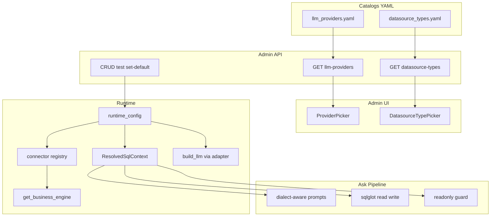

# 多供应商模型 × 多类型数据源 × 专业配置 UI · 开发计划

> **状态**：P0～P3 + P1.5 已落地（P4 Excel/Oracle 等仍按计划不做）  
> **版本**：v1.1 · 2026-08  
> **前置**：一期已落地 — 见 [LLM_DATASOURCE_CONFIG_PLAN.md](./LLM_DATASOURCE_CONFIG_PLAN.md)（V016 + Admin CRUD + runtime_config）  
> **对标**：[SQLBot](https://github.com/dataease/SQLBot) · [AI 模型配置](https://dataease.cn/sqlbot/v1/system/model/) · [数据源概览](https://dataease.cn/sqlbot/v1/user_manual/datasource_description/)  
> **目标**：模型供应商可选、业务库类型可选；配置界面达到 SQLBot 级专业观感（卡片 / 向导 / 供应商墙），并贯通本仓库 Ask / Meta / Guard 链路  
> **硬性原则（v1.1）**：  
> 1. **禁止在业务代码中写死**大模型供应商列表或业务库类型列表——一律 **Catalog / Registry / 配置数据** 驱动；新增供应商或库类型以「加目录项 + 可选插件」完成，而不是改 `if provider == ...` 散落分支。  
> 2. **生成查询 SQL、改写 SQL、introspect、只读校验** 必须读取 **当前默认业务库的 `db_type` + `server_version`**，禁止继续写死 `MySQL 5.7` / `read="mysql"`。  
> **其它原则**：协议层尽量 OpenAI 兼容 / SQLAlchemy 方言适配；UI 自建专业皮肤，**不复制 SQLBot Logo/版权**；业务库仍只读

---

## 目录

1. [背景与差距](#1-背景与差距)
2. [产品目标与分期](#2-产品目标与分期)
3. [硬性设计约束：禁止写死](#3-硬性设计约束禁止写死)
4. [硬性设计约束：方言与版本感知 SQL](#4-硬性设计约束方言与版本感知-sql)
5. [对标 SQLBot 能力矩阵](#5-对标-sqlbot-能力矩阵)
6. [信息架构与 UI 设计规范](#6-信息架构与-ui-设计规范)
7. [模型供应商体系（Catalog 驱动）](#7-模型供应商体系catalog-驱动)
8. [业务数据源类型体系（Registry 驱动）](#8-业务数据源类型体系registry-驱动)
9. [后端架构改动](#9-后端架构改动)
10. [前端改造清单](#10-前端改造清单)
11. [关联改动（问数链路）](#11-关联改动问数链路)
12. [数据模型演进](#12-数据模型演进)
13. [分步实施指南](#13-分步实施指南)
14. [验收标准](#14-验收标准)
15. [风险与降级](#15-风险与降级)
16. [明确不做](#16-明确不做)

---

## 1. 背景与差距

### 1.1 一期现状（已有）

| 能力 | 现状 |
|------|------|
| 配置存储 | `copilot_llm_model` / `copilot_business_datasource` |
| 运行时 | `runtime_config` 库优先、env 回退 |
| 管理页 | `AdminSystemLlm.vue` / `AdminSystemDatasources.vue`：Element 表格 + Dialog |
| 协议 | Chat/Embedding = OpenAI 兼容；业务库 = **仅 MySQL + aiomysql** |
| 供应商 | `provider` 自由文本，无预设、无 Logo、无默认 API Base |
| **写死问题（须清扫）** | Prompt / plan / guard / scope_injector / column_guard 大量写死 **MySQL 5.7** 与 `read="mysql"`；仓库层 `db_type != "mysql"` 直接 400 |

### 1.2 相对 SQLBot 的差距

| 维度 | SQLBot | 本项目一期 | 本计划要补 |
|------|--------|------------|------------|
| 模型供应商 | 十余家可选 + 通用兼容 | 手填字符串 | **Catalog 驱动**供应商墙 + 预填 |
| 数据源类型 | MySQL/PG/Oracle/CK/Doris/…/Excel | 仅 MySQL | **Registry 驱动**类型墙 + 连接器插件 |
| SQL 方言 | 随数据源 | 代码写死 MySQL 5.7 | **按当前库类型+版本**生成/校验 |
| 新建体验 | 选类型 → 填连接 → 校验 → 选表 | 单 Dialog 填表 | 多步向导 + 卡片墙 |
| 列表体验 | 卡片网格、类型筛选、搜索 | 朴素表格 | 卡片 + 筛选 + 空状态 |
| 默认模型 | 页眉「系统默认模型」下拉 | 行内「设为默认」 | 页眉默认选择器 + 卡片角标 |

### 1.3 用户诉求（钉死）

1. **模型供应商要有很多选择**（对齐 SQLBot 列表）  
2. **业务库类型要有很多选择**（对齐 SQLBot 列表）  
3. **界面要像 SQLBot 一样专业且好看**（信息架构 + 视觉质量，非抄皮肤文件）  
4. **代码里不要写死**大模型供应商或业务库类型  
5. **生成/改写 SQL 时必须跟随当前数据库类型与版本**

---

## 2. 产品目标与分期

### 2.1 总目标

管理员在专业配置台中：

1. 从 **供应商墙** 选 DeepSeek / 百炼 / 通义 / OpenAI / Ollama…（选项来自 Catalog API，非前端写死数组为主数据源），自动带出 API Base 与推荐参数，测试连通后设为默认 Chat/Embedding。  
2. 从 **数据源类型墙** 选库类型（选项来自 Catalog API），按向导完成连接校验；默认数据源驱动问数与 Meta introspect。  
3. 列表页为 **卡片网格**，支持搜索、类型筛选、默认角标、快捷测试。  
4. 问数链路中，LLM Prompt、sqlglot 解析/生成、Scope 注入、只读 Guard、introspect **全部读取** `ResolvedSqlContext(db_type, dialect, server_version, features)`。

### 2.2 分期（避免一次改穿）

| 阶段 | 名称 | 交付 | 工期估 |
|------|------|------|--------|
| **P0** | 专业 UI 壳 + Catalog API 骨架 | 卡片墙、向导；前端**禁止**本地写死完整列表（可短暂兜底，须标注 temporary） | 3～4d |
| **P1** | 供应商 Catalog 闭环 + 清扫 provider 写死 | 后端唯一目录源；页眉默认模型 | 2d |
| **P1.5** | **方言/版本上下文**落地（可与 P1 并行） | `ResolvedSqlContext`；Prompt/guard/sqlglot 去 MySQL 硬编码 | 2～3d |
| **P2** | 多库引擎（第一批） | PostgreSQL + SQL Server + introspect + 版本探测 | 4～5d |
| **P3** | 多库引擎（第二批） | ClickHouse / Doris / StarRocks | 4～6d |
| **P4** | 文件源与增强 | Excel/CSV；Oracle/达梦按需 | 另立专项 |

**本计划正文覆盖 P0～P3 + P1.5**；P4 仅列预留。

---

## 3. 硬性设计约束：禁止写死

### 3.1 什么叫「写死」（禁止）

| 禁止形态 | 反例 | 正确做法 |
|----------|------|----------|
| 业务逻辑里 `if provider == "deepseek"` 散落 | 各 API/前端分支特判 | 供应商差异收进 **Catalog 元数据**（defaultApiBase、extraTemplate、adapterKey） |
| 前端 `const PROVIDERS = ['deepseek',…]` 当唯一真相 | 改一处漏三处 | **只消费** `GET /llm-providers`；本地 constants 仅作离线兜底且与后端同步生成/注释 |
| `if db_type != "mysql": raise` 写在 repository 通用路径 | 新引擎永远加不进 | **Registry**：未注册类型 → 明确 `UNSUPPORTED`；已注册即可用 |
| Prompt 字符串写死「方言：MySQL 5.7」 | PG 库仍被要求写 MySQL | 从 `ResolvedSqlContext` 格式化注入 |
| sqlglot 全局 `read="mysql"` / `dialect="mysql"` | 多引擎解析错误 | `read=ctx.sqlglot_read`，`sql(dialect=ctx.sqlglot_write)` |
| URL 拼接写死 `mysql+aiomysql://` | 无法切 PG | `connector.build_url(dsn)` |

### 3.2 唯一真相源（Single Source of Truth）

```text
模型供应商真相源
  └── backend/app/system/catalogs/  （YAML 或 Python 数据模块 + 可选 DB 覆盖表）
        └── GET /api/v1/admin/system/llm-providers
              └── 前端墙 / 向导 / 校验

业务库类型真相源
  └── backend/app/system/catalogs/datasource_types.*
        + connectors 包内 entry_points / 显式 register()
        └── GET /api/v1/admin/system/datasource-types
              └── 前端类型墙 / 向导动态表单 schema
```

**扩展新供应商**：只改 Catalog 条目（+ 若有非 OpenAI 协议再加 `adapter` 插件名），**禁止**改 Ask/LLM 主流程 if-else。  
**扩展新库类型**：实现 `BusinessConnector` + 在 registry 注册 + Catalog 标记 `ga`，**禁止**在 `admin_system` / `datasource_repository` 写类型白名单硬编码（白名单 = registry.keys()）。

### 3.3 Catalog 存放形式（钉死）

优先 **声明式文件**，便于运营增删、Code Review 清晰：

```text
backend/app/system/catalogs/
  llm_providers.yaml          # 或 .json
  datasource_types.yaml
  loader.py                   # 加载、校验 schema、合并 env 覆盖
```

允许用 Python dataclass 描述 schema，但 **条目数据**不要散落在 `admin_system.py`、Vue `<script>` 里。

可选增强（非本阶段必须）：`copilot_llm_provider_catalog` 表做热更新；仍由 loader 统一读出，业务代码不直接 SQL 供应商名。

### 3.4 前端约束

- `ProviderPicker` / `DatasourceTypePicker`：**挂载时请求 Catalog API**  
- `constants/llmProviders.js`：仅 `OFFLINE_FALLBACK`，文件头注释「与 catalogs/*.yaml 保持同步；禁止作为主数据源」  
- 动态表单：连接字段来自 Catalog 的 `formSchema`（host/port/database/…），禁止按 `db_type` 在 Vue 里写十几份 `v-if`

### 3.5 Code Review 门禁（合入检查）

合入前 `rg` 清扫（示例）：

```text
rg -n "MySQL 5\.7|dialect=\"mysql\"|read=\"mysql\"|db_type != \"mysql\"|openai_compatible" backend/app frontend/src
rg -n "deepseek|dashscope|clickhouse" backend/app --glob '!**/catalogs/**' --glob '!**/connectors/**'
```

业务目录（`agent/`、`sql/`、`policy/`、`meta/` 除 introspect 插件）出现具体供应商名或库名 → **必须改走 context/catalog**。

---

## 4. 硬性设计约束：方言与版本感知 SQL

### 4.1 问题

当前链路多处写死 MySQL，例如：

- `role_policy` / `llm_sql` / `plan_llm` / `plan_analyzer`：文案含「MySQL 5.7」  
- `scope_injector` / `column_guard`：`sqlglot.parse_one(..., read="mysql")`  
- `BusinessSchemaIntrospector`：仅 `information_schema`（MySQL 语义）  
- `ResolvedBusinessDsn.sqlalchemy_url`：固定 `mysql+aiomysql`

切换 PostgreSQL / SQL Server / ClickHouse 后，若不改，会出现：**Prompt 教错方言、AST 解析失败、生成不可运行 SQL**。

### 4.2 运行时上下文（唯一出口）

新增并缓存（随 `refresh_runtime_config` / 设默认数据源失效）：

```python
@dataclass(frozen=True)
class ResolvedSqlContext:
    db_type: str                 # catalog code，如 postgresql
    dialect: str                 # 逻辑方言名，如 postgres / mysql / tsql / clickhouse
    sqlglot_read: str            # sqlglot read 参数
    sqlglot_write: str           # sqlglot 生成 dialect
    server_version: str | None   # 原始版本串，如 "5.7.44-log" / "16.2"
    version_major: int | None
    version_minor: int | None
    features: frozenset[str]     # 如 {"window_functions", "cte", "json_table"}
    prompt_dialect_label: str    # 注入 Prompt 的人类可读句，如 "PostgreSQL 16（支持 CTE/窗口函数）"
    identifier_quote: str        # " / ` / []
    limit_style: str             # limit_offset | top | fetch
```

**来源**：

1. 默认数据源行的 `db_type` → Catalog/Connector 映射出 dialect / sqlglot_*  
2. **连通时探测版本**：`connector.detect_version(conn)`（如 `SELECT VERSION()` / `SELECT version()` / `SELECT @@VERSION`）  
3. 写入缓存；可落库 `copilot_business_datasource.server_version`（V017）避免每次问数探测  
4. 探测失败：用 Catalog 声明的 `default_version_hint` + features 下限（保守）

### 4.3 必须消费 `ResolvedSqlContext` 的触点

| 触点 | 今日写死 | 改造 |
|------|----------|------|
| `build_sql_system_preamble` / `role_policy` 方言句 | MySQL 5.7 | `ctx.prompt_dialect_label` + features 约束句 |
| `llm_sql` / `plan_llm` / `plan_analyzer` 分路聚合提示 | 「MySQL 5.7 标量子查询」 | 按 features：有 CTE 可用 WITH；仅 5.7 无窗口则保持子查询策略 |
| `scope_injector` | `read/sql mysql` | `ctx.sqlglot_*` |
| `column_guard` / `sql/guard` | mysql | 同上 + 按方言禁 DDL |
| `sql/executor` | 无版本 | 可选记录 version 到 span |
| Meta introspect | MySQL information_schema | `get_introspector(ctx.db_type)` |
| L1 / 样例 SQL 校验 | 隐含 MySQL | 校验时声明样例适用 `db_type`；执行前方言检查 |
| Brief / Research 内嵌 SQL | 间接走 ask | 自动继承 ctx |

### 4.4 Prompt 注入模板（示例）

```text
【SQL 方言与版本 — 必须遵守】
- 引擎：{prompt_dialect_label}
- 标识符引用：{identifier_quote}
- 分页：{limit_style}
- 能力：{features_csv}
- 禁止使用目标引擎不支持的语法（例如在 MySQL 5.7 禁止窗口函数/CTE；在 PostgreSQL 使用符合其版本的语法）
- 仅输出单条只读 SELECT（或方言等价只读查询）
```

`features` 由 **版本规则表**（声明在 connector/catalog，非散落 if）计算，例如：

```yaml
# datasource_types.yaml 片段（示意）
mysql:
  dialect: mysql
  sqlglot: mysql
  version_features:
    - when: ">=8.0.0"
      features: [cte, window_functions, json_table]
    - when: ">=5.7.0,<8.0.0"
      features: []   # 保守：无窗口/CTE
```

### 4.5 生成后校验

1. sqlglot 用 `ctx.sqlglot_read` 解析  
2. 若解析失败 → correct_sql / 重生成，错误信息带上方言  
3. Guard：只读 + 标识符规则 + （可选）按 features 拒绝窗口函数等  
4. **禁止**在校验里写死仅 MySQL 函数黑白名单；黑白名单挂在 connector.capabilities

### 4.6 版本探测时机

| 时机 | 动作 |
|------|------|
| 数据源「校验连接」成功 | `detect_version` → 更新行上 `server_version` + 刷新 `ResolvedSqlContext` |
| `set-default` | 若版本空则探测一次 |
| 问数开始（可选） | 版本空或过期（如 >7 天）后台刷新；失败不阻断，用缓存/保守 features |

---

## 5. 对标 SQLBot 能力矩阵

### 5.1 模型供应商（Catalog 条目示例，非代码写死列表）

> 下表是 **catalog 初始数据** 的说明，落地时进入 `llm_providers.yaml`；业务代码通过 API/loader 读取，**不要**再复制一份到 agent 里。

| provider 代码 | 展示名 | 默认 API Base（可改） | 协议 |
|---------------|--------|----------------------|------|
| `deepseek` | DeepSeek | `https://api.deepseek.com` | OpenAI 兼容 |
| `dashscope` | 阿里云百炼 / 通义 | `https://dashscope.aliyuncs.com/compatible-mode/v1` | OpenAI 兼容 |
| `qianfan` | 千帆大模型 | 文档默认兼容地址 | OpenAI 兼容 |
| `hunyuan` | 腾讯混元 | 兼容地址 | OpenAI 兼容 |
| `spark` | 讯飞星火 | 兼容地址 | OpenAI 兼容 |
| `gemini` | Gemini | 兼容/代理地址 | OpenAI 兼容或专用适配 |
| `openai` | OpenAI | `https://api.openai.com/v1` | 原生 |
| `azure_openai` | Azure OpenAI | 用户填资源端点 | OpenAI 兼容变体 |
| `kimi` | Kimi | Moonshot 兼容地址 | OpenAI 兼容 |
| `volcengine` | 火山引擎 | 兼容地址 | OpenAI 兼容 |
| `minimax` | MiniMax | 兼容地址 | OpenAI 兼容 |
| `ollama` | Ollama（本地） | `http://127.0.0.1:11434/v1` | OpenAI 兼容 |
| `openai_compatible` | 通用 OpenAI 兼容 | 用户自填 | OpenAI 兼容 |

> P0/P1：默认 `adapterKey=openai_compatible` 走现有 `ChatOpenAI` / `AsyncOpenAI` / Embedding HTTP。  
> 特殊协议：Catalog 配 `adapterKey`，由 `app/system/llm_adapters/` 插件解析；**主流程只调 adapter 接口**。

### 5.2 数据源类型（Catalog + Registry 条目示例）

> 同样进入 `datasource_types.yaml`；`status` / `connector` / `version_features` 均声明在目录中。

| db_type | 展示名 | 分组 | 落地阶段 | connector 模块 |
|---------|--------|------|----------|----------------|
| `mysql` | MySQL | OLTP | 已有 | `connectors.mysql` |
| `postgresql` | PostgreSQL | OLTP | P2 | `connectors.postgresql` |
| `sqlserver` | SQL Server | OLTP | P2 | `connectors.sqlserver` |
| `oracle` | Oracle | OLTP | P4 | 按需 |
| `dm` | 达梦 | OLTP | P4 | 按需 |
| `kingbase` | Kingbase | OLTP | P4 | 按需（可复用 postgres dialect 规则） |
| `clickhouse` | ClickHouse | OLAP | P3 | `connectors.clickhouse` |
| `doris` | Apache Doris | OLAP | P3 | `connectors.doris`（可委托 mysql 协议） |
| `starrocks` | StarRocks | OLAP | P3 | `connectors.starrocks` |
| `elasticsearch` | Elasticsearch | OLAP | P4 | 另议 |
| `redshift` | AWS Redshift | 仓 | P4 | 可委托 postgres 规则 |
| `hive` | Apache Hive | 仓/湖 | P4 | 按需 |
| `excel` / `csv` | Excel/CSV | 文件 | P4 | 虚拟源 |

---

## 6. 信息架构与 UI 设计规范

### 6.1 路由与导航（相对一期微调）


| 路由 | 页面 | 说明 |
|------|------|------|
| `/admin/system/llm` | AI 模型配置台 | 专业卡片墙 + 添加向导 |
| `/admin/system/datasources` | 数据源配置台 | 专业卡片墙 + 新建向导 |
| `/admin/system` | （可选）系统配置总览 | 两个入口的仪表卡片 |

`MetaAdminNav` 保留「AI 模型 / 数据源」；文案可改为与 SQLBot 更接近的「模型配置 / 数据源」。

### 6.2 视觉方向（专业好看，避免 AI 套娃风）


**定调**：浅色工作台 + 清晰层级 + 品牌绿强调（与现有 Ask/Meta 绿系衔接），卡片有轻阴影与圆角，**不要** 紫渐变 / 奶油衬线报章风 / 暗黑霓虹。

| Token | 建议值 |
|-------|--------|
| `--sys-bg` | `#F5F7FA`（与现 admin 一致） |
| `--sys-surface` | `#FFFFFF` |
| `--sys-border` | `#E5E7EB` |
| `--sys-accent` | `#12B886`～`#0CA678`（主按钮/默认角标） |
| `--sys-text` | `#1F2937` |
| `--sys-muted` | `#6B7280` |
| 圆角 | 卡片 `12px`，按钮 `8px` |
| 阴影 | `0 1px 2px rgba(0,0,0,.04), 0 4px 12px rgba(0,0,0,.04)` |
| 字体 | 沿用项目现有中文字体栈；标题 `600`，正文 `400` |

### 6.3 页面结构（对标 SQLBot，本仓库实现）


#### AI 模型页

```text
┌ Header：标题「AI 模型配置」 | 系统默认 Chat ▾ | 系统默认 Embedding ▾ | 添加模型 ┐
├ 工具条：搜索 + 角色筛选（Chat/Embedding） + 供应商筛选
├ 内容：响应式卡片网格（每卡：Logo、名称、provider、model、Base 摘要、默认角标、测试/编辑/…）
└ 空状态：插画 +「添加第一个模型」
```

**添加模型**：全屏/宽抽屉向导  

1. **选供应商** — Logo 墙（可搜索）  
2. **填参数** — 名称、角色、API Base（预填）、Key、模型名、温度/超时/thinking  
3. **测试并保存** — 连通成功才允许「保存并设为默认」

#### 数据源页

```text
┌ Header：标题「数据源」 | 搜索 | 类型筛选 | 新建数据源 ┐
├ 内容：卡片网格（类型图标、名称、主机/库摘要、默认「当前问数库」角标、校验状态、操作）
└ 空状态：引导新建
```

**新建数据源**：三步向导（对标 SQLBot）

1. **选择类型** — OLTP/OLAP/文件分组墙  
2. **配置连接** — 动态表单（按 `db_type` schema）+「校验连接」  
3. **完成** — 设为默认开关；提示「去表管理注册/刷新结构」（一期不在此页内嵌选表；选表仍走现有 Meta，避免重复造 Meta）

> 与 SQLBot 差异（有意）：SQLBot 在数据源里勾选表；本项目 **语义层已在 Meta**，向导第 3 步以「跳转表管理」为主，P2 可加「从该源 introspect 表名列表」快捷入口。

### 6.4 组件拆分（前端）


```text
frontend/src/
  views/
    AdminSystemLlm.vue              # 薄页面壳
    AdminSystemDatasources.vue
  components/system-config/
    SystemConfigLayout.vue          # 统一页头/背景
    ProviderPicker.vue              # 供应商墙
    DatasourceTypePicker.vue        # 数据源类型墙
    LlmModelCard.vue
    DatasourceCard.vue
    LlmModelWizard.vue
    DatasourceWizard.vue
    DefaultModelSelect.vue          # 页眉默认模型
  styles/
    system-config.css               # tokens + 卡片网格
  constants/
    llmProviders.fallback.js        # 仅离线兜底，禁止当主数据源
    datasourceTypes.fallback.js
```

动效（克制）：卡片 hover 上浮 2px；向导步骤切换 fade；默认角标出现时短 scale。**2～3 个即可**，禁止堆特效。

---

## 7. 模型供应商体系（Catalog 驱动）

### 7.1 Catalog API

`GET /api/v1/admin/system/llm-providers`

返回条目来自 `catalogs/llm_providers.yaml`（**唯一真相源**），示意：

```json
{
  "items": [
    {
      "code": "deepseek",
      "name": "DeepSeek",
      "logoKey": "deepseek",
      "defaultApiBase": "https://api.deepseek.com",
      "suggestedModels": ["deepseek-v4-flash", "deepseek-chat"],
      "supportsThinking": true,
      "adapterKey": "openai_compatible",
      "extraDefaults": { "thinking_enabled": true, "reasoning_effort": "high" },
      "roles": ["chat"],
      "docsUrl": null
    }
  ]
}
```

前端 **必须**优先打 API；失败时才用 fallback 文件。

### 7.2 创建/更新契约增强

- `provider` 必须存在于 Catalog（未知 → 400）；调用 `catalog.has_provider(code)`，**不要**在 repository 写死允许列表
- `apiBase` 为空时用 Catalog `defaultApiBase` 回填
- `extra_json` 合并 Catalog `extraDefaults`（用户显式字段优先）

### 7.3 测试

测试逻辑读 Catalog 的 `adapterKey` / `testPath`，**禁止**按供应商名写大型 if-else。

---

## 8. 业务数据源类型体系（Registry 驱动）

### 8.1 Catalog API

`GET /api/v1/admin/system/datasource-types` — 数据来自 `datasource_types.yaml`。

`status`: `ga` | `beta` | `coming_soon`。可选集合 = **Catalog ∩ Registry 已注册 connector**；驱动未装 → UI「需安装扩展依赖」。

动态连接表单字段来自条目的 `formSchema`，前端禁止按 `db_type` 堆多套 `v-if` 表单。

### 8.2 连接器接口

```text
app/system/connectors/
  base.py
  mysql.py
  postgresql.py
  ...
  registry.py     # register(db_type, factory)；启动扫描，业务层无类型白名单硬编码
```

```python
class BusinessConnector(Protocol):
    db_type: str
    def build_url(self, dsn: ResolvedBusinessDsn) -> str: ...
    async def test_connection(self, dsn: ResolvedBusinessDsn) -> tuple[bool, str]: ...
    async def detect_version(self, conn) -> str: ...
    def build_sql_context(self, *, server_version: str | None) -> ResolvedSqlContext: ...
```

`datasource_repository.insert`：**删除** `if db_type != "mysql"`；改为 `registry.get(db_type) or raise UNSUPPORTED`。

### 8.3 Introspect

`get_introspector(db_type)` 插件化；禁止 Meta 主流程写死 MySQL `information_schema` 一种实现。

### 8.4 SQL 方言与版本

见 [§4](#4-硬性设计约束方言与版本感知-sql)。`Settings.sql_dialect` 仅作无默认数据源时的 env 回退。

---

## 9. 后端架构改动



### 9.1 文件清单

| 路径 | 说明 |
|------|------|
| `app/system/catalogs/*.yaml` + `loader.py` | 供应商/库类型唯一目录 |
| `app/system/llm_adapters/` | 按 adapterKey 调用 |
| `app/system/connectors/*` + `registry.py` | 多引擎；含版本探测与 SqlContext |
| `app/system/sql_context.py` | `ResolvedSqlContext` / `resolve_sql_context()` |
| `app/meta/introspector_*.py` | 分引擎 introspect |
| `app/api/admin_system.py` | catalog 路由；test 走 connector |
| `app/db/business.py` | URL 由 connector 生成 |
| `app/sql/guard.py`、`policy/scope_injector.py`、`sql/column_guard.py` | 去 mysql 写死 |
| `app/agent/llm_sql.py`、`plan_llm.py`、`plan_analyzer.py`、`policy/role_policy.py` | Prompt 注入 ctx |
| `V017__datasource_version_and_options.sql` | `server_version`、`options_json` |

### 9.2 可选依赖

`db-pg` / `db-mssql` / `db-ch`；未安装时不 register 或标记 unavailable。

---

## 10. 前端改造清单

| 项 | 说明 |
|----|------|
| 卡片工作台 + 向导 | 专业观感 |
| 墙数据来自 API | 禁止本地主列表写死 |
| 动态 formSchema | 禁止按类型复制多套表单 |
| 展示 serverVersion | 校验/探测后展示 |
| fallback 文件 | 仅离线；注释标明禁止主用 |

---

## 11. 关联改动（问数链路）

| 模块 | 改动 |
|------|------|
| `runtime_config` | 刷新 `ResolvedSqlContext` |
| Prompt 相关 | 删除「MySQL 5.7」字面量 |
| sqlglot / guard / scope | 方言来自 ctx |
| connectors / business | URL、test、version |
| Meta introspect | 按 db_type 插件 |
| health | 展示 db_type / version / dialect / provider（来自 resolve） |

---

## 12. 数据模型演进

### 12.1 复用 V016 列

`provider`、`db_type`、`extra_json` 保留。

### 12.2 V017

```sql
ALTER TABLE copilot_business_datasource
  ADD COLUMN options_json TEXT NULL COMMENT 'SSL/schema/额外参数 JSON' AFTER password_enc,
  ADD COLUMN server_version VARCHAR(128) NULL COMMENT '最近探测到的数据库版本串' AFTER options_json,
  ADD COLUMN version_checked_at DATETIME NULL COMMENT '版本探测时间' AFTER server_version;
```

---

## 13. 分步实施指南

### Phase P0 · UI + Catalog API 骨架（3～4d）

| # | 任务 | 验收 |
|---|------|------|
| 0.1 | 卡片 + 向导 + 视觉 tokens | 观感达标 |
| 0.2 | yaml catalog + GET API | 前端只消费 API |
| 0.3 | 去掉 repository `!= mysql` 硬编码 | 改为 registry |

### Phase P1 · 供应商闭环（2d）

| # | 任务 | 验收 |
|---|------|------|
| 1.1 | adapterKey 调用链 | 新供应商只改 yaml |
| 1.2 | 页眉默认模型 | 即时 refresh |
| 1.3 | 测试无供应商 if 树 | |

### Phase P1.5 · 方言/版本上下文（2～3d）

| # | 任务 | 验收 |
|---|------|------|
| 1.5.1 | ResolvedSqlContext + 版本探测 | 写入 server_version |
| 1.5.2 | 清扫 Prompt MySQL 5.7 | 业务目录 rg 为 0 |
| 1.5.3 | sqlglot/guard/scope 用 ctx | mysql 字面量仅存 connector |
| 1.5.4 | version_features 规则 | 5.7 vs 8.0 Prompt 不同 |
| 1.5.5 | 单测不同 ctx Prompt | |

### Phase P2 · PG + SQL Server（4～5d）

插件注册 + introspect + 全链路 ctx；不改 repository 白名单。

### Phase P3 · OLAP（4～6d）

ClickHouse / Doris / StarRocks；委托关系留在 connector 内部，Catalog 仍独立 db_type。

---

## 14. 验收标准

### 14.1 体验

- [x] 卡片工作台 + 供应商墙 + 类型墙 + 向导
- [x] 页眉默认 Chat/Embedding
- [x] 数据源卡片展示类型与版本

### 14.2 反写死

- [x] 新增 mock provider **只改 yaml** 即可上墙（adapter 已存在时）
- [x] 新增 connector + yaml 后无需改 repository if 白名单
- [x] `rg "MySQL 5\.7"` 在 agent/policy/sql 为 0
- [x] `rg 'read="mysql"|dialect="mysql"'` 仅出现在 mysql connector / catalogs / 测试（业务路径走 dialect helper）

### 14.3 方言与版本

- [x] MySQL 5.7：Prompt features 保守（无窗口/CTE）
- [x] PostgreSQL 16：sqlglot/Prompt 为 postgres（单测 + connector）
- [x] 切换默认源后下一轮问数上下文立即变化（refresh + resolve_sql_context）
- [x] 校验连接更新 server_version（V017）

### 14.4 引擎

- [x] P2：PG + SQL Server 可校验并问数（需 optional extras：`db-pg` / `db-mssql`）
- [x] P3：至少一类 OLAP 可用（Doris/StarRocks 用 MySQL 协议；ClickHouse 需 `db-ch`）

---

## 15. 风险与降级

| 风险 | 缓解 |
|------|------|
| 版本探测各异 | 封在 connector.detect_version |
| features 过粗 | 规则表可调；保守默认 |
| sqlglot 支持差 | connector 声明近似方言 + 纠正循环 |
| 目录与插件不同步 | Catalog ∩ registry；CI |
| 驱动膨胀 | optional-dependencies |

---

## 16. 明确不做

- 抄袭 SQLBot 源码/Logo/版权
- 在 agent/sql/policy **写死**供应商名或库类型名作为分支条件
- 一次做完 Hive/ES/Excel（P4）
- 本期 Ask 多数据源切换
- copilot 系统库做成业务源

---

## 附录 A · 与一期文档关系

| 文档 | 关系 |
|------|------|
| [LLM_DATASOURCE_CONFIG_PLAN.md](./LLM_DATASOURCE_CONFIG_PLAN.md) | 一期基座 |
| **本文 v1.1** | 多供应商、多库、专业 UI、反写死、方言/版本感知 SQL |
| [DATABASE_CHANGE_POLICY.md](./DATABASE_CHANGE_POLICY.md) | 只读策略 |
| [PROGRESS.md](./PROGRESS.md) | 进度 |

## 附录 B · 建议排期

```text
W1:     P0 UI + Catalog API
W1～W2: P1 + P1.5（清扫 MySQL 硬编码 + ResolvedSqlContext）
W2:     P2 PostgreSQL + SQL Server
W3:     P3 OLAP + 反写死 rg 门禁验收
```

## 附录 C · 参考链接

- [SQLBot GitHub](https://github.com/dataease/SQLBot)
- [SQLBot · AI 模型配置](https://dataease.cn/sqlbot/v1/system/model/)
- [SQLBot · 数据源概览](https://dataease.cn/sqlbot/v1/user_manual/datasource_description/)
- [SQLBot · 快速入门](https://dataease.cn/sqlbot/v1/quick_start/)

## 附录 D · 一期遗留写死清扫清单（P1.5 必做）

| 文件 | 问题 |
|------|------|
| `app/policy/role_policy.py` | 「方言：MySQL 5.7」 |
| `app/agent/llm_sql.py` | 「MySQL 5.7」分路聚合提示 |
| `app/agent/plan_llm.py` / `plan_analyzer.py` | 同上 |
| `app/policy/scope_injector.py` | `read="mysql"` / `dialect="mysql"` |
| `app/sql/column_guard.py` | 同上 |
| `app/system/datasource_repository.py` | `db_type != "mysql"` |
| `app/system/models.py` | URL 写死 `mysql+aiomysql` |
| `app/api/admin_system.py` | `_probe_mysql` 唯一探测路径 |
| `app/meta/introspector.py` | 仅 MySQL information_schema |
